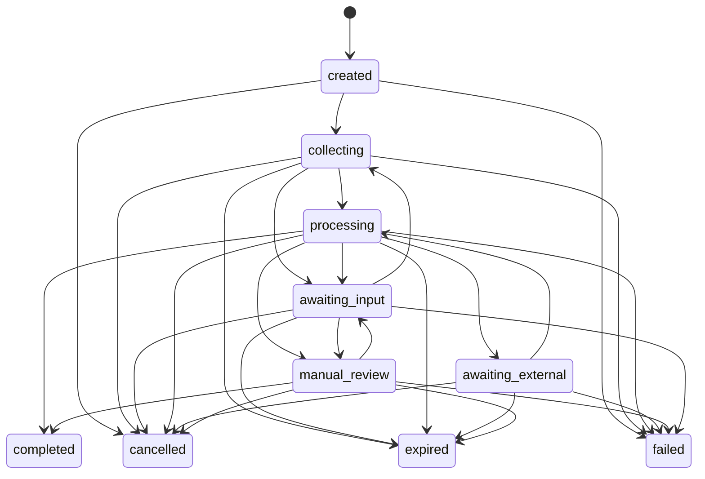

# Idenqa Architecture Amendments

## Review draft

**Status:** Proposed for review — second-pass completeness revision  
**Date:** 26 August 2026  
**Applies to:** `global-identity-core-technical-architecture.md` draft v0.5

This document proposes targeted amendments to the Idenqa technical architecture. It does not replace or modify the main architecture specification. Accepted amendments should be incorporated into the relevant sections of that specification through reviewed changes.

---

## 1. Open-source core is the first product increment

### Proposed architectural clarification

Idenqa begins with the open-source identity core, its public SDKs, and its basic hosted and embeddable capture pages. Commercial operator Web applications, Console, and managed Cloud control planes are incremental consumers and operators of the core; they are not prerequisites for proving the architecture.

The first implementation proves that identity evidence can be represented, checks can be orchestrated, provider outputs can be normalised, policies can be evaluated deterministically, and decisions can be reproduced through stable APIs, SDKs, and command-line tooling. It uses synthetic evidence and mock adapters before processing real personal data.

No operator dashboard, standalone consumer mobile application, Console, or managed Cloud service is required for the first open-source release. Public SDKs and the basic open-source capture pages are part of the open-source product, not deferred commercial surfaces. The core must remain operable through its documented API, SDKs, CLI, configuration files, webhooks, capture pages, and synthetic fixtures.

### Capture pages are part of the open-source contract

Idenqa Core includes a secure basic Web capture application that can be self-hosted with the core or embedded into an authorised customer journey. It provides the minimum complete subject experience for:

- Session-token validation
- Recipient identity and required notice presentation
- Consent or other required subject acknowledgement
- Document and evidence collection permitted by the server-created workflow
- Camera and file input where supported
- Quality feedback supplied by approved capture or model capabilities
- Direct upload to the evidence boundary
- Progress, retry, interruption, resumption, cancellation, and completion
- Accessible safe-default presentation and localisation fallback
- Local evidence cleanup

The capture application consumes the same public capture-session and SDK contracts available to customers. It cannot select the tenant, change the policy, remove required steps, alter the decision, or access unrelated subject resources.

The open-source capture boundary includes the portable experience schema, validator, safe default theme, required copy composition, and file-based or API-based configuration needed to operate independently.

Commercial Cloud and Console may add visual authoring, managed assets, multi-brand inheritance, cross-platform preview, approvals, publication workflows, targeting, experiments, analytics, custom-domain operations, managed localisation, signed edge delivery, and emergency fleet-wide rollback. Those commercial capabilities improve operation of capture experiences; they do not gate the existence of a usable, secure open-source capture journey.

### SDKs are part of the open-source contract

The SDK family is the supported integration layer over the public contracts:

- **Core client SDKs:** create subjects and verifications, inspect checks and decisions, manage policies, and consume safe resource models.
- **Capture SDKs:** bind to a server-created session, present or expose required capture steps, collect permitted evidence, upload directly to the evidence boundary, resume safely, and clean up local data.
- **Provider SDK:** implement, validate, package, and test provider adapters.
- **Model SDK:** implement and test model manifests, inference requests, signals, and proposal contracts.
- **Webhook SDKs:** verify signatures, enforce replay windows, parse versioned events, and support idempotent handling.
- **Policy test kit:** validate, simulate, explain, and regression-test policy versions.

Capture SDKs may contain a headless session/evidence layer and optional trusted UI modules. An SDK embedded in a customer's application is not the same thing as a commercial operator application, managed Cloud service, or standalone consumer application.

The API remains authoritative so customers are not forced to use a specific language or SDK. SDKs provide safe defaults, typed contracts, security-sensitive implementation, conformance, and a practical adoption path; they must not contain identity capabilities that are unavailable through documented core contracts.

The first supported client languages and capture platforms are a release-sequencing decision, but every advertised SDK is open source, versioned with a compatibility matrix, and tested against the same conformance suite.

### Proposed delivery sequence

#### Increment 0 — Open-source foundations

- Repository, secure build, release signing, and contribution policy
- Tenant context and tenant-scoped identifiers
- Domain IDs and canonical timestamps
- Encryption, tokenisation, secrets, and evidence-storage interfaces
- Append-only audit contract
- Transactional outbox and idempotency primitives
- Synthetic subject and evidence fixtures
- Mock provider and model adapters
- Public contract schemas and SDK generation foundations
- Threat model and architecture decision records

**Exit condition:** a local deployment can create a tenant, subject, verification, and immutable audit trail using synthetic data without an operator dashboard or managed-cloud dependency.

#### Increment 1 — Deterministic identity core

- Subject, claim, identifier, verification, check, signal, decision, and consent domains
- Durable verification state machine
- Typed policy representation and deterministic evaluator
- Policy test runner and simulation CLI
- Provider and model capability contracts
- Provider SDK, model SDK, webhook verification SDK, and policy test kit
- At least one supported core client SDK
- Mock end-to-end verification
- Signed webhook delivery
- Exportable decision explanation and provenance

**Exit condition:** an API, supported client SDK, or CLI request can run a complete synthetic verification and produce a reproducible decision whose policy, facts, signals, providers, model versions, and reason codes can be inspected without proprietary software.

#### Increment 2 — Evidence and real integrations

- Regional evidence vault
- Upload-intent and processing-grant APIs
- Retention and deletion operations
- Adapter isolation
- First real authoritative or registry provider
- First real document or biometric provider
- Manual-review domain and API
- Capture SDK session, direct-upload, resumption, error, and cleanup contracts
- At least one supported capture SDK suitable for the first adopter segment
- Basic self-hosted and embeddable Web capture pages
- Portable experience schema, validator, safe default theme, and local configuration

**Exit condition:** the open-source capture pages and at least one supported capture SDK can collect permitted evidence and complete a verification without Idenqa Cloud or Console. Server-side integrations and customer-owned capture clients can use the same public contracts. Every interface used with real people satisfies the consent, accessibility, capture-integrity, and evidence-handling requirements.

#### Later increments — Product surfaces

- Commercial Console
- Managed Cloud configuration and operations
- Commercial capture-experience authoring, targeting, analytics, and managed delivery
- AI-assisted orchestration
- Reusable Verification Cloud

Additional SDK languages, native UI modules, and cross-platform wrappers may ship incrementally according to adopter demand, but they remain part of the open-source SDK family rather than becoming proprietary product surfaces.

Commercial Web applications and future mobile applications must consume the same public contracts and SDKs proven by the core. They must not introduce hidden identity operations that are unavailable through documented APIs.

---

## 2. Separate execution state, proofing outcome, and customer action

### Problem

The current use of `verified` and `rejected` as verification lifecycle states can conflate three different concerns:

1. Whether the workflow executed successfully
2. Whether the available evidence satisfied the requested assurance
3. Whether the customer approves a person for its product or service

Idenqa should authoritatively report identity-proofing results, but it should not silently become the customer's account-opening, employment, credit, immigration, or eligibility decision engine.

### Proposed rule

> Idenqa determines whether identity evidence satisfies a declared assurance policy. The relying customer makes its separate business or eligibility decision. Operational failures and policy-configuration failures never become adverse findings about the subject.

### Proposed verification states

- `created`
- `collecting`
- `processing`
- `awaiting_input`
- `awaiting_external`
- `manual_review`
- `completed`
- `cancelled`
- `expired`
- `failed`

`failed` means the workflow could not complete because of an internal, configuration, authorisation, residency, or unrecoverable provider error. It is not an identity result.

### Proposed decision outcomes

- `verified` — the evidence satisfied the requested assurance profile
- `not_verified` — the evidence conclusively failed one or more requirements under the active policy
- `inconclusive` — the available evidence could not support either a verified or not-verified conclusion

Manual review is a workflow route, not a final identity outcome. A reviewer eventually produces one of the same decision outcomes or requests additional evidence.

### Required language

- `not_verified` must not be described as proof of fraud, deception, or ineligibility.
- Provider unavailability, model unavailability, consent absence, region conflicts, and invalid policy configuration must not produce `not_verified`.
- Fraud signals may support a policy requirement or a review route, but the public reason must be evidence-based and safe to disclose.
- Customer-specific approval or rejection may be recorded as an external reference, but it is not an Idenqa identity decision.

### Proposed state machine



`completed` requires an immutable decision with `verified`, `not_verified`, or `inconclusive`. Reconsideration appends a superseding decision. It never mutates the previous decision.

---

## 3. Define formal policy-evaluation semantics

### Proposed policy-engine contract

Policy evaluation is a pure deterministic function:

```text
evaluation_result = evaluate(
    canonical_policy,
    immutable_fact_snapshot,
    evaluation_time,
    evaluator_version
)
```

It does not call providers, models, storage, network services, or clocks during evaluation. Workflow orchestration gathers facts and performs approved effects; policy evaluation decides what the current facts permit or require.

### Required evaluation values

Every policy requirement evaluates to exactly one of:

- `satisfied`
- `not_satisfied`
- `inconclusive`
- `unavailable`
- `prohibited`

These values are not interchangeable:

- `not_satisfied` means sufficient evidence exists to determine that a requirement was not met.
- `inconclusive` means evidence exists but is insufficient or ambiguous.
- `unavailable` means an authorised source or model could not provide a result.
- `prohibited` means consent, authority, residency, contract, or policy forbids the operation.

### Required workflow directives

A policy evaluation may emit only typed directives such as:

- `complete_verified`
- `complete_not_verified`
- `complete_inconclusive`
- `request_input`
- `run_check`
- `retry_check`
- `use_fallback`
- `route_manual_review`
- `fail_workflow`

The workflow engine validates and executes directives. A directive does not itself perform an external action.

### Policy representation requirements

The implementation must define:

- A typed abstract syntax tree independent of YAML or JSON syntax
- Schema and semantic validation
- Canonical serialisation and content digest
- Explicit units, time zones, durations, thresholds, and version references
- Bounded expression depth and evaluation cost
- A bounded workflow graph with cycle detection, maximum step count, retry budget, provider-call budget, and total cost ceiling
- No arbitrary code, network access, filesystem access, or dynamic imports
- Static detection of unreachable rules, missing outcomes, unsafe fallbacks, and contradictory requirements
- Deterministic rule precedence and conflict reporting
- A compatibility policy for evaluator and schema versions
- Static proof that every reachable state has a terminal, input, retry, fallback, or review route

### Decision reproducibility

Every decision records:

- Policy ID, version, and digest
- Evaluator version
- Immutable fact-snapshot digest
- Evaluation time
- Requirement results
- Directives considered and selected
- Reason codes
- Threshold-set versions
- Provider, model, and preprocessing versions contributing facts

Reproduction reruns the stored policy against the stored fact snapshot. It does not contact external providers or rerun non-deterministic models.

### Proposed correction to policy-failure handling

Replace patterns such as:

```yaml
policy_violation: reject
```

with explicit operational handling:

```yaml
on:
  conclusive_requirement_failure: complete_not_verified
  inconclusive_evidence: route_manual_review
  provider_unavailable: use_policy_approved_fallback
  missing_consent: request_input
  prohibited_processing: fail_workflow
  invalid_policy_configuration: fail_workflow
  region_conflict: fail_workflow
```

---

## 4. Add a scoped evidence-processing grant

### Proposed trust-boundary rule

The Evidence Vault is the only component that unwraps stored evidence data-encryption keys. Model and adapter runners may receive authorised plaintext for processing, but they never receive storage credentials, tenant key-encryption keys, or reusable decryption keys.

### Processing-grant record

A processing grant contains:

- Grant ID
- Tenant, region, verification, evidence, and check references
- Authorised runner identity and attested workload version
- Processing purpose
- Permitted operation
- Permitted evidence fields or asset variants
- Maximum uses
- Expiry
- Output destination
- Policy and consent references
- Creation, use, denial, expiry, and revocation audit references

### Processing flow

1. The workflow engine requests a processing grant for a policy-approved check.
2. The Evidence Vault verifies tenant, region, consent, purpose, runner identity, and evidence state.
3. The authorised runner redeems the one-time or limited-use grant over an authenticated channel.
4. The Vault streams the minimum permitted plaintext or a purpose-specific derivative.
5. The runner processes evidence in memory or encrypted ephemeral storage.
6. The runner returns normalised output by reference.
7. Temporary plaintext, derivatives, and caches are destroyed according to the grant.
8. Grant creation, redemption, denial, expiry, and revocation are audited.

Provider adapters that require raw evidence use this same contract. An adapter never obtains a general evidence read capability.

---

## 5. Make PostgreSQL authoritative for durable orchestration

### Proposed rule

> PostgreSQL is the source of truth for workflow state, scheduled work, external attempts, timers, and delivery intent. Redis and worker queues may accelerate dispatch but must not be required to reconstruct or recover a verification.

### Required durable records

- `workflow_instances`
- `workflow_steps`
- `check_attempts`
- `external_attempts`
- `workflow_timers`
- `inbox_messages`
- `outbox_events`
- `worker_leases`

### Execution guarantees

- A state transition and its emitted outbox events commit in one database transaction.
- Every inbound callback or event is deduplicated through an inbox record.
- Workers claim work with bounded leases and fencing tokens.
- A stale worker cannot commit after its lease has been superseded.
- Each external action has a stable attempt ID and provider idempotency key.
- Retry policy is defined per error category and external operation safety.
- Callback and polling results for the same attempt converge idempotently.
- A successful external action followed by a local crash is reconciled rather than blindly repeated.
- Timers and expired leases can be reconstructed from PostgreSQL after Redis or worker loss.
- Poison work is quarantined with its safe diagnostic context and requires an authorised replay or terminal resolution.
- The system promises at-least-once execution with idempotent effects; it does not claim exactly-once delivery across external systems.

Distributed locks in Redis must not protect domain invariants. Domain invariants are enforced through transactions, constraints, optimistic concurrency, or compare-and-swap state transitions in the authoritative store.

---

## 6. Replace simple retention precedence with typed resolution

### Problem

Retention obligations are not always linearly ordered. A short privacy-retention rule, a provider deletion obligation, a regulatory minimum, and a legal hold may conflict rather than having a simple “most restrictive” winner.

### Proposed retention resolution

Each applicable rule declares:

- Authority and rule version
- Data or evidence class
- Processing purpose
- Minimum retention, if any
- Maximum retention, if any
- Trigger event
- Permitted deletion method
- Legal-hold behaviour
- Region and backup restrictions

The resolver calculates a permitted retention interval. If the applicable minimum is later than the applicable maximum, the configuration is invalid and must be resolved before evidence collection or escalated through an explicitly authorised exception process.

Legal hold suspends eligible deletion actions but does not permit unrelated use or access. It records authority, scope, start, review date, and release.

### Proposed asynchronous deletion lifecycle

- `requested`
- `validated`
- `blocked_by_legal_hold`
- `in_progress`
- `awaiting_backup_expiry`
- `completed`
- `failed`

### Deletion semantics

- Active storage, derived assets, search indexes, caches, and queued payloads are deleted or crypto-shredded promptly.
- Per-object data-encryption keys are destroyed when crypto-shredding is the selected deletion method.
- Immutable backups expire according to a published maximum lifetime.
- A deletion tombstone contains no personal content and survives long enough to prevent restoration from making deleted data active again.
- Restore procedures replay deletion tombstones before restored evidence becomes accessible.
- `completed` means all systems covered by the active deletion contract have confirmed deletion or irreversible key destruction.
- If backup expiry remains outstanding, the operation reports `awaiting_backup_expiry` rather than claiming immediate physical deletion.
- The retained deletion proof contains operation identifiers, system confirmations, rule versions, and timestamps but no deleted claims, identifiers, biometric templates, or evidence digests usable for subject correlation.

---

## 7. Expand the public API around consequential operations

### Proposed resources

```text
POST /v1/consent-receipts
GET  /v1/consent-receipts/{consent_id}
POST /v1/consent-receipts/{consent_id}/revoke

POST /v1/evidence/{evidence_id}/access-grants
GET  /v1/evidence-access-grants/{grant_id}
POST /v1/evidence-access-grants/{grant_id}/revoke

POST /v1/privacy/deletion-requests
GET  /v1/privacy/deletion-requests/{request_id}

GET  /v1/verifications/{verification_id}/decisions
GET  /v1/decisions/{decision_id}
POST /v1/verifications/{verification_id}/reconsiderations

POST /v1/policies/validate
POST /v1/policies/{policy_id}/versions
POST /v1/policy-versions/{version_id}/simulate
POST /v1/policy-versions/{version_id}/activate
```

### API rules

- `GET /v1/evidence/{evidence_id}` returns metadata only by default.
- Raw or rendered evidence requires a separate, short-lived access grant.
- Subject deletion creates a deletion request and returns `202 Accepted`; it does not imply synchronous physical deletion.
- Mutable administrative resources use optimistic concurrency through an explicit version or `ETag`/`If-Match` contract.
- Idempotency keys are scoped to tenant, credential, method, and route and persist the original operation result for a documented period.
- API minor changes are additive; removals and semantic changes require a new major API version.
- Every consequential response includes a request or correlation ID suitable for audit lookup without exposing personal data.
- Webhook signing keys support rotation, overlapping verification windows, and key identifiers.

---

## 8. Strengthen tenant and regional enforcement

### Tenant isolation rule

Tenant scope must be structurally difficult to omit. Tenant ID is derived from the authenticated execution context, not accepted as an unrestricted client-selected query parameter.

The implementation should enforce tenant scope through:

- Tenant-aware repository interfaces
- Composite database keys and uniqueness constraints
- Database row-level security as defence in depth where practical
- Tenant-scoped cache, queue, metric, rate-limit, and object-storage keys
- Cross-tenant negative tests for every resource type
- Explicit privileged mediation for the few authorised cross-tenant Cloud operations

### Regional assignment rule

Region assignment becomes immutable before personal evidence is accepted. Every command that can access, process, replicate, back up, or transmit personal evidence carries an explicit region and transfer-policy context.

The global control plane must have a documented field-level data inventory. Tenant configuration that reveals sensitive provider relationships, investigation state, subject activity, or regulated-sector information must remain regional or be represented globally only through minimised opaque metadata.

Regional failover is not automatic when it would move personal data or processing into a prohibited region. In that case the system remains unavailable, enters a declared degraded mode, or uses an already-authorised in-region recovery environment.

---

## 9. Clarify assurance comparison

Assurance dimensions are not universally interchangeable ordinal scores. `strong`, `authoritative`, or `enhanced` can mean different things across evidence classes, jurisdictions, sectors, and relying-party policies.

### Proposed rule

An assurance profile is a typed set of requirements, not a single rank. A profile is satisfied only when its declared dimensions and evidence constraints are individually satisfied.

Mappings to NIST, eID, sector, or customer-specific frameworks are versioned mapping records with:

- Source framework and version
- Target profile and version
- Applicable jurisdiction and use case
- Mapping rationale
- Evidence constraints
- Known gaps
- Approver and review date

The platform must not claim two assurance profiles are equivalent merely because their labels or ordinal strengths appear similar.

---

## 10. Make facts, provenance, and decision snapshots explicit

### Subject data is a projection, not a decision input by reference

The mutable current view of a subject must not be used to reproduce an earlier decision. A subject record may show the latest accepted name, address, document, or status, while previous decisions continue to reference the immutable facts that existed when they were made.

### Proposed fact model

The evidence pipeline distinguishes:

- `observation` — an immutable value or result received from a person, document, provider, model, credential, or reviewer
- `normalised_fact` — a typed interpretation of one or more observations
- `signal` — a deterministic or probabilistic finding derived from declared inputs
- `current_subject_projection` — the latest tenant-scoped view assembled from non-superseded facts
- `decision_snapshot` — the immutable set of facts and signals evaluated for one decision

Every observation, fact, and signal records:

- Source and source class
- Evidence, check, provider-attempt, or model-inference references
- Input versions and transformations
- Collection and observation time
- Valid-from, valid-until, and freshness state where meaningful
- Confidence and units where meaningful
- Supersession and correction references
- Lineage group

### Prevent correlated evidence from being double counted

Two provider responses or model signals are not independent merely because they have different IDs. Signals derived from the same document image, registry, portrait, device observation, upstream data broker, or provider subcontractor share a lineage group.

Assurance and policy evaluation must consider source independence and correlation. It must not satisfy a multiple-source requirement by counting several transformations of the same underlying evidence as independent corroboration.

### Decision snapshot requirements

A decision snapshot contains exact immutable references and canonical digests for:

- Claims and identifiers used
- Evidence versions and provenance
- Check attempts and normalised results
- Signals and lineage groups
- Consent, purpose, and lawful-authority references
- Region and transfer-policy context
- Policy, assurance profile, threshold sets, and evaluator version
- Provider, model, runtime, and preprocessing versions
- Review findings used by the evaluator

A correction creates a superseding fact and updates the current subject projection. It never changes an earlier snapshot. Reconsideration evaluates a new snapshot and appends a new decision linked to the decision it supersedes.

### Digest and correlation rule

Integrity digests of evidence may be sensitive because identical values can enable cross-tenant or cross-system correlation. Raw integrity digests are restricted internal data and are not exposed as public identifiers. Lookup, reuse detection, or deduplication across a tenant boundary requires an explicitly authorised keyed-token scheme and separate policy. Global public-content deduplication is prohibited for identity evidence.

---

## 11. Define manual-review, correction, and appeal authority

### Proposed review rule

> A reviewer supplies authorised findings and selects from policy-permitted resolutions. A reviewer cannot bypass consent, residency, tenant isolation, evidence integrity, prohibited-processing rules, or other hard controls.

### Review policy declares

- Which inconclusive or risk conditions may enter each queue
- Required reviewer role, region, language, and certification
- Evidence fields and assets that may be revealed
- Permitted findings, reason codes, and follow-up requests
- Which outcomes one reviewer may authorise
- When dual control or independent review is required
- Maximum review duration and escalation route
- Quality-sampling and conflict rules

### Review finding versus identity decision

A review finding is immutable input to policy evaluation. The reviewer does not directly mutate a verification into `verified` or `not_verified`. The decision service validates the review authority, combines the finding with the pinned evidence snapshot and policy, and appends the resulting identity decision.

AI summaries and recommendations are never review findings. A human must explicitly adopt an allowed finding with a reason and evidence reference before it can influence a decision.

### Separation of duties

- A person who changes or activates a policy cannot approve an affected exceptional case alone when dual control applies.
- Platform support cannot act as a tenant reviewer without a time-bound delegated grant.
- A reviewer cannot approve their own access escalation.
- A reviewer who made the original decision is excluded from an independent appeal when policy requires independence.

### Proposed reconsideration and appeal lifecycle

- `requested`
- `eligibility_check`
- `awaiting_correction`
- `awaiting_new_evidence`
- `independent_review`
- `resolved`
- `withdrawn`
- `expired`

An appeal records the decision challenged, permitted grounds, deadline, actor, evidence additions, correction references, assigned reviewer, findings, and resolution. New evidence may require a new verification rather than mutating the original one. The resulting decision links to, but does not erase, the challenged decision.

Customer-facing explanations distinguish identity evidence outcomes from the customer's downstream eligibility decision and avoid disclosing controls in a way that materially enables fraud.

---

## 12. Complete the provider and model adapter lifecycle

### Problem

`Start`, `Poll`, and `HandleCallback` describe the common execution path but do not fully cover configuration validation, cancellation, reconciliation, data rights, or provider-side restrictions.

### Proposed provider contract capabilities

An adapter contract may implement typed capabilities for:

- Manifest and configuration validation
- Credential validation without exposing the credential
- Capability and restriction discovery
- Cost or unit estimation where supported
- Start
- Poll or status retrieval
- Signed callback validation and normalisation
- Cancellation where supported
- Reconciliation by platform attempt ID and provider reference
- Provider-side evidence deletion or deletion request
- Retention and data-location reporting
- Health checks that do not process subject data

Not every provider supports every capability. Unsupported operations are declared explicitly in the signed manifest rather than inferred from runtime errors.

### Attempt pinning

Each provider attempt pins:

- Adapter ID, version, package digest, and contract version
- Provider account and credential reference version
- Capability and restriction snapshot
- Provider endpoint and processing region
- Input references and processing grant
- Stable platform attempt ID and provider idempotency key
- Timeout, retry, polling, callback, and reconciliation policy
- Cost ceiling and observed cost units

A later manifest or account change does not retroactively alter an existing attempt.

### Callback and reconciliation rules

- Callback authenticity is verified before tenant or attempt lookup affects domain state.
- Provider references are mapped through tenant-scoped attempt records.
- Callback and polling responses pass through the same normalisation and idempotency path.
- Late results cannot overwrite a newer terminal attempt or decision.
- Unknown, duplicated, conflicting, or out-of-order results are retained as protected diagnostics and reconciled explicitly.

### Stable error taxonomy

Adapters map provider errors to stable classes:

- `invalid_input`
- `unsupported_capability`
- `authentication_failed`
- `authorisation_failed`
- `rate_limited`
- `temporary_unavailable`
- `permanent_unavailable`
- `provider_rejected_request`
- `subject_not_found`
- `inconclusive_result`
- `callback_invalid`
- `contract_or_region_prohibited`
- `unknown_provider_error`

The error class controls retry and workflow behaviour. Free-form provider text never controls policy.

### Provider-specific extensions

Typed provider extensions may preserve advanced functionality, but they are namespaced, versioned, and isolated from stable public resources. A workflow that depends on an extension declares that dependency and cannot be silently routed to a provider that lacks it.

### Model execution parity

Every model inference similarly pins the model digest, runtime image, preprocessing pipeline, configuration, threshold set, hardware/runtime class where relevant, and output schema. Cancellation, timeout, resource limits, cache retention, and result reconciliation are part of the model-runner contract.

---

## 13. Specify principals, authorisation, key lifecycle, and audit trust

### Principal types

The authorisation model distinguishes:

- Tenant service credentials
- Applicant capture sessions
- Tenant operators and reviewers
- Platform operators and support personnel
- Provider and model workloads
- Internal services
- Automated retention, deletion, and reconciliation actors

Every command records both the authenticated principal and the effective tenant actor. Impersonation or delegated support access is explicit, time bounded, reason bound, and audited.

### Authorisation decision context

Authorisation evaluates:

- Principal and authentication strength
- Tenant and delegated authority
- Resource type, classification, and state
- Requested action and processing purpose
- Region and transfer context
- Consent or other authority reference where applicable
- Reviewer assignment or workload identity
- Time, grant expiry, and maximum uses
- Break-glass status

Default is deny. Resource existence must not be leaked across tenant or regional boundaries through distinguishable errors.

### Key hierarchy and lifecycle

The implementation defines separate lifecycles for:

- Per-object data-encryption keys
- Tenant or deployment key-encryption keys
- Identifier-tokenisation HMAC keys
- Audit-signing and checkpoint keys
- Webhook-signing keys
- Manifest and release-signing keys

For each key class, define generation, custody, versioning, rotation, overlap, revocation, backup or escrow, loss, compromise, destruction, and audit behaviour.

Customer-managed key unavailability fails closed for new decryption and sensitive writes. It produces an operational state, not a subject outcome. A tenant key cannot be destroyed until the deletion engine has identified the intended blast radius and the customer has satisfied the required confirmation and recovery policy.

Tokenisation-key rotation supports lookups across active key versions without silently changing identifiers or creating cross-tenant tokens.

### Audit integrity model

“Append only” is a storage behaviour, not by itself proof against a privileged database or infrastructure operator. The audit design states the threats it detects and the parties it trusts.

The minimum design includes:

- Tenant-scoped monotonic sequence numbers
- Previous-event hash linkage
- Signed periodic checkpoints
- Key IDs and rotation history
- Trusted timestamp source and clock-skew handling
- Export to customer-controlled immutable storage
- An open verification tool that detects gaps, reordering, mutation, and invalid checkpoints
- Explicit behaviour when an audit write or checkpoint cannot be committed

The system must not claim audit immutability beyond the guarantees supplied by its key custody, checkpoint publication, and independent copies.

---

## 14. Define contract evolution and database migration safety

### Versioned contracts

The compatibility policy covers:

- Public APIs
- Webhooks and domain events
- Provider and model adapter contracts
- Policy schemas and evaluator versions
- Evidence-processing grants
- Capture session and future SDK contracts
- Audit-event schemas

Additive fields do not change existing semantics. Enum values are never silently repurposed. Consumers must tolerate declared additive evolution, while security-critical unknown values fail safely where interpretation is required.

Every stored workflow, attempt, decision, and event records the contract version required to interpret it. The open-source release includes schemas and conformance fixtures for every supported contract version.

### Database migrations

Production migrations follow an expand-migrate-contract sequence:

1. Add backward-compatible schema.
2. Deploy code that can read old and new representations.
3. Backfill through restartable, observable jobs.
4. Verify counts, digests, tenant scope, and invariants.
5. Switch writes to the new representation.
6. Remove the old representation only after the rollback and mixed-version window closes.

Migrations are idempotent, bounded, resumable, tenant safe, and tested against production-scale synthetic data. Destructive migrations require backup verification, explicit approval, and a documented recovery path.

Rolling deployments declare which API, event, policy, adapter, and database versions may coexist. A worker that cannot interpret a claimed workflow version must release or quarantine the work rather than guessing.

---

## 15. Define the minimum open-source operational contract

An API-, SDK-, and capture-first core still needs safe operational tooling. “No commercial operator dashboard first” must not mean “no way to integrate, collect evidence, operate, or recover the system.”

### Minimum CLI and administrative capabilities

- Initialise and inspect configuration
- Run preflight and dependency health checks
- Apply and verify database migrations
- Create, suspend, export, and rotate a tenant configuration
- Register and validate provider, model, storage, and KMS adapters
- Validate, test, simulate, diff, and activate policy versions
- Create and inspect synthetic verifications
- Inspect workflow steps, attempts, timers, and safe error details
- Reconcile or replay an idempotent operation with explicit authority
- Inspect webhook delivery and safely request replay
- Request and inspect retention or deletion operations
- Export and verify audit checkpoints
- Verify backup restoration and deletion-tombstone replay
- Report version and contract compatibility

Commands that expose restricted evidence, alter active policy, replay external effects, rotate destructive keys, or exercise break-glass access require explicit authorisation, confirmation, and audit records. Ordinary diagnostics redact personal data by default.

The CLI calls the same application services or documented administrative API used by the open-source capture pages and future commercial interfaces. It does not become a second, privileged implementation of domain rules.

### Open-source release usability gate

The first release is not considered operable merely because its packages compile. A clean environment must be able to:

1. Start the core and its declared open dependencies.
2. Run migrations and preflight checks.
3. Create a local tenant and activate an example policy.
4. Install at least one supported client SDK and execute a synthetic verification through SDK, API, or CLI.
5. Complete a synthetic subject journey through the open-source capture pages.
6. Inspect the reproducible decision and audit chain.
7. Simulate provider failure and recover without database surgery.
8. Export all tenant-owned core data through documented tooling.
9. Run provider, model, webhook, policy, capture-page, and supported capture-SDK conformance fixtures without proprietary services.

No step may require Idenqa Cloud, Idenqa Console, a proprietary licence server, or an undocumented administrative endpoint.

---

## 16. Separate processing authority from consent

### Problem

Consent is one possible authority for processing identity evidence, but it is not interchangeable with contract, legal obligation, public authority, or another jurisdiction-recognised basis. Withdrawal of consent also has different consequences from expiry of a notice, termination of a contract, satisfaction of a legal obligation, or release of a legal hold.

The platform must record and enforce the authority declared by the customer without selecting or guaranteeing that authority on the customer's behalf.

### Proposed processing-authority record

- Tenant, subject, verification, and controller references
- Declared processing purpose
- Declared authority or lawful-basis category
- Applicable jurisdiction and policy-pack version
- Permitted claims, evidence classes, checks, providers, models, and recipients
- Permitted processing and storage regions
- Required notices and notice versions
- Consent receipt when the declared authority depends on consent
- Guardian or representative authority where applicable
- Valid-from, expiry, withdrawal, objection, restriction, and supersession state
- Retention and deletion consequences
- Creator, approver, and audit references

### Enforcement rules

- Evidence collection and every subsequent processing purpose require an active, policy-compatible authority reference.
- The system does not infer, recommend, or silently change a lawful basis.
- A general terms-of-service acceptance is not treated as biometric or identity-processing consent.
- Consent is specific, informed, versioned, and as granular as the applicable policy requires.
- Refusal or withdrawal of optional consent cannot be represented as evidence that the subject failed identity verification.
- Withdrawal blocks future processing that depends on that consent, but does not falsely promise deletion of records retained under another valid obligation.
- A new purpose, recipient class, provider class, model use, training use, or cross-border transfer requires compatible authority and notice rather than relying on purpose drift.
- Restriction, objection, guardian change, or authority expiry can pause a workflow without converting it into `not_verified`.
- Self-hosted and managed deployments expose the same authority, notice, consent, withdrawal, and restriction records through documented APIs.

The audit trail distinguishes what the customer declared, what Idenqa enforced, what the person was shown, and which actor authorised each operation.

---

## 17. Documentation structure after amendment approval

The existing specification should remain the product and reference-architecture document. Implementation-critical semantics should move into focused, versioned specifications:

```text
/docs/architecture/
  reference-architecture.md
  trust-boundaries.md
  data-residency.md

/docs/specifications/
  sdk-contracts-and-compatibility.md
  capture-pages-and-experience-schema.md
  domain-model.md
  verification-state-machine.md
  policy-language.md
  durable-orchestration.md
  evidence-access.md
  processing-authority-and-consent.md
  retention-and-deletion.md
  review-correction-and-appeals.md
  provider-and-model-contracts.md
  principals-keys-and-audit.md
  contract-compatibility-and-migrations.md
  public-api.md
  operations-cli.md

/docs/decisions/
  ADR-0001-modular-core.md
  ADR-0002-postgresql-authority.md
  ADR-0003-deterministic-policy-authority.md
  ADR-0004-regional-data-planes.md
  ADR-0005-open-core-commercial-console-boundary.md
```

The reference architecture states intent and boundaries. Specifications define testable behaviour. ADRs preserve the reasoning behind consequential choices.

---

## 18. Recommended decisions for this review

The following can be accepted without choosing providers, regions, or customer segments:

1. The open-source core includes its client, capture, adapter, webhook, and policy SDK contracts plus basic hosted and embeddable capture pages; commercial operator applications, Console, and Cloud capabilities are incremental consumers.
2. Workflow state, identity-proofing outcome, and customer business decision are separate concepts.
3. Policy evaluation is pure, typed, deterministic, and snapshot based.
4. PostgreSQL is authoritative for workflow recovery; Redis is optional acceleration.
5. Evidence plaintext is released only through purpose-bound processing or review grants.
6. Deletion is an observable asynchronous operation with honest backup semantics.
7. Assurance profiles are typed requirement sets rather than universal scalar levels.
8. Consequential operations remain available through documented public APIs.
9. Decisions evaluate immutable fact snapshots with explicit lineage and source-correlation handling.
10. Reviewers contribute bounded findings; deterministic decision authority remains in the core.
11. Provider and model attempts pin adapter, restriction, runtime, and reconciliation contracts.
12. Principal, key, audit, compatibility, and migration lifecycles are first-class architecture contracts.
13. The open-source core ships enough capture pages, SDK, CLI, and administrative tooling to integrate and operate without a commercial operator dashboard or managed Cloud service.
14. Every processing operation references a declared authority; consent is modelled separately and is never treated as the only possible basis.

Provider selection, first managed region, initial customer segment, and interface sequencing after the core remain separate product decisions.

---

## 19. Incorporation checklist after approval

Accepted amendments must be applied consistently rather than added as an isolated appendix. The merge into the reference architecture should update:

- Terminology and primary entities
- Verification and check state machines
- End-to-end sequence diagrams
- Trust-boundary and raw-PII access tables
- Policy examples and evaluation outputs
- Manual-review and appeal descriptions
- Retention and deletion flow
- Provider and model interfaces
- Public endpoints, error model, and webhook contracts
- PostgreSQL, Redis, outbox, and worker responsibilities
- Security, key-management, tenant-isolation, audit, privacy, and residency sections
- Repository layout and CLI deliverables
- Implementation increments and exit conditions
- Version-one acceptance criteria
- Architecture decisions and open product decisions
- Testing strategy and conformance fixtures

During incorporation, remove the duplicated `Security architecture` and `Public API design` headings, resolve stale cross-references, and ensure examples use the accepted state, outcome, error, and processing-authority terminology.
