# Idenqa

## Technical Architecture and Product Specification

**Status:** Draft v0.6 — integrated architecture revision  
**Date:** 26 August 2026  
**Product name:** Idenqa  
**Pronunciation:** eye-DEN-kah  
**Audience:** Founders, engineers, security teams, compliance teams, ML engineers, integration partners, and contributors

---

## 1. Executive summary

Idenqa is an open-source, AI-native identity-infrastructure platform with a separately licensed commercial operations dashboard and managed Cloud. Idenqa Core enables organisations to collect identity evidence, connect any authoritative data provider, run biometric and document intelligence privately, apply deterministic verification policies, investigate exceptions, and produce explainable, reproducible identity decisions through stable APIs.

The platform is global by design. Countries such as Nigeria, the United States, Brazil, India, the United Kingdom, and members of the European Union are represented through provider adapters, document packs, trust frameworks, and jurisdiction policies. No country is embedded as the architectural centre.

The product follows a simple separation of responsibility:

- External providers supply authoritative evidence that the platform cannot originate itself.
- Predictive ML produces scored identity and fraud signals.
- Non-deterministic AI interprets evidence, proposes routes, assists reviewers, and optimises verification journeys.
- Deterministic policy evaluates the accumulated evidence and authorises consequential actions.
- Humans resolve ambiguity and approve decisions where policy or regulation requires them.

The open-source promise is ownership of a usable identity-verification stack, not only a headless engine. Customers may run the core in their own infrastructure, integrate through open SDKs, collect evidence through basic self-hosted or embeddable capture pages, retain control of evidence and encryption keys, bring their own providers and models, define their own policies, and migrate away without replacing the identity architecture embedded in their products. The production operations dashboard, managed experience tooling, and managed Cloud are paid products that connect to the same documented APIs and may be delivered as managed cloud, bring-your-own-cloud, or commercially licensed self-hosted software.

### 1.1 Product statement

> Idenqa is the open identity core for global verification: it turns evidence from any provider into private, explainable, and auditable decisions, with commercial Cloud and Console products for operating it at scale.

### 1.2 Architectural rule

> AI may discover, classify, score, route, recommend, and explain. Deterministic controls decide what is allowed and whether the evidence satisfies the required assurance.

### 1.3 Product family and positioning

| Product             | Role                                                                                                                                         |
| ------------------- | -------------------------------------------------------------------------------------------------------------------------------------------- |
| **Idenqa Core**     | Open-source identity domain, evidence, workflow, policy, provider, model, decision, and audit engine                                         |
| **Idenqa Cloud**    | Managed regional data planes, experience configuration, reusable verification, operations, and enterprise services                           |
| **Idenqa Console**  | Proprietary dashboard for review, policy, providers, analytics, compliance, and Cloud administration                                         |
| **Idenqa Capture**  | Open capture contracts, SDKs, and basic hosted or embedded Web pages, with managed commercial authoring and delivery available through Cloud |
| **Idenqa Pass**     | Person-facing reusable-verification experience and profile controls                                                                          |
| **Idenqa Registry** | Trusted provider, model, document, credential issuer, schema, and assurance catalogue                                                        |

The primary company and platform name is **Idenqa**. Product names describe deployable or purchasable surfaces; they are not separate identity silos. The recommended company tagline is **Identity infrastructure you control.** Developer positioning is **The open identity core for global verification.** The reusable-verification proposition is **Verify once. Prove anywhere.** Public launch remains conditional on formal trademark, company-name, domain, package-registry, and social-handle clearance.

---

## 2. Product vision

Identity proofing should be infrastructure rather than a collection of proprietary workflows hidden behind a single verification vendor. Developers should be able to model identity evidence and assurance with stable primitives in the same way financial systems model balances and transactions.

Idenqa Core provides those primitives while allowing every replaceable dependency to remain replaceable:

- Registry and database providers
- Document-verification engines
- Liveness engines
- Face-comparison models
- Fraud and device-intelligence providers
- AML and watchlist providers
- Storage systems
- Key-management systems
- Workflow policies
- AI models
- Deployment environments

The system must be useful in three deployment modes:

1. **Self-hosted:** all core components and selected models run in customer-controlled infrastructure.
2. **Managed regional cloud:** the same APIs run in managed regional data planes.
3. **Hybrid:** control and policy may be managed while evidence and biometric processing remain in customer infrastructure.

---

## 3. Goals

### 3.1 Primary goals

- Provide stable global primitives for identity proofing.
- Normalise authoritative evidence from heterogeneous providers.
- Support provider-owned, customer-owned, and managed provider credentials.
- Enable private, self-hosted biometric and document inference.
- Make every consequential decision attributable and reproducible.
- Support deterministic, predictive, and non-deterministic computation safely.
- Preserve tenant control of identity data, evidence, policies, and keys.
- Provide secure web and mobile evidence-capture experiences.
- Provide consistent, accessible, white-labelled capture experiences without allowing presentation settings to weaken verification or consent.
- Support global data residency through regional data planes.
- Offer policy-as-code for assurance, routing, retention, and compliance.
- Provide auditable manual review, correction, and appeal workflows.
- Remain usable as an open-source product without mandatory cloud connectivity.

### 3.2 Secondary goals

- Reduce provider integration and migration cost.
- Reduce verification cost and latency through guarded routing.
- Support model evaluation, shadowing, and replacement.
- Make compliance evidence exportable.
- Provide an adapter ecosystem for countries, providers, models, and trust frameworks.
- Provide a Cloud reuse network in which a person can selectively reuse valid verification components with another organisation.
- Support interoperable, portable verified assertions without making decentralised identity a core dependency.

---

## 4. Non-goals

The initial product will not:

- Become a government identity registry.
- Claim authoritative data that it did not receive from an authorised source.
- Train biometric models on customer evidence by default.
- Use a language model as the sole authority for verification or rejection.
- Perform unrestricted cross-tenant biometric or fraud searches.
- Replace customer legal counsel or automatically guarantee regulatory compliance.
- Provide consumer authentication, SSO, OAuth, or general CIAM as a primary function.
- Combine individual identity proofing, KYB, AML, transaction monitoring, and authentication into one initial release.
- Guarantee support for every identity document or country in the first release.
- Require blockchain or decentralised identity technology for core operation.
- Execute tenant-supplied JavaScript, native code, arbitrary HTML or CSS, remote analytics, or unsandboxed templates inside capture journeys.

### 4.1 Version-one boundary

Version one focuses on:

- Individual identity proofing
- Government-document collection
- Authoritative registry and database validation through adapters
- Attribute matching
- Liveness and one-to-one face comparison
- Deterministic policy decisions
- Provider routing and fallback
- Manual review
- Evidence, consent, retention, and audit controls
- Webhooks and developer SDKs

KYB, continuous AML monitoring, authentication, age estimation, qualified signatures, and cross-tenant fraud networks are later modules. The reusable-verification network is a later Cloud module rather than a version-one core requirement.

### 4.2 Open-source-first delivery rule

Idenqa begins with the open-source identity core, public SDKs, and the basic capture experience required to operate it independently. Commercial operator interfaces and managed Cloud capabilities are incremental consumers rather than prerequisites.

The sequence is:

1. **Foundations:** domain primitives, tenancy, encryption interfaces, audit, outbox, synthetic fixtures, public contracts, and SDK foundations.
2. **Deterministic core:** durable verification workflows, typed policy evaluation, provider and model SDKs, webhooks, client SDK, CLI, and reproducible synthetic decisions.
3. **Evidence and capture:** evidence vault, processing grants, retention and deletion, real adapters, capture SDK, and basic self-hosted or embeddable Web capture pages.
4. **Commercial and advanced surfaces:** Console, managed Cloud operations, visual experience authoring, targeting, analytics, managed delivery, AI-assisted orchestration, and reusable verification.

Public SDKs and basic capture pages are part of the open-source product. Additional SDK languages, native UI modules, and cross-platform wrappers may ship incrementally according to adopter demand, but remain part of the open-source SDK family.

---

## 5. Design principles

### 5.1 Customer ownership

Customers own or control:

- Deployment
- Identity records
- Evidence and derived biometric data
- Encryption keys
- Provider relationships and credentials
- Verification policies
- Models and thresholds
- Retention schedules
- Audit history
- Export and migration

### 5.2 Secure by default

Production deployments must fail closed when encryption, tenant isolation, provider verification, or policy validation is missing. Insecure development conveniences must be explicitly marked and unavailable in production mode.

### 5.3 Privacy by architecture

The operational core should process references and normalised signals whenever raw evidence is unnecessary. Evidence access is purpose-bound, time-bound, role-bound, and audited.

### 5.4 Deterministic authority

Final policy evaluation, access control, consent enforcement, retention, cryptographic verification, and cross-border restrictions are deterministic.

### 5.5 AI as bounded intelligence

AI outputs are treated as untrusted inputs until schema, evidence, policy, and authorisation checks succeed.

### 5.6 Provider and model portability

Workflows depend on capability contracts rather than vendor-specific response shapes.

### 5.7 Global core, regional execution

The domain model is jurisdiction-neutral. Regional data planes, provider packs, and policy packs express local requirements.

### 5.8 Append rather than erase history

Decisions and evidence findings are superseded by new records. Audit history is immutable. Privacy deletion removes or cryptographically destroys personal evidence while retaining only legally permitted, non-identifying operational proofs.

### 5.9 Modular first implementation

The reference implementation begins as a modular Go codebase with isolated worker processes for sensitive or failure-prone workloads. It does not begin as dozens of independently deployed microservices.

### 5.10 Safe customization

Tenant branding may change permitted presentation, never truth, authority, consent meaning, required assurance, capture integrity, accessibility, or policy. Customization is versioned data rendered by trusted SDK code rather than tenant-supplied executable code.

---

## 6. Terminology

| Term                     | Meaning                                                                                                                                     |
| ------------------------ | ------------------------------------------------------------------------------------------------------------------------------------------- |
| Subject                  | The natural person whose identity is being evaluated                                                                                        |
| Tenant                   | The organisation using the platform                                                                                                         |
| Claim                    | A statement about a subject, such as name or date of birth                                                                                  |
| Observation              | An immutable value or result received from a subject, evidence source, provider, model, parser, credential, or reviewer                     |
| Normalised fact          | A typed interpretation derived from one or more observations, with provenance and lineage                                                   |
| Identifier               | A structured identifying value such as passport number or national ID                                                                       |
| Evidence                 | A document, registry response, portrait, credential, or attestation supporting a claim                                                      |
| Evidence asset           | Encrypted binary evidence such as an image, video, PDF, or NFC payload                                                                      |
| Check                    | One operation performed against evidence                                                                                                    |
| Signal                   | A normalised deterministic or probabilistic finding                                                                                         |
| Verification             | A session that attempts to establish identity to a required assurance                                                                       |
| Assurance profile        | The evidence and verification strength required for a use case                                                                              |
| Provider                 | An external authoritative, document, biometric, fraud, or watchlist source                                                                  |
| Model                    | A predictive or generative AI component                                                                                                     |
| Policy                   | Deterministic rules governing collection, routing, decisioning, retention, and access                                                       |
| Decision                 | The authoritative outcome produced under a specific policy version                                                                          |
| Decision snapshot        | The immutable facts, signals, evidence, authority, versions, and review findings evaluated for one decision                                 |
| Case                     | A manual investigation attached to one or more verifications                                                                                |
| Review finding           | An immutable, policy-permitted human finding used as input to deterministic decision evaluation                                             |
| Processing authority     | The declared purpose, authority category, scope, jurisdiction, and validity governing a processing operation                                |
| Consent receipt          | Evidence of the subject's notice, choice, and permitted processing                                                                          |
| Jurisdiction pack        | Versioned legal and operational defaults for a jurisdiction                                                                                 |
| Provider pack            | Adapter, schemas, capabilities, restrictions, and conformance tests for a provider                                                          |
| Document pack            | Templates, parsers, rules, and model configuration for document families                                                                    |
| Experience configuration | A versioned, validated set of brand assets, semantic design tokens, copy, locale rules, and safe journey preferences used by Idenqa Capture |

---

## 7. System context

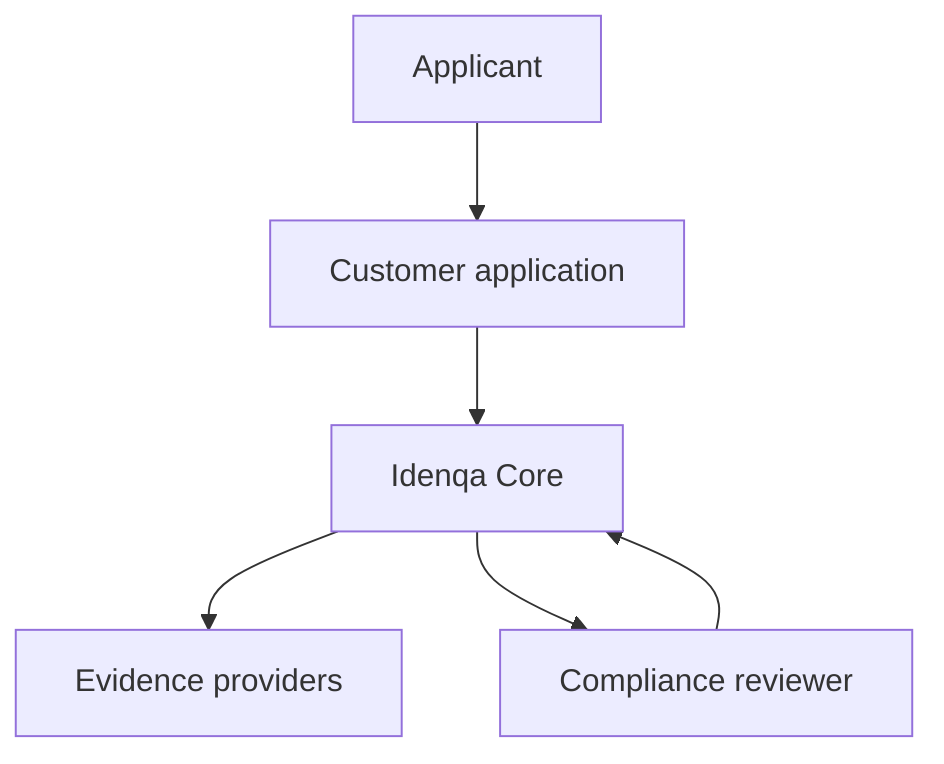

The customer application creates a verification and sends the applicant into a hosted or embedded capture journey. The platform collects permitted evidence, invokes authorised providers and models, evaluates policy, and returns a decision or manual-review requirement.

---

## 8. High-level architecture

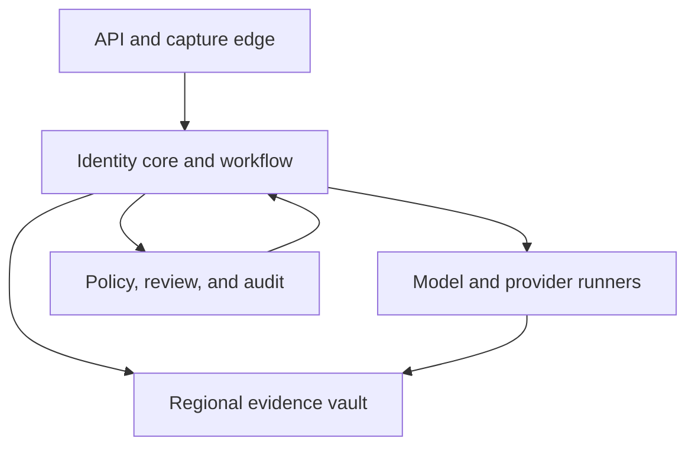

### 8.1 Logical components

| Component          | Responsibility                                                 | Raw PII access                   |
| ------------------ | -------------------------------------------------------------- | -------------------------------- |
| API Gateway        | Authentication, rate limiting, request validation, idempotency | No by default                    |
| Identity Core      | Subjects, verifications, state machines, checks, decisions     | Encrypted structured claims only |
| Workflow Engine    | Deterministic orchestration and timeouts                       | Signal references                |
| Policy Engine      | Access, routing, assurance, decision, and retention rules      | Normalised facts and signals     |
| Provider Gateway   | External provider communication                                | Minimum required for each check  |
| Adapter Runner     | Isolated provider adapter execution                            | Scoped, temporary                |
| Evidence Vault     | Encrypted documents, portraits, video, and payloads            | Yes                              |
| Biometric Runner   | Liveness, face detection, embedding, and comparison            | Temporary                        |
| Document Runner    | OCR, classification, quality, authenticity, and NFC processing | Temporary                        |
| AI Orchestrator    | Bounded route and action proposals                             | Redacted context by default      |
| Model Registry     | Models, versions, evaluations, thresholds, and rollout         | No raw production evidence       |
| Review Service     | Cases, assignments, reason codes, dual control, appeals        | Authorised, audited              |
| Audit Ledger       | Append-only security and domain events                         | Tokenised references             |
| Webhook Dispatcher | Signed event delivery and retries                              | Minimized event payloads         |
| Control Plane      | Tenant, billing, deployment, and configuration metadata        | No identity evidence             |

### 8.2 Recommended initial process boundaries

The first implementation should use these deployable processes:

- **core-api:** public and administrative APIs.
- **core-worker:** workflows, provider calls, policy evaluation, outbox, and webhooks.
- **evidence-service:** upload intents, encrypted asset metadata, retrieval grants, and deletion.
- **model-runner:** isolated document and biometric inference.
- **adapter-runner:** isolated provider adapters.
- **capture-web:** open-source basic hosted and embeddable subject capture experience, introduced with evidence collection.
- **operator-console:** separately deployed commercial dashboard for advanced operations and manual review; not required to build or operate the open core.

The core processes, public SDKs, and capture Web application share versioned contracts and originate from the public core repository. The operator console consumes only documented administrative APIs and events, lives in a private repository, and is not included in the open-source distribution.

---

## 9. Global deployment and data residency

### 9.1 Regional data-plane pattern

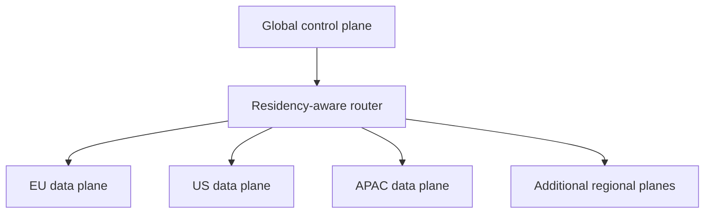

The control plane stores tenant configuration, deployment metadata, non-sensitive billing references, and region assignments. It must not store identity evidence, decrypted claims, portraits, embeddings, or provider payloads.

The control plane maintains a field-level data inventory. Configuration that reveals sensitive provider relationships, investigation state, subject activity, or regulated-sector information remains regional or is represented globally only through minimised opaque metadata.

Each regional data plane contains:

- Regional API and worker capacity
- Regional PostgreSQL
- Regional evidence object storage
- Regional key-management integration
- Regional provider credentials
- Regional model runners
- Regional logs and audit storage

### 9.2 Region selection

Region must be explicit. It may be selected by:

- Tenant configuration
- Workflow configuration
- Subject-declared country when policy permits
- Contractual routing rules

It must never be silently inferred from browser locale, device language, or IP address when that inference could create a legal or residency decision.

### 9.3 Cross-region behaviour

- Identity evidence remains in its assigned data plane.
- Cross-region metadata contains opaque references only.
- Cross-region provider calls require an explicit policy permit.
- Replication targets must satisfy the same residency rules.
- Backups inherit the source data classification and residency.
- Telemetry, support access, key operations, provider processing, and deletion workflows carry the same explicit region and transfer-policy context as domain commands.
- Failover is not automatic when it would move personal data or processing into a prohibited region. The system remains unavailable, uses a declared degraded mode, or fails over only to a pre-authorised in-region recovery environment.

---

## 10. Trust boundaries

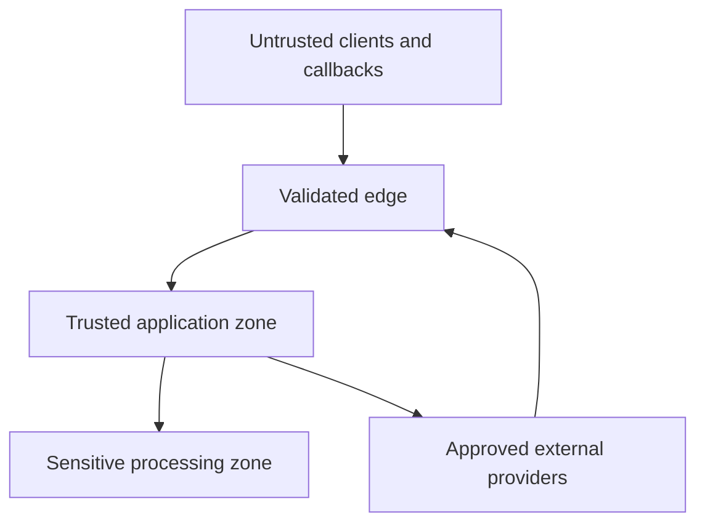

### 10.1 Boundary rules

- All client, webhook, provider, and model outputs are untrusted input.
- Every boundary uses authenticated channels and versioned schemas.
- Raw evidence never enters ordinary application logs or traces.
- The Evidence Vault is the only component that unwraps stored evidence data-encryption keys.
- Model and adapter runners receive only purpose-bound plaintext streams or derivatives through short-lived processing grants; they never receive tenant key-encryption keys or general evidence-read capability.
- Provider adapters receive capability-scoped credentials.
- AI orchestration cannot directly execute tools or access arbitrary networks.
- Review access uses just-in-time grants and produces an audit event.

---

## 11. Core domain model

### 11.1 Aggregate relationships

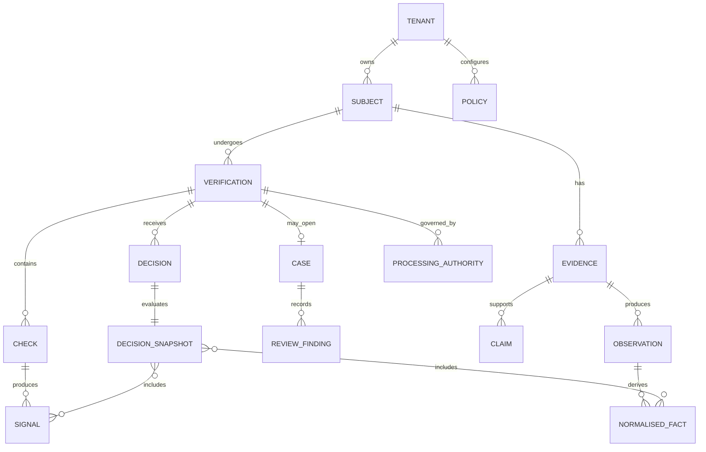

### 11.2 Primary entities

#### Tenant

- Stable ID
- Status
- Home region
- Allowed regions
- Encryption key reference
- Provider-account references
- Model and policy allow-lists
- Retention defaults
- Feature and assurance permissions

#### Subject

- Stable tenant-scoped ID
- External customer reference
- Encrypted structured claims
- Tenant-scoped identifier tokens
- Lifecycle status
- Created, updated, and deletion metadata

Subject IDs must not be globally linkable by default.

The subject's structured claims form a current tenant-scoped projection. That mutable projection is never used by reference to reproduce an earlier decision; decisions use immutable snapshots.

#### Identifier

- Type
- Issuing country or authority
- Encrypted raw value
- Tenant-scoped HMAC token
- Last four or masked display form
- Validity dates
- Provenance
- Verification state

Plain hashes are prohibited for predictable identifiers. Exact lookup uses a tenant-scoped keyed HMAC.

#### Claim

- Claim type
- Normalised encrypted value
- Original encrypted value when required
- Source
- Confidence
- Validity period
- Evidence references
- Supersession reference

Claims used for decisioning resolve to immutable observations and normalised facts. Correction creates a superseding record rather than modifying a value already used by a decision.

#### Observation

- Immutable value or result received from a person, document, provider, model, credential, deterministic parser, or reviewer
- Source and source class
- Evidence, check, attempt, or inference reference
- Collection and observation time
- Input version and transformation
- Validity and freshness
- Confidence and units where meaningful
- Supersession or correction reference
- Lineage group

#### Normalised fact

- Typed fact name and value
- Source observation references
- Normalisation and schema version
- Valid-from, valid-until, and freshness state
- Confidence and units where meaningful
- Correlation and lineage group
- Supersession reference

Several facts or signals derived from the same document, registry, portrait, device observation, upstream broker, or provider subcontractor are not independent merely because they have different IDs. Assurance evaluation uses lineage groups to prevent correlated transformations of one underlying source from being counted as independent corroboration.

#### Evidence

- Evidence ID
- Type
- Source class
- Provider
- Evidence-asset references
- Integrity digest
- Collection purpose
- Consent receipt
- Retention deadline
- Access classification
- Provenance chain

#### Verification

- Subject
- Workflow and policy versions
- Requested assurance
- State
- Region
- Capture-session and experience-configuration versions
- Checks
- Signals
- Current decision
- Case reference
- Expiry
- Idempotency and external references

#### Check

- Check type
- Provider or model
- Capability requirements
- Inputs by reference
- State
- Attempts
- Timeout
- Normalised output
- Error classification
- Cost and latency metadata

#### Signal

- Type
- Value
- Units or scale
- Confidence where meaningful
- Source class
- Provider or model version
- Input digests
- Creation time
- Expiry
- Evidence references

#### Decision

- Outcome: verified, not_verified, or inconclusive
- Assurance achieved
- Policy version
- Signal snapshot
- Reason codes
- Machine or human actor
- Review requirements
- Superseded decision
- Creation time

#### Decision snapshot

- Immutable claim, identifier, observation, fact, evidence, check, signal, and review-finding references
- Consent and processing-authority references
- Region and transfer-policy context
- Policy, assurance-profile, threshold-set, and evaluator versions and digests
- Provider, model, runtime, and preprocessing versions
- Evaluation time and canonical snapshot digest

A correction updates the subject projection through superseding facts. Reconsideration evaluates a new snapshot and appends a decision linked to the decision it supersedes. It never changes an earlier snapshot.

#### Case

- Reason
- Priority
- Assigned queue and reviewer
- Evidence grants
- Findings
- Notes
- Decisions
- Quality-control outcome
- Appeal reference

#### Review finding

- Case, reviewer, role, region, and delegated-authority references
- Finding type and policy-permitted reason code
- Evidence, fact, and signal references
- Requested follow-up or proposed resolution
- Dual-control or independent-review state
- Creation and supersession time

A review finding is immutable input to deterministic decision evaluation. It is not itself an identity decision.

#### Processing authority

- Tenant, subject, verification, controller, and processor references
- Declared processing purpose
- Declared authority or lawful-basis category
- Jurisdiction and policy-pack version
- Permitted claims, evidence, checks, providers, models, recipients, and regions
- Required notices and consent receipt where applicable
- Guardian or representative authority where applicable
- Valid-from, expiry, withdrawal, objection, restriction, and supersession state
- Retention and deletion consequences
- Creator, approver, and audit references

The platform records and enforces the authority declared by the customer. It does not infer, select, recommend, or guarantee the customer's lawful basis.

#### Consent receipt

- Subject
- Tenant
- Processing purpose
- Requested evidence
- Providers or provider classes disclosed
- Biometric processing notice
- Training permission, default false
- Policy and notice version
- Capture method
- Timestamp and revocation state

Consent is one possible processing authority rather than a synonym for all lawful processing. Refusal or withdrawal cannot become evidence that the subject failed verification. Withdrawal blocks future processing that depends on that consent but does not falsely promise deletion of records retained under another valid obligation.

#### Experience configuration

- Tenant, environment, and optional brand scope
- Stable configuration ID and immutable version
- Lifecycle state: draft, approved, published, superseded, or revoked
- Light and dark brand assets with content digests
- Semantic colour, typography, spacing, radius, and motion tokens
- Locale catalogue and structured copy overrides
- Required Idenqa, tenant, regulatory, consent, and accessibility disclosures
- Verified support links, privacy URL, terms URL, and optional custom domain
- Applicable workflows, countries, applications, and SDK-version range
- Creator, approver, publish time, rollback target, and audit references

Every capture session is pinned to one published experience-configuration version. Updating a tenant's branding never changes a journey already in progress or the evidence of what the person saw and accepted.

#### Reusable verification profile

- Cloud-internal profile ID
- Home region and permitted processing regions
- Passkey and approved recovery-method references
- Encrypted reusable-component references
- Status, risk state, and assurance ceiling
- User preferences and communication state
- Creation, last-use, suspension, and deletion metadata

The reusable profile is not a tenant subject. Its identifier is never disclosed to relying tenants and cannot be used as a public universal identifier.

#### Reusable component

- Component type, such as identity attributes, document validation, address, or applicant binding
- Selectively disclosable claims
- Issuer and source provenance
- Original evidence and verification digests
- Assurance dimensions achieved
- Issue, valid-from, refresh-by, and expiry times
- Status and revocation reference
- Jurisdiction, sector, provider, and licence restrictions
- Permitted disclosure classes

Components are immutable after issuance. Corrections or refreshes supersede them with new versions.

#### Reuse request

- Requesting tenant and recipient display identity
- Required claims, checks, assurance, and maximum ages
- Accepted issuers, providers, countries, and evidence types
- Processing purpose, lawful-basis declaration, notice, and retention statement
- Requested region and transfer constraints
- Callback, expiry, nonce, and replay state

#### Reuse grant

- Reusable profile and tenant-scoped subject mapping
- Reuse request
- Specifically authorised claims and components
- Consent and notice receipt
- Authentication and step-up method
- Recipient-bound audience and nonce
- Issue and expiry time
- Revocation and disclosure history

#### Reuse presentation

- Recipient-bound disclosed claims
- Component and provenance references
- Assurance and freshness metadata
- Cryptographic proof and issuer key reference
- Status or revocation checks
- Missing, stale, prohibited, and step-up-required components
- Resulting tenant verification reference

---

## 12. Verification lifecycle

### 12.1 Verification state machine

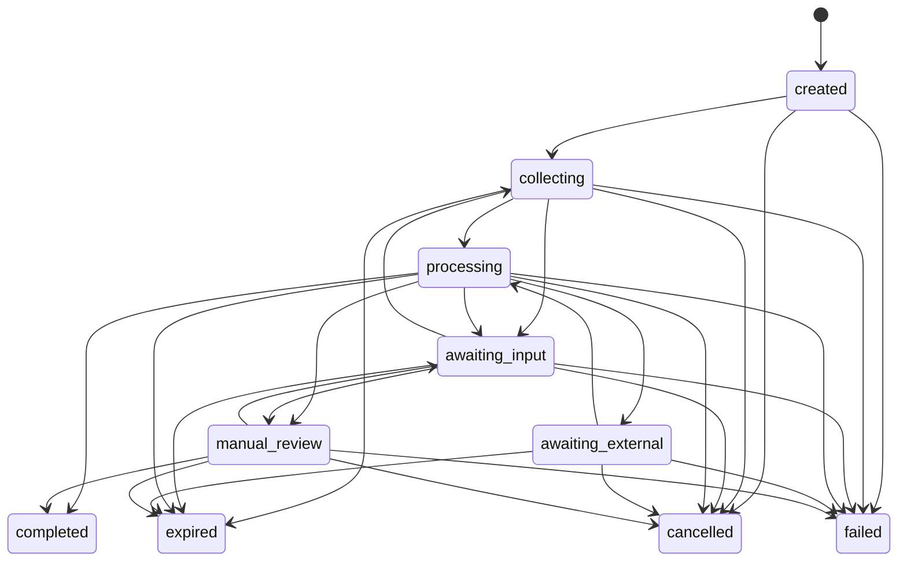

### 12.2 State requirements

- **created:** policy is resolved and the session has an immutable regional assignment.
- **collecting:** the subject may upload only evidence permitted by the active workflow.
- **awaiting_input:** additional subject input, acknowledgement, correction, or evidence is required.
- **processing:** deterministic checks, providers, and models are executing.
- **awaiting_external:** an asynchronous provider, authority, consent, or registry callback is pending.
- **manual_review:** automated policy cannot produce an authorised terminal decision.
- **completed:** an immutable `verified`, `not_verified`, or `inconclusive` identity decision has been appended.
- **cancelled:** customer or subject ended the session.
- **expired:** the configured completion window elapsed.
- **failed:** the workflow could not complete because of an internal, configuration, authorisation, residency, or unrecoverable external error. Failure is an operational state, not an identity outcome.

Terminal decisions are not mutated. Reconsideration appends a superseding decision or creates a new verification when fresh evidence is required.

Identity-proofing outcomes are distinct from workflow execution and customer business decisions:

- **verified:** the evidence satisfied the requested assurance profile.
- **not_verified:** sufficient evidence conclusively established that one or more requirements were not satisfied.
- **inconclusive:** the available evidence could not support either a verified or not-verified conclusion.

Provider or model unavailability, missing authority or consent, region conflicts, and invalid policy configuration must not produce `not_verified`. Idenqa reports identity-proofing results; the relying customer makes its separate account, employment, credit, eligibility, or other business decision.

### 12.3 Check states

Check execution states are:

- queued
- running
- awaiting_input
- awaiting_provider
- completed
- skipped_by_policy
- timed_out
- cancelled
- failed

A completed check result is:

- passed
- not_passed
- inconclusive

`failed` describes operational execution failure, not evidence about the subject. Timed-out, unavailable, prohibited, and failed executions never silently become `not_passed`. An inconclusive result never becomes passed or not-passed without explicit policy.

---

## 13. End-to-end verification flow

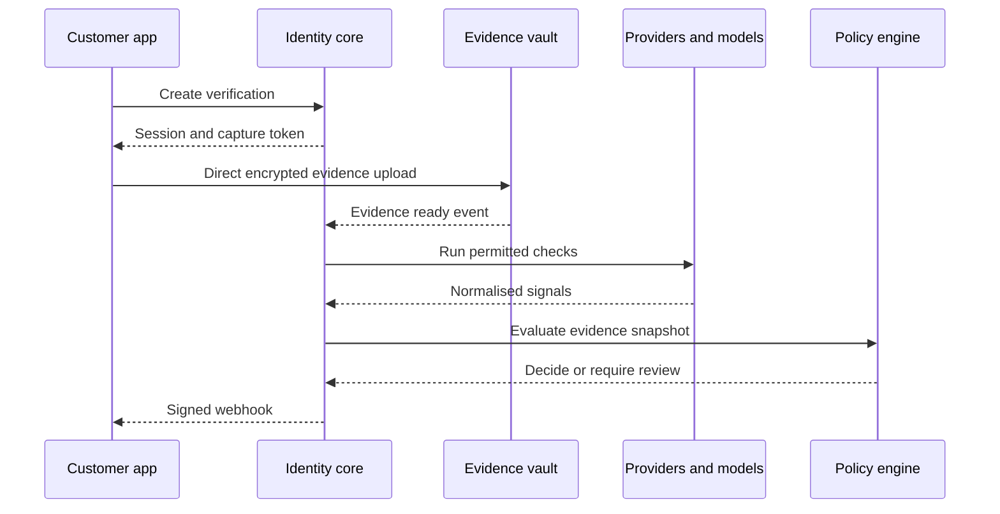

### 13.1 Required guarantees

- Creation and upload-intent requests are idempotent.
- Evidence is uploaded directly to the evidence boundary.
- Evidence collection and processing reference active purpose-compatible authority.
- Provider and model input is reference-based.
- Every signal identifies its provenance.
- Policy evaluates an immutable fact-and-signal snapshot with lineage and version digests.
- The webhook event references the authoritative API resource.
- Retries cannot produce duplicate external actions.
- Operational failure cannot be converted into a subject identity outcome.

---

## 14. Evidence model

### 14.1 Evidence classes

- Government document image
- NFC or chip payload
- Registry response
- Reference portrait
- Live selfie or video
- Address document
- Phone or email possession result
- Bank or financial identity result
- Digital credential or attestation
- Human attestation
- Provider-native verification result

### 14.2 Evidence provenance

Every item must record:

- Who or what collected it
- When and in which region it was collected
- The declared purpose
- Applicable consent or lawful-authority reference
- Transformations applied
- Original and derived asset digests
- Provider response signature or callback evidence
- Expiry and retention
- Every access event

### 14.3 Asset ingestion

Accepted provider representations may include:

- Signed URL
- Base64
- Multipart binary
- Provider object reference
- Embedded structured payload

Adapters normalise these into an internal evidence asset. Base64 is not used for normal client uploads because it increases payload size and creates logging risk.

Provider URL ingestion must:

- Permit only adapter-declared hosts
- Resolve and connect through an SSRF-resistant fetcher
- Reject private, loopback, link-local, and metadata-service addresses
- Enforce type and size limits
- Verify declared and detected content type
- Record the source and integrity digest
- Avoid redirects outside the allow-list

### 14.4 Evidence minimisation

- Store match results rather than full registry records when sufficient.
- Retain portraits and document images only as long as the active policy requires.
- Redact evidence presented to reviewers when fields are irrelevant.
- Separate immutable proof of processing from the personal content being processed.

### 14.5 Integrity digests and correlation

Evidence integrity digests are restricted internal data because identical digests can enable cross-tenant or cross-system correlation. They are not exposed as public resource identifiers. Lookup, reuse detection, or deduplication across a tenant boundary requires a separately authorised keyed-token scheme and explicit policy. Global public-content deduplication is prohibited for identity evidence.

---

## 15. Assurance model

Assurance expresses how strongly the platform has established that:

1. The claimed identity exists.
2. The evidence is valid and authoritative.
3. The applicant is bound to that evidence.
4. Relevant fraud controls have succeeded.

### 15.1 Assurance dimensions

| Dimension           | Example strengths                                                      |
| ------------------- | ---------------------------------------------------------------------- |
| Identity resolution | weak, moderate, strong                                                 |
| Evidence validation | self-asserted, corroborated, authoritative, cryptographically verified |
| Applicant binding   | none, possession, supervised, biometric with PAD                       |
| Source independence | single, correlated, independent                                        |
| Fraud resistance    | basic, enhanced, high                                                  |
| Human oversight     | none, review, dual control                                             |

### 15.2 Assurance profiles

The core uses platform-defined assurance dimensions. An assurance profile is a typed set of requirements, not a universal scalar rank. Each declared dimension and evidence constraint must be satisfied independently; labels such as `strong`, `authoritative`, or `enhanced` are not assumed equivalent across evidence classes, jurisdictions, sectors, or customer policies.

Jurisdiction packs may map profiles to frameworks such as NIST Identity Assurance Levels, eID schemes, or sector-specific customer classifications. A mapping is a versioned record containing the source framework, target profile, jurisdiction and use case, evidence constraints, rationale, known gaps, approver, and review date.

An assurance profile is versioned and immutable after use.

```yaml
name: global-individual-substantial
version: 1

requires:
  identity_resolution: moderate
  evidence_validation: authoritative
  applicant_binding: biometric_with_pad
  fraud_resistance: enhanced

on_inconclusive:
  action: manual_review
```

---

## 16. Provider abstraction

### 16.1 Provider categories

- Authoritative registry
- Document verification
- Biometric verification
- Liveness or PAD
- Device intelligence
- Phone and email verification
- Address verification
- AML, sanctions, and PEP
- Reusable credential verifier
- Human or video verification

### 16.2 Capability contract

```go
type ProviderCapabilities struct {
    Countries               []string
    IdentifierTypes         []string
    DocumentTypes           []string
    RegistryValidation      bool
    Attributes              []string
    ReferencePortrait       bool
    ProviderFaceMatch       bool
    Liveness                bool
    AsyncCallbacks          bool
    DataRegions             []string
    ExternalImageProcessing bool
}

type Provider interface {
    Manifest(context.Context) (ProviderManifest, error)
    Start(context.Context, ProviderRequest) (ProviderAttempt, error)
    Poll(context.Context, ProviderAttemptRef) (ProviderResult, error)
    HandleCallback(context.Context, SignedCallback) (ProviderResult, error)
}

type ProviderConfigValidator interface {
    ValidateConfiguration(context.Context, ProviderConfigRef) error
}

type ProviderCanceller interface {
    Cancel(context.Context, ProviderAttemptRef) error
}

type ProviderReconciler interface {
    Reconcile(context.Context, ProviderAttemptRef) (ProviderResult, error)
}

type ProviderEvidenceDeleter interface {
    DeleteProviderEvidence(context.Context, ProviderAttemptRef) (DeletionReceipt, error)
}
```

Configuration validation, cancellation, reconciliation, provider-side deletion, cost estimation, and health are optional typed capabilities. Unsupported capabilities are declared by the signed manifest rather than inferred from arbitrary runtime errors.

### 16.3 Provider manifest

A provider pack declares:

- Adapter version
- Countries and evidence types
- Required subject attributes
- Returned claims and assets
- Synchronous or asynchronous behaviour
- Authentication mechanism
- Data residency
- Provider-side retention
- Whether portraits may be exported
- Whether external biometric processing is permitted
- Contract and account mode
- Cost units
- Rate limits
- Timeouts
- Error mappings
- Webhook verification
- Conformance-test version

### 16.4 Credential modes

- Tenant-owned credentials
- Platform-managed credentials
- Customer-brokered credentials
- Development sandbox credentials

Credentials are references to a secrets manager and never stored in adapter configuration or ordinary database fields.

### 16.5 Routing

Deterministic routing can use:

- Explicit provider
- Country and capability
- Tenant priority order
- Residency
- Cost ceiling
- Health and circuit state

AI-assisted routing may propose a provider based on predicted conversion, latency, and cost. Deterministic policy must approve the proposal.

### 16.6 Adapter isolation

Third-party adapters run out of process with:

- Signed manifests
- Minimal network allow-lists
- Capability-scoped secrets
- CPU, memory, and time limits
- Read-only package filesystem
- No direct database access
- Versioned input and output schemas
- Conformance and security tests

### 16.7 Attempt pinning

Every provider attempt pins:

- Adapter ID, version, package digest, and contract version
- Provider account and credential-reference version
- Capability and restriction snapshot
- Provider endpoint and processing region
- Input references and evidence-processing grant
- Stable platform attempt ID and provider idempotency key
- Timeout, retry, polling, callback, and reconciliation policy
- Cost ceiling and observed cost units

A later manifest, account, or routing change does not retroactively change an existing attempt.

### 16.8 Callback and reconciliation

- Callback authenticity is verified before lookup can affect domain state.
- Provider references map through tenant-scoped attempt records.
- Callback and polling responses use the same normalisation and idempotency path.
- Late results cannot overwrite a newer terminal attempt or decision.
- Unknown, duplicated, conflicting, or out-of-order results are retained as protected diagnostics and reconciled explicitly.

The selected initial execution task is `verification.execute` payload version 1. It contains only the tenant-scoped check and attempt identifiers; queue metadata supplies task identity, tenant partition, timing, retry, trace, and idempotency controls. It has five attempts, one-second initial and 30-second maximum backoff, deterministic 20% jitter, a deadline equal to the durable attempt deadline capped at ten minutes after scheduling, and 30-day successful queue-metadata retention. External provider or model work finishes before PostgreSQL is opened. The bounded result is then applied with exact-result inbox deduplication and Headgate's current-lease `CompleteTx` in the same transaction as attempt history, observations, reconciliation, and safe outbox intent. The domain attempt fence records immutable attempt provenance; the Headgate fence prevents a superseded task lease from committing.

The selected reconciliation task is `verification.reconcile` payload version 1 on the maintenance queue. It carries only the check and attempt identifiers, has eight attempts, 30-second initial and 15-minute maximum backoff, deterministic 20% jitter, a 24-hour deadline, and 30-day successful queue-metadata retention. Reconciliation scheduling performs one startup sweep and then runs every minute, with batches of 100, two-minute item leases, and one installation-wide Headgate duty lease. These scheduling controls are validated deployment configuration. Narrow, explicitly granted `SECURITY DEFINER` functions reveal only routing identifiers across forced tenant RLS; all consequential reads and writes re-enter tenant scope. PostgreSQL notification wake-ups carry only a tenant routing hint and are latency hints, while a one-second durable poll preserves correctness. Progress projection atomically turns `verification.check.progress.v1` outbox intents into durable `verification.check.progress` replay events and marks their sources published. Capture clients receive only check ID, operational state, and check version, acknowledge by durable cursor, and recover authoritative state through REST snapshots; outcome, signals, reason codes, provider data, and evidence are excluded.

### 16.9 Stable provider errors

Adapters map provider failures to stable classes including invalid input, unsupported capability, authentication or authorisation failure, rate limit, temporary or permanent unavailability, provider rejection, inconclusive result, invalid callback, contract or region prohibition, and unknown provider error. A provider-declared no-record or non-match response is a normalised evidence result rather than a transport error when the capability contract defines it that way.

The error class controls retry and workflow behaviour. Free-form provider text never controls policy. Provider-specific extensions are namespaced and versioned; a workflow that requires one cannot be silently routed to a provider that lacks it.

### 16.10 Initial Pan-African provider and adopter pack

D-014 selects mobile-first regulated African fintechs onboarding adult individuals as the first adopter segment. Version one starts with Nigeria, Ghana, Kenya, and South Africa in English. This is a bounded launch pack, not a claim of continent-wide or permanent provider coverage.

Smile ID and Dojah are the first real adapters. Both run out of process through the public provider-runner contract, consume tenant-owned credential references, declare exact sandbox or production account mode, and pin their country, product, region, retention, callback, deletion, and result restrictions. Neither is hard-coded as the primary provider. A tenant may select either, and deterministic policy may use the other only when it exposes equivalent semantics and the active processing authority permits that provider, recipient, region, and purpose. Registry lookup, document verification, and biometric verification are distinct capabilities; fallback cannot silently replace one with another.

Provider contract v1.1 carries structured subject values only as bounded, uniquely named opaque input references declared by the pinned capability. An input-only authority lookup needs no dummy evidence grant, and a request declaring contract v1.0 cannot carry the additive field. The isolated runner resolves each value for one purpose-bound attempt; values do not enter the public request envelope, task payload, logs, traces, audit payloads, or manifests. This is additive within provider contract major version 1 and is carried by the Protobuf runner transport without exposing provider-native types.

The shared acquisition baseline is live selfie, liveness or presentation-attack detection, one-to-one face comparison, national identity document, passport and driving-licence capture, document front/back handling, capture-quality checks, and MRZ or barcode parsing where the exact pack and provider declare support. The initial authority-backed identifiers are:

| Country | Authority-backed v1 identifiers | Initial image-document pack |
| --- | --- | --- |
| Nigeria | NIN/VNIN; BVN only for an explicitly banking-compatible tenant profile | NIN slip or national ID, passport, driving licence |
| Ghana | Ghana Card | Ghana Card, passport, driving licence |
| Kenya | National ID or passport | National ID, passport, driving licence |
| South Africa | National ID | National ID or green book, passport, driving licence |

Every item still requires a tested immutable pack revision. A provider's broader catalogue is not automatically supported by Idenqa. Resident, refugee, alien, voter, tax, phone, bank-account, or other identifiers remain `provider_only` or unsupported until explicitly packed and tested. NFC, voice, KYB, AML, address verification, non-English localisation, and additional countries are deferred. Production enablement separately requires provider agreements, tenant credentials, data-residency and cross-border review, processing-authority compatibility, representative test evidence, and deletion/reconciliation validation.

---

## 17. Model abstraction

Predictive and generative models are replaceable components that emit normalised signals or proposals.

```go
type ModelCapabilities struct {
    Tasks          []string
    InputTypes     []string
    OutputSchemas  []string
    Regions        []string
    RequiresGPU    bool
    Deterministic  bool
}

type SignalModel interface {
    Manifest(context.Context) (ModelManifest, error)
    Infer(context.Context, InferenceRequest) (SignalSet, error)
}

type ProposalModel interface {
    Manifest(context.Context) (ModelManifest, error)
    Propose(context.Context, ProposalRequest) (AgentProposal, error)
}
```

Models may be:

- Built-in and locally hosted
- Customer supplied
- Commercial on-premise
- Managed regional
- External API based when policy permits

Model outputs never receive implicit authority because of their source.

Every inference pins the model digest, runtime image, preprocessing pipeline, configuration, threshold set, hardware or runtime class where relevant, and output schema. Cancellation, timeout, resource limits, cache retention, and result reconciliation are part of the model-runner contract.

---

## 18. AI architecture

The platform distinguishes deterministic computation, predictive ML, and non-deterministic AI. These are separate contracts with different authority.

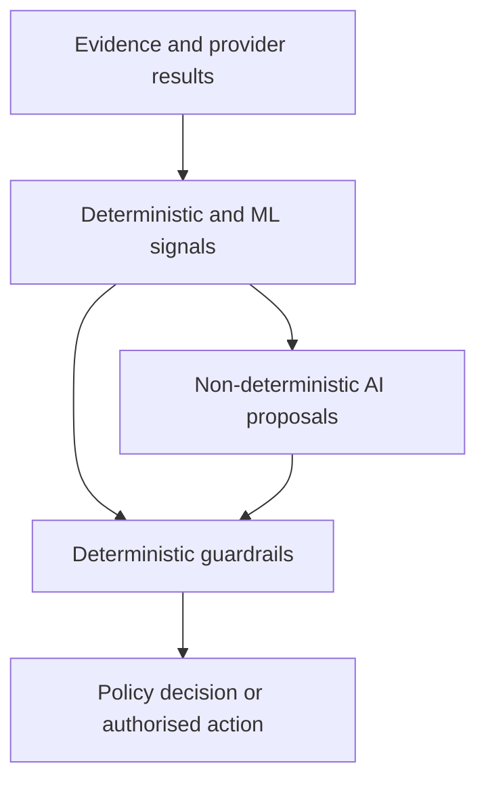

### 18.1 Deterministic layer

The following are deterministic:

- Schema validation
- Identifier format and checksum validation
- MRZ checksum validation
- Cryptographic chip and credential verification
- Exact authoritative-provider responses
- Consent enforcement
- Region and transfer restrictions
- Retention and deletion
- Provider and model allow-lists
- Threshold comparison
- Policy evaluation
- Access authorisation
- Final event creation

### 18.2 Predictive ML layer

Predictive models may produce:

- OCR field candidates
- Document-type classification
- Document-quality scores
- Tamper and manipulation risk
- Face detection and quality
- Face similarity
- Liveness and presentation-attack risk
- Deepfake and injection risk
- Name and address similarity
- Duplicate-identity likelihood
- Device and behaviour risk
- Synthetic-identity likelihood
- Fraud-graph relationships

Outputs are scored signals, not decisions.

### 18.3 Non-deterministic AI layer

Non-deterministic AI may:

- Propose the next verification step
- Recommend an alternative provider
- Interpret unfamiliar document layouts
- Explain ambiguous name or address differences
- Summarise a review case
- Develop fraud-investigation hypotheses
- Generate a policy draft from natural language
- Propose exception and accessibility paths
- Generate adversarial test scenarios
- Produce customer-facing capture guidance

It may not independently:

- Verify or reject a subject
- Grant raw-evidence access
- Change an active policy
- Select a lawful basis
- Override consent
- Delete or export evidence
- Change retention
- Transfer evidence across regions
- Confirm a sanctions match
- Change biometric thresholds

### 18.4 Agent proposal contract

```go
type AgentProposal struct {
    ProposalID     string
    Action         string
    Arguments      map[string]any
    Reason         string
    EvidenceRefs   []string
    SignalRefs     []string
    ModelID        string
    ModelVersion   string
    PromptVersion  string
    ContextDigest  string
    CreatedAt      time.Time
}
```

An agent proposal is accepted only after:

1. Output schema validation
2. Evidence-reference validation
3. Tool and action allow-list validation
4. Tenant-policy validation
5. Jurisdiction and residency validation
6. Cost and rate-limit validation
7. Human approval when required

The executor records the accepted proposal and executes a deterministic command. Replay uses the stored accepted command rather than asking the model to recreate it.

### 18.5 Automation modes

Each workflow declares an AI authority level:

- **disabled:** no non-deterministic AI
- **assist:** summarisation and explanation only
- **recommend:** proposals require deterministic or human approval
- **guardrailed_auto:** allow-listed proposals may execute after deterministic approval
- **human_required:** AI assists but a human must decide

### 18.6 Natural-language policy compiler

The compiler produces an inactive policy draft. Before activation it must:

- Pass the policy schema
- Pass static safety analysis
- Produce a human-readable diff
- Run against tenant test cases
- Run against platform adversarial fixtures
- Identify changed cost and evidence requirements
- Receive explicit approval

### 18.7 AI data access

- Generative models receive redacted structured evidence by default.
- Raw biometrics are not sent to a general-purpose external model.
- Multimodal processing of raw evidence requires an approved model, region, purpose, and retention policy.
- Prompts and responses containing sensitive data inherit evidence classification.
- Customer data is excluded from training unless separately and explicitly authorised.

---

## 19. Biometric subsystem

### 19.1 Scope

The initial biometric subsystem supports one-to-one applicant binding:

- Applicant live capture
- Presentation-attack detection
- Face quality assessment
- Face detection and alignment
- Embedding creation
- Reference portrait preparation
- Similarity measurement
- Threshold evaluation

One-to-many identification is not enabled by default and is outside version-one scope.

### 19.2 Biometric flow

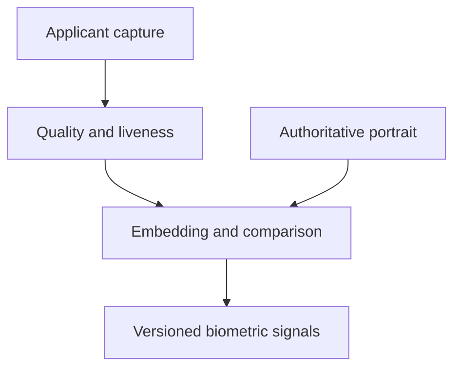

### 19.3 Required signal separation

Face similarity and liveness are independent:

- A high face-similarity score does not prove the capture is live.
- A strong liveness result does not establish that the applicant matches the reference identity.
- Low image quality produces an inconclusive outcome rather than an automatic rejection.

### 19.4 Biometric result

```json
{
  "signal": "biometric.face_match",
  "result": "passed",
  "score": 0.8731,
  "threshold": 0.742,
  "model_id": "face-verification",
  "model_version": "1.3.0",
  "capture_asset_digest": "sha256:...",
  "reference_asset_digest": "sha256:...",
  "liveness_signal_ref": "sig_live_...",
  "evaluated_at": "2026-08-26T17:00:00Z"
}
```

### 19.5 Model metrics

Model evaluation records:

- False match rate
- False non-match rate
- Failure to acquire
- Failure to enrol
- Threshold-specific performance
- Demographic performance
- Image-quality sensitivity
- Presentation-attack APCER
- Presentation-attack BPCER
- Device and camera-class performance

Thresholds are selected per assurance profile and use case. A single global threshold is prohibited unless evaluation justifies it.

### 19.6 Capture-security controls

- Detect screenshots, replays, and virtual-camera injection where technically possible.
- Bind capture sessions to short-lived signed tokens.
- Include server challenges in active capture modes.
- Record SDK, model, device, and capture-protocol versions.
- Reject replays of completed capture tokens.
- Treat rooted, jailbroken, emulated, or instrumented devices as signals rather than universal rejection unless policy requires it.

### 19.7 Biometric storage

- Raw capture, reference portrait, and embedding have independent retention.
- Embeddings are treated as sensitive biometric material.
- Cross-tenant comparison is disabled.
- Reuse across customer applications requires explicit policy and subject notice.
- Deletion includes derived embeddings and model caches.

---

## 20. Document subsystem

### 20.1 Capabilities

- Automatic document capture
- Front and back handling
- Document-type and issuing-country classification
- Quality, glare, blur, crop, obstruction, and resolution checks
- OCR and structured field extraction
- MRZ parsing and checksums
- Barcode parsing
- NFC or chip reading through supported SDKs
- Document-expiry and age calculation
- Field consistency
- Template and security-feature inspection
- Manipulation and screenshot risk
- Portrait extraction

### 20.2 Global support model

Global support is capability-driven rather than marketing-driven. Every document pack declares:

- Country
- Authority
- Document type
- Known versions and validity dates
- Required sides
- Supported fields
- Security checks
- Barcode, MRZ, and NFC support
- Model and parser versions
- Evaluation coverage
- Known limitations

The API returns support level:

- fully_supported
- structurally_supported
- provider_only
- best_effort
- unsupported

### 20.3 Unknown documents

A vision-language model may propose a document class and field regions for an unfamiliar document. Those results are provisional until validated through:

- Deterministic format rules
- Cryptographic evidence
- Authoritative provider response
- Supported-template comparison
- Human review

### 20.4 NFC and digital credentials

Cryptographically signed evidence should receive greater evidence strength than image-only evidence when trust-chain validation succeeds. Trust stores, issuer certificates, revocation, and verification time must be recorded.

---

## 21. Fraud and risk subsystem

### 21.1 Initial signals

- Device reuse
- Identifier reuse
- Portrait reuse within a tenant
- Document reuse
- Capture replay
- Verification velocity
- IP and network anomalies
- Provider inconsistency
- Identity-attribute inconsistency
- Unusual session timing
- Repeated failed liveness
- High-risk model findings

### 21.2 Tenant isolation

Fraud analysis is tenant-isolated by default. Cross-tenant network intelligence requires:

- A separate product and data-sharing contract
- Documented lawful basis
- Strong pseudonymisation
- Explicit tenant participation
- Purpose limitation
- Regional compliance review
- Controlled false-positive handling

### 21.3 Fraud graph

The graph stores tokenised nodes and evidence-backed relationships:

- Subject token
- Device token
- Identifier token
- Document digest token
- Portrait-template token when legally permitted
- Address token
- Provider event

AI may develop hypotheses from the graph, but graph evidence and deterministic policy control any action.

---

## 22. Workflow and policy engine

### 22.1 Policy classes

- Collection policy
- Verification policy
- Routing policy
- Assurance policy
- AI authority policy
- Manual-review policy
- Access policy
- Retention policy
- Data-residency policy
- Notification policy

### 22.2 Policy requirements

Policies are:

- Declarative
- Typed
- Versioned
- Immutable after activation
- Schema validated
- Deterministically evaluated
- Testable before activation
- Explainable to operators

Arbitrary remote code is prohibited in policy definitions.

### 22.3 Formal evaluation contract

Policy evaluation is a pure deterministic function:

```text
evaluation_result = evaluate(
    canonical_policy,
    immutable_fact_snapshot,
    evaluation_time,
    evaluator_version
)
```

It does not call providers, models, storage, networks, or clocks during evaluation. Workflow orchestration gathers facts and performs approved effects; policy evaluation determines what the current facts permit or require.

The initial evaluator is **Selected** as `github.com/google/cel-go` v0.31.0 behind Idenqa-owned contracts. Public policy v1 identity is bounded canonical JSON rather than CEL's AST or protobuf representation. Each uniquely named rule contains one boolean CEL condition and one explicit Idenqa result. CEL receives only `facts: map<string,string>` and `region: string`; every statically indexed fact must exactly match declared contributing-fact provenance. Macros, comprehensions, functions, receiver calls, dynamic indexing, field selection, construction, arithmetic, conditionals, native structs, clocks and I/O are excluded. Parser, AST-depth, node-count and runtime-cost limits fail closed. YAML examples in this document are illustrative authoring notation, not v1 canonical policy identity.

Durable policy revisions are registered only after the canonical public document compiles successfully. Revisions are immutable and retain their exact canonical bytes, digest, schema version, evaluator identity and explicit UTC registration time. Each tenant and policy has a separate active pointer with a monotonic activation version. A switch requires the caller's expected version, advances it by exactly one and atomically appends the previous revision, selected revision, actor and activation time. PostgreSQL foreign keys, forced tenant row-level security and append-only triggers defend this lineage. Selecting an older registered revision uses the same primitive; rollback authorisation, approval, step-up authentication and dual-control requirements belong to the administration layer rather than the storage primitive.

Decision input loading first obtains one atomic reference-only authoritative projection containing the selected policy ID, authority and subject-response receipts, explicit region and bounded normalised facts, then resolves the active immutable revision for that policy. The snapshot pins that reference before evaluation. The CEL adapter subsequently resolves the exact pinned revision rather than consulting the active pointer again, so a concurrent activation cannot change the decision's meaning. Compiled evaluators use an explicit-capacity, tenant-complete bounded LRU with cold-key deduplication and cancellation-aware waiters; failures are not cached and the resolver starts no goroutines.

The API process assigns its validated deployment region and accepts the tenant-selected policy identifier when it creates a verification session. Both are part of creation idempotency and the immutable durable session snapshot; capture requests cannot choose or later change them. Upgraded legacy rows without trustworthy historical placement or policy assignment remain unassigned and fail closed for policy input. The PostgreSQL authoritative source forces tenant scope and loads the pinned policy, time-valid active authority, latest subject response and exact terminal check state in one read-only repeatable-read transaction. Each validated namespaced normalised signal maps directly to the same public fact key, with `satisfied`, `not_satisfied`, and `inconclusive` preserved one-to-one. `unavailable` and `prohibited` are derived only from authoritative workflow or authority state, never guessed from a signal. Duplicate keys fail closed. The source exposes only bounded owned records and exact provenance; it never reads raw evidence or provider payloads.

The durable authoring boundary is `policy.author` v1 on the verification queue. Its tenant-partitioned, decision-idempotent payload pins only the decision, verification and optional predecessor identifiers plus exact UTC evaluation and decision times; authoritative facts and policy meaning are reloaded from PostgreSQL and raw evidence never enters the task payload. The production trigger creates the versioned intent after capture completion when every required verification check is terminal. Rediscovery uses a stable decision identity and readiness time, so at-least-once scheduling remains an exact idempotent replay. A transactional handler performs authoritative loading and deterministic evaluation before opening the effect transaction. It then rechecks exact replay, appends the immutable decision and rereads its canonical meaning inside Headgate's fence-verified `job.Once` transaction, so a lost completion fence rolls the decision effect back. Existing exact decisions bypass evaluation, concurrent exact creation is reproducible, semantic poison quarantines, and retryable failures remain bounded.

Policy simulation is an effect-free path over supplied synthetic inputs, not a production-state preview. It accepts one byte-exact canonical policy document and explicit reference-only tenant, verification, authority, subject-response, region, fact and evaluation-time values. The document compiles under the selected evaluator without registration or activation, then uses the same immutable snapshot, owned evaluator output and deterministic resolution contracts as production. Simulation may return terminal or non-terminal directives but never creates a decision, changes workflow state or contacts a repository, provider, model, network, filesystem or clock. A separately versioned bounded bundle carries canonical policy, snapshot and evaluation meaning with nested and envelope digests; offline restoration re-enters owned snapshot and evaluation validation without CEL or PostgreSQL. Its safe report omits facts, source references, reason codes, expressions and canonical input bytes. The internal simulator and bundle are implemented, while the future public policy-testkit module location and conformance API remain unresolved.

The internal scenario-suite foundation layers bounded named examples over that simulator without changing its authority. At most 256 unique scenarios run sequentially in canonical name order. Expected requirement results are resolved against each synthetic snapshot through the same owned production resolver, so an expectation cannot invent a second directive-precedence model. Mismatches remain safe report data and are all retained; malformed meaning, cancellation and execution failures fail the run. Each actual result remains available as a self-checking simulation bundle, while the order-independent suite report contains only safe simulation summaries and exact actual/expected evaluation digests. It excludes facts, provenance, expressions, requirement details, reasons and canonical policy bytes. This does not select the future public policy-testkit package or conformance API.

Read-only catalog inspection is a separate internal application seam, not policy administration. Revision pages contain exact policy and evaluator identity plus registration time; activation-history pages additionally contain the monotonic version, selected and previous revision, actor and activation time. Both are metadata-only, newest first, bounded to 100 returned items and use exclusive numeric boundaries internally. PostgreSQL forces tenant scope in read-only transactions, does not select canonical policy bytes, and validates durable identity, versions, timestamps and strict ordering before returning. Cross-tenant reads produce empty pages. Public cursor encoding, authorisation scopes, HTTP or CLI presentation, activation approval, rollback treatment and Console behaviour remain unresolved.

Every requirement evaluates to exactly one of:

- `satisfied`
- `not_satisfied`
- `inconclusive`
- `unavailable`
- `prohibited`

`not_satisfied` means sufficient evidence conclusively failed the requirement. `inconclusive` means evidence is ambiguous or insufficient. `unavailable` means an authorised source could not return a result. `prohibited` means authority, consent, residency, contract, or policy forbids the operation. These states are never silently converted into one another.

A policy emits typed workflow directives rather than executing effects:

- `complete_verified`
- `complete_not_verified`
- `complete_inconclusive`
- `request_input`
- `run_check`
- `retry_check`
- `use_fallback`
- `route_manual_review`
- `fail_workflow`

The policy implementation defines a typed abstract syntax tree independent of YAML or JSON, canonical serialisation and content digests, explicit units and time semantics, bounded expression and workflow-graph complexity, cycle detection, step and retry budgets, provider-call and cost ceilings, deterministic precedence, conflict reporting, and compatibility rules for policy-schema and evaluator versions.

Static analysis verifies that every reachable state has a terminal, input, retry, fallback, or review route. Policies have no arbitrary code, network access, filesystem access, dynamic imports, or unbounded evaluation.

Every decision records its policy digest, evaluator version, fact-snapshot digest, evaluation time, requirement results, directives considered and selected, reason codes, threshold versions, and contributing provider, model, runtime, and preprocessing versions. Reproduction uses the stored snapshot; it does not contact providers or rerun non-deterministic models.

### 22.4 Example verification policy

```yaml
apiVersion: identitycore.dev/v1
kind: VerificationPolicy
metadata:
  name: individual-standard
  version: 3

spec:
  assuranceProfile: global-individual-substantial@1
  region: tenant_home

  collect:
    - government_document
    - live_face_capture

  checks:
    registry:
      capability: authoritative_identity
      provider: auto
      requiredClaims:
        - legal_name
        - date_of_birth
      referencePortrait: preferred

    document:
      authenticity: required
      expiry: required

    biometric:
      liveness: required
      faceMatch: required

  ai:
    mode: recommend
    permittedActions:
      - choose_provider
      - request_alternative_evidence
      - route_manual_review

  on:
    conclusive_requirement_failure: complete_not_verified
    inconclusive_evidence: route_manual_review
    provider_unavailable: use_policy_approved_fallback
    missing_consent: request_input
    prohibited_processing: fail_workflow
    invalid_policy_configuration: fail_workflow
    region_conflict: fail_workflow

  retention:
    rawCapture: 24h
    documentImages: 30d
    decisionRecord: 5y
```

### 22.5 Evaluation output

```json
{
  "policy": "individual-standard@3",
  "directive": "route_manual_review",
  "decision_outcome": null,
  "assurance_achieved": "moderate",
  "requirements": [
    { "name": "registry_validation", "state": "satisfied" },
    { "name": "document_authenticity", "state": "satisfied" },
    { "name": "liveness", "state": "satisfied" },
    { "name": "face_match", "state": "inconclusive" }
  ],
  "reason_codes": ["FACE_MATCH_INCONCLUSIVE"]
}
```

### 22.6 Simulation

Before activation, customers can execute a policy against:

- Synthetic test subjects
- Recorded redacted signal fixtures
- Provider failure fixtures
- Accessibility cases
- Adversarial cases
- Previous tenant decisions where permitted

Simulation never invokes billable providers unless explicitly requested.

---

## 23. Manual review and appeals

### 23.1 Review queues

Queues can be partitioned by:

- Tenant
- Region
- Reason
- Assurance profile
- Risk level
- Language
- Required reviewer certification

### 23.2 Reviewer controls

- Least-privilege roles
- Just-in-time evidence grants
- Field and image redaction
- Watermarked evidence display
- Screenshot deterrence where supported
- Session timeout
- Mandatory reason codes
- Notes with evidence references
- Dual approval for selected policies
- Review quality sampling

A manual-review policy also declares the permitted findings and reason codes, follow-up requests, maximum review duration, escalation route, which outcomes one reviewer may authorise, and when dual control or an independent reviewer is required.

A reviewer supplies an immutable finding and selects from policy-permitted resolutions. The reviewer does not directly mutate a verification into `verified` or `not_verified`. The decision service validates the reviewer's authority, combines the finding with the pinned evidence snapshot and policy, and appends the resulting decision.

Reviewers cannot bypass processing authority, consent, residency, tenant isolation, evidence integrity, or prohibited-processing controls. Policy activators cannot approve affected exceptional cases alone when dual control applies; reviewers cannot approve their own access escalation; and platform support requires a time-bound delegated tenant grant to act as a reviewer.

### 23.3 Review copilot

The copilot may:

- Summarise evidence
- Highlight conflicts
- Identify relevant policy requirements
- Link each statement to evidence or signals
- Suggest follow-up checks
- Draft a reason code and explanation

The reviewer must be able to see the underlying referenced evidence. Unsupported statements are visibly marked and cannot become decision reasons.

AI summaries and recommendations are not review findings. A human explicitly adopts an allowed finding with a reason and evidence reference before it can influence a decision.

### 23.4 Correction and appeal

The platform supports:

- Subject correction requests
- New evidence submission
- Decision reconsideration
- Independent reviewer assignment
- Appeal deadline
- Superseding decisions
- Customer-facing reason categories

An appeal or reconsideration follows `requested -> eligibility_check -> awaiting_correction | awaiting_new_evidence | independent_review -> resolved | withdrawn | expired`. It records the decision challenged, permitted grounds, deadline, actor, evidence additions, correction references, assigned reviewer, findings, and resolution.

New evidence may require a new verification rather than mutation of the original. A resulting decision links to, but does not erase, the challenged decision. When policy requires independence, the reviewer responsible for the challenged decision cannot resolve the appeal.

Rejection reasons must be safe to disclose without revealing fraud-detection details that would enable attacks.

---

## 24. Security architecture

### 24.1 Data classification

| Class                | Examples                                           | Default controls                              |
| -------------------- | -------------------------------------------------- | --------------------------------------------- |
| Restricted biometric | Face images, videos, embeddings                    | Isolated storage, short retention, JIT access |
| Restricted identity  | National identifiers, documents, registry payloads | Field and object encryption, tokenised lookup |
| Confidential         | Provider credentials, policies, cases              | Secrets management, RBAC, audit               |
| Internal             | Tenant configuration, deployment metadata          | Authentication and tenant isolation           |
| Public               | SDK documentation, schemas                         | Integrity and release signing                 |

### 24.2 Encryption

- TLS for external connections.
- Authenticated service-to-service channels.
- Envelope encryption for evidence assets.
- Per-object data-encryption keys.
- Tenant or deployment key-encryption keys in KMS or HSM.
- Field-level authenticated encryption for sensitive structured claims.
- Separate keys for identifier tokenisation.
- Rotation with versioned key references.
- Customer-managed-key support for enterprise and self-hosted deployments.

Encryption libraries are selected from mature, reviewed implementations. Custom cryptographic primitives are prohibited.

Separate lifecycle contracts apply to per-object data-encryption keys, tenant or deployment key-encryption keys, identifier-tokenisation HMAC keys, audit checkpoint keys, webhook-signing keys, and manifest or release-signing keys. Each contract defines generation, custody, versioning, rotation, overlap, revocation, backup or escrow, loss, compromise, destruction, and audit behaviour.

Customer-managed key unavailability fails closed for new decryption and sensitive writes and produces an operational state rather than a subject outcome. A tenant key cannot be destroyed until the deletion engine resolves the intended blast radius and the required confirmation and recovery policy succeeds. Tokenisation-key rotation supports lookup across active key versions without creating global or cross-tenant tokens.

### 24.3 Tenant isolation

- Tenant scope is derived from authenticated execution context rather than accepted as an unrestricted client-selected query parameter.
- Tenant-aware repository interfaces make tenant omission structurally difficult.
- Tenant ID is part of every domain key, composite uniqueness constraint, and query.
- Database row-level security provides defence in depth where practical.
- Object paths use non-guessable tenant-scoped prefixes.
- Caches, queues, and rate limits are tenant scoped.
- Provider credentials cannot be requested outside the tenant execution context.
- Audit tests attempt cross-tenant access continuously.
- Privileged cross-tenant Cloud operations require explicit mediated services, narrow purpose, and separate audit events.

### 24.4 Authentication and authorisation

- Scoped API keys for server integrations
- OAuth client credentials for enterprise integrations
- Short-lived capture tokens for applicants
- SSO and SCIM for operator access
- RBAC plus attribute-based restrictions
- Step-up authentication for raw evidence and policy activation
- Just-in-time privilege for administrative access

Principal types include tenant services, applicant capture sessions, tenant operators and reviewers, platform operators and support personnel, provider and model workloads, internal services, and automated retention, deletion, and reconciliation actors.

Every command records both the authenticated principal and effective tenant actor. Authorisation evaluates authentication strength, tenant and delegated authority, resource classification and state, requested action, purpose, region, transfer context, processing-authority or consent reference, assignment or workload identity, time, grant limits, and break-glass status. Default is deny. Cross-tenant resource existence is not leaked through distinguishable responses.

Impersonation, delegated support, and break-glass access are explicit, time bound, reason bound, separately approved where required, and audited.

### 24.5 Secrets

- Secrets manager references only
- No plaintext provider keys in configuration or database
- Automatic rotation support
- Separate development, staging, and production credentials
- Secret-access audit events

### 24.6 Logs and telemetry

The logging API must support typed sensitive fields that are redacted before emission. Prohibited content includes:

- Raw identifiers
- Names, addresses, and dates of birth
- Images and base64
- Provider payloads
- Access tokens
- Provider secrets
- Face embeddings

Debug mode cannot disable redaction in production.

### 24.7 Audit ledger

Audit events are:

- Append only
- Tenant scoped
- Time synchronised
- Hash chained or periodically Merkle anchored
- Exportable to customer-controlled WORM storage
- Separate from editable case notes

Append-only storage is not by itself proof against a privileged database or infrastructure operator. The audit design documents which threats it detects and which parties and keys it trusts.

The minimum implementation includes tenant-scoped monotonic sequence numbers, previous-event hash linkage, signed periodic checkpoints, key IDs and rotation history, trusted timestamp and clock-skew handling, export to customer-controlled immutable storage, and an open verification tool that detects gaps, reordering, mutation, and invalid checkpoints.

The selected v1 implementation uses closed canonical reference-only records linked by SHA-256 and Ed25519 checkpoints over an exact tenant sequence and chain head. Checkpoints carry immutable key IDs resolved through retained public-key history. PostgreSQL serialises tenant sequence allocation, forces row-level security on tenant records and checkpoints, and rejects mutation at the database boundary. Authorised export reads one consistent snapshot, and `idenqa audit verify` validates the bounded export plus public keys without a database or running core. These guarantees detect gaps, deletion, reordering, mutation, wrong keys, and invalid signatures; they do not protect against compromised signing-key custody or the loss of every independently controlled copy.

Audit-write or checkpoint failure has an explicit fail-closed or degraded-mode policy. The platform does not claim immutability beyond the guarantees supplied by key custody, checkpoint publication, and independently controlled copies.

### 24.8 API security

- Strict JSON schema
- Request-size and field-count limits
- Idempotency
- Rate limiting and quotas
- Replay prevention
- Signed webhook events
- Callback signature verification
- SSRF-resistant provider fetches
- Content sniffing and malware scanning
- Dependency and container scanning
- Security headers for hosted interfaces

### 24.9 Supply-chain security

- Software bill of materials
- Signed releases and containers
- Build provenance
- Pinned dependencies
- Automated vulnerability scanning
- Secret scanning
- Reproducible builds where practical
- Signed provider and model manifests
- Documented vulnerability disclosure and patch SLA

### 24.10 Incident response

The managed service maintains:

- Security incident classification
- On-call and escalation
- Evidence preservation
- Tenant impact analysis
- Regulatory and contractual notification workflows
- Credential and key rotation procedures
- Model rollback
- Post-incident review

---

## 25. Privacy and compliance architecture

The product is compliance-ready rather than automatically compliant. Software supplies controls and evidence; the operating organisation and customer remain responsible for lawful configuration and operation.

### 25.1 Framework baseline

The engineering and governance programme aligns with:

- ISO/IEC 27001 for information-security management
- ISO/IEC 27701 for privacy-information management
- ISO/IEC 42001 for AI-management systems
- NIST SP 800-63A for identity proofing
- NIST AI Risk Management Framework
- ISO/IEC 30107 for presentation-attack detection
- OWASP ASVS and MASVS
- SOC 2 Trust Services Criteria for the managed service
- W3C Verifiable Credentials 2.0 for portable assertions
- OpenID for Verifiable Credential Issuance and OpenID for Verifiable Presentations for wallet interoperability
- FATF digital-identity guidance and jurisdiction-specific third-party-reliance rules where the customer performs regulated customer due diligence

### 25.2 Jurisdiction packs

A jurisdiction pack may declare:

- Definitions of sensitive and biometric data
- Permitted processing purposes
- Required notices and consent
- Age and guardian requirements
- Automated-decision restrictions
- Human-review and appeal requirements
- Data residency and transfer mechanisms
- Default retention and deletion
- Breach-notification metadata
- Provider disclosure requirements
- Data-subject rights
- Prohibited model or evidence uses

Jurisdiction packs are versioned guidance and enforceable defaults, not legal advice.

### 25.3 Controller and processor roles

The managed service ordinarily acts as:

- Processor for customer-directed identity evidence and verification
- Controller for account, security, billing, and service-operation data

The exact role is documented per data flow. Self-hosted customers assume additional operational responsibility.

### 25.4 Processing authority and consent

Every evidence collection and subsequent processing operation references an active, policy-compatible processing-authority record. The record declares purpose, authority category, jurisdiction, permitted evidence, checks, providers, models, recipients and regions, required notices, consent where applicable, validity, restrictions, and retention consequences.

The system does not infer, recommend, or silently change a lawful basis. General terms acceptance is not treated as biometric or identity-processing consent. A new purpose, provider or recipient class, training use, or cross-border transfer requires compatible authority and notice rather than relying on purpose drift.

Consent is specific, informed, versioned, and as granular as policy requires. Refusal or withdrawal cannot be represented as identity-verification failure. Withdrawal blocks future processing dependent on that consent but does not erase records retained under another valid obligation. Restriction, objection, guardian change, or authority expiry may pause a workflow without producing `not_verified`.

The audit trail distinguishes what the customer declared, what Idenqa enforced, what the person was shown, and which actor authorised each operation.

### 25.5 Privacy operations

The platform supports:

- Data inventory
- Records of processing
- Data-protection impact-assessment exports
- Consent and notice records
- Data-subject access
- Correction
- Portability
- Deletion
- Restriction and objection markers
- Legal hold
- Subprocessor records
- Transfer records
- Retention reports

### 25.6 Data minimisation

- Collect only fields required by the active policy.
- Request provider scopes based on required claims.
- Return match results instead of source records where possible.
- Separate product analytics from identity evidence.
- Disable analytics by default in self-hosted deployments.
- Never monetise or train on identity evidence without separate authorisation.

---

## 26. Retention and deletion

### 26.1 Retention engine

Retention is calculated when evidence is created from:

- Tenant policy
- Jurisdiction pack
- Provider restriction
- Processing purpose
- Evidence type
- Legal hold

Each rule declares its authority and version, data class, purpose, minimum and maximum retention where applicable, trigger, deletion method, legal-hold behaviour, region, and backup restrictions.

The resolver calculates a permitted retention interval. If an applicable minimum is later than an applicable maximum, configuration is invalid and must be resolved before evidence collection or through an explicitly authorised exception. Retention obligations are not treated as a simple total ordering.

The selected deployment defaults are 30 days for raw and derived evidence, 7 days for webhook payloads, 365 days for workflow metadata, 7 years for reference-only audit records and deletion tombstones, and 35 days for backup expiry. Tenant policy may shorten these durations. An extension is valid only when an explicit deployment cap permits it. Every binding records its exact policy meaning and region when the object is created.

Legal hold suspends eligible deletion but does not authorise unrelated processing or access. It records authority, scope, start, review date, and release.

Processing, active storage, derived storage, and backups are immutably pinned to the verification session region. An unavailable regional dependency fails closed or leaves recoverable work pending; it never causes an implicit cross-region fallback.

### 26.2 Deletion flow

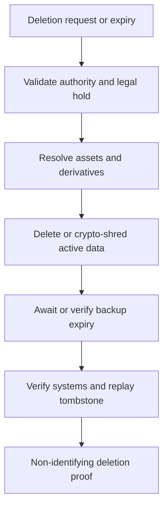

Deletion operations use these states:

- requested
- validated
- blocked_by_legal_hold
- in_progress
- awaiting_backup_expiry
- completed
- failed

Deletion covers:

- Raw assets
- Thumbnails
- OCR output
- Embeddings
- Model caches
- Queue payloads
- Search indexes
- Replicas
- Backups according to documented expiry

The audit record must not retain the deleted personal content.

Active storage, derivatives, indexes, caches, and queued payloads are deleted or crypto-shredded promptly. Per-object data-encryption keys are destroyed when crypto-shredding is selected. Immutable backups expire within a published maximum lifetime.

The worker owns the same provider-neutral, region-pinned evidence-deletion configuration used by API composition. A bounded installation-wide coordinator discovers due deletion workflows through an explicitly granted identifier-only PostgreSQL function, then submits stable versioned `privacy.delete` intents to Headgate. The durable deletion request is the reconciliation source, so a crash between request commit and task submission cannot lose the operation. Task payloads contain only the deletion identifier; every attempt reloads authoritative targets under tenant scope. Immediate active-data removal and the 35-day backup-finalisation boundary use the same replay-safe workflow and never fall back to another region.

A non-identifying deletion tombstone survives long enough to prevent restoration from making deleted data active again. Restore procedures replay tombstones before evidence becomes accessible. `completed` means every system covered by the active deletion contract confirmed deletion or irreversible key destruction; backup work remains `awaiting_backup_expiry` until that condition is true.

The deletion proof contains operation identifiers, rule versions, system confirmations, and timestamps but no claims, identifiers, biometric templates, or evidence digests usable for correlation.

---

## 27. Evidence vault

### 27.1 Storage design

- Object storage for binary evidence
- PostgreSQL for encrypted metadata
- KMS or HSM for key wrapping
- Content digest for integrity, not public deduplication
- Short-lived retrieval grants
- Regional storage and backup

### 27.2 Upload design

1. An authenticated capture client idempotently requests a short-lived `upl_` intent for one exact session requirement, artefact, acquisition method, media type, byte count, SHA-256 digest, region, and retention binding.
2. Core returns the safe upload resource, its strong ETag, and the dedicated Idenqa evidence-ingress URI; v1 does not return a storage-direct plaintext URL.
3. The client sends one complete raw JPEG or PNG body directly to evidence ingress with `Content-Length`, exact `Content-Type`, RFC 9530 `Content-Digest`, and `If-Match`.
4. Evidence ingress fences the attempt before reading, streams through independent validation and application encryption, and re-evaluates current processing authority before acceptance.
5. Acceptance atomically records available evidence, the terminal upload state, audit, reconciliation retention, and `evidence.ready.v1` outbox intent. Completed replay returns the existing result without consuming the repeated body.
6. Workflow schedules approved processing. Interrupted attempts restart from byte zero; partial or orphan ciphertext is exactly deleted or durably reconciled.

### 27.3 Access grant

An access grant includes:

- Subject and evidence
- Actor
- Purpose
- Permitted operations
- Region
- Expiry
- Maximum uses
- Watermark policy

Every successful and denied access attempt is audited.

### 27.4 Processing grant

A processing grant authorises one model or adapter workload to receive the minimum plaintext or derivative required for one approved operation. It includes tenant, region, verification, evidence, check, runner identity and workload version, purpose, permitted fields or variants, maximum uses, expiry, output destination, and processing-authority, consent, and policy references.

The workflow requests the grant; the Vault verifies scope and runner identity; the runner redeems it over an authenticated channel; and the Vault streams the permitted plaintext without releasing storage credentials or tenant key-encryption keys. Runners use memory or encrypted ephemeral storage and destroy plaintext, derivatives, and caches according to the grant.

Grant creation, redemption, denial, expiry, and revocation are audited. Provider adapters that require raw evidence use this same contract and never obtain general evidence-read capability.

---

## 28. Data storage and messaging

### 28.1 PostgreSQL

PostgreSQL is the authoritative store for:

- Domain state
- Encrypted claims
- Workflow state
- Provider attempts
- Signals
- Decisions
- Cases
- Policy versions
- Workflow instances, steps, attempts, timers, and worker leases
- Inbound-message deduplication records
- Outbox events
- Audit indexes

### 28.2 Object storage

S3-compatible regional object storage holds encrypted evidence assets. Storage-layer encryption supplements but does not replace application envelope encryption.

The object-store contract also supports bounded tenant-prefix inventory for residual orphan recovery. Inventory metadata is not evidence metadata and cannot authorise reads. After waiting beyond the maximum upload-attempt lease plus a provider/application clock-skew allowance, recovery validates the canonical Idenqa key and physical-version shape, then asks tenant-scoped PostgreSQL whether an evidence asset or active reconciliation record protects that exact version. Only an old, unreferenced ciphertext object may be deleted. Dependency failure preserves the object and replays the same inventory page; PostgreSQL remains authoritative for references and object storage remains the durable source for undiscovered physical objects.

### 28.3 Headgate background execution

Headgate v0.1.2 is the selected production job system. Idenqa integrates its Go SDK and PostgreSQL driver behind the owned `platform/task` port. Headgate uses PostgreSQL for policy admission, scheduling, claims, leases, attempts, and worker execution state; the domain remains authoritative for verification and other business state.

Application state and resulting job enqueueing normally commit in one PostgreSQL transaction through Headgate's supported pgx transaction adapter. A workflow whose authoritative row is itself a durable, bounded discovery source may instead use stable reconciliation-backed submission, as selected for privacy deletion; a crash cannot erase the source intent and duplicate submissions converge on the versioned idempotency key. Idenqa does not write Headgate's internal tables directly. Job payloads are versioned, contain opaque references rather than evidence bytes or identity claims, and are handled at least once with idempotent effects and Idenqa-owned fencing on consequential commits. Headgate types do not cross into domain packages, public contracts, or SDKs.

Headgate's MySQL and Redis backends, Rust SDK, workflow module, UI, and optional integrations are not selected implicitly. The selected production layout uses a dedicated `headgate` schema in the same PostgreSQL database, a stable deployment-unique installation identity, explicit release-pinned migrations outside runtime startup, and `verification`, `evidence`, `delivery`, and `maintenance` queues and rate classes. The explicit `idenqa migrate headgate` path uses Headgate's coordinated v0.1.2 migration module; it is migration-only and does not introduce another execution backend. Both API and worker validate compatibility through their caller-owned pool and never migrate at startup. Deployment grants the restricted runtime role `USAGE` and the required Headgate table and sequence privileges without granting schema ownership or migration authority. Tenant work is partitioned by tenant ID; installation-wide maintenance uses an explicit system partition. Every owned task declares bounded retention. Private queue carrier kinds reconcile Headgate's compile-time registration with Idenqa's runtime exact-name/version registry; Idenqa identity, idempotency key, retry policy, and exact version remain durable metadata, while Headgate types remain confined to the adapter. Headgate lifecycle events connect to Idenqa-owned telemetry hooks and process-owned OpenTelemetry providers; Headgate does not install exporters or global providers. Process concurrency, fleet rate and burst, per-tenant partition concurrency, leases, polling, crash limits, fallback retry base and cap, graceful shutdown, and the memory guard are validated deployment configuration. Saturation queues work. Headgate v0.1.2 does not invoke its declared retry-policy hook, so the Idenqa Store decorator derives exact task-specific retry delays from the claimed durable envelope and supplies them through Headgate's supported Ack delay override. The PostgreSQL production adapter passes the portable owned conformance contract plus crash/replacement tests. Retention durations for task types not yet introduced remain owned by their future task definitions.

### 28.4 Redis

Redis may support:

- Rate limiting
- Short-lived capture state
- Distributed locks
- Provider health cache

Redis is not the authoritative domain store, and queue payloads contain opaque references rather than raw PII.

Redis may accelerate rate limiting and ephemeral coordination. It is not required to reconstruct a verification, timer, attempt, job, or delivery intent. Distributed Redis locks do not protect domain invariants.

### 28.5 Reliable eventing

The transactional outbox pattern atomically records domain changes and events. Workers deliver events at least once; consumers are idempotent.

Event ordering is guaranteed per aggregate where required, not globally.

### 28.6 Durable orchestration

- State transitions and emitted outbox events commit in one PostgreSQL transaction.
- Inbound callbacks and events are deduplicated through durable inbox records.
- Workers claim work through bounded leases and fencing tokens; stale workers cannot commit after supersession.
- Every external action has a stable attempt ID and provider idempotency key.
- Retry policy is defined by stable error class and external-operation safety.
- Callback and polling results for one attempt converge idempotently.
- External success followed by local failure is reconciled rather than blindly repeated.
- Timers and expired leases reconstruct from PostgreSQL after Redis or worker loss.
- Poison work is quarantined with safe diagnostic context and requires authorised replay or terminal resolution.

The system promises at-least-once execution with idempotent effects. It does not claim exactly-once delivery across external systems.

---

## 29. Public API design

### 29.1 Conventions

- HTTPS JSON APIs
- Versioned path prefix
- Stable resource IDs
- UTC RFC 3339 timestamps
- Idempotency keys for mutations
- Cursor pagination
- Structured problem responses
- Explicit include and expansion parameters
- No provider-native objects in stable public resources

### 29.2 Authentication

Server integrations use scoped API credentials or OAuth client credentials. Applicant-facing calls use verification-scoped short-lived tokens that cannot enumerate subjects or access unrelated evidence.

### 29.3 Core endpoints

```text
POST   /v1/subjects
GET    /v1/subjects/{subject_id}
PATCH  /v1/subjects/{subject_id}
DELETE /v1/subjects/{subject_id}

POST   /v1/verifications
GET    /v1/verifications/{verification_id}
POST   /v1/verifications/{verification_id}/cancel
POST   /v1/verifications/{verification_id}/resume
GET    /v1/verifications/{verification_id}/decisions
POST   /v1/verifications/{verification_id}/reconsiderations
GET    /v1/decisions/{decision_id}

POST   /v1/evidence/upload-intents
GET    /v1/evidence/{evidence_id}
POST   /v1/evidence/{evidence_id}/access-grants
GET    /v1/evidence-access-grants/{grant_id}
POST   /v1/evidence-access-grants/{grant_id}/revoke

POST   /v1/processing-authorities
GET    /v1/processing-authorities/{authority_id}
POST   /v1/processing-authorities/{authority_id}/restrict
POST   /v1/consent-receipts
GET    /v1/consent-receipts/{consent_id}
POST   /v1/consent-receipts/{consent_id}/revoke

POST   /v1/privacy/deletion-requests
GET    /v1/privacy/deletion-requests/{request_id}

GET    /v1/cases
GET    /v1/cases/{case_id}
POST   /v1/cases/{case_id}/assign
POST   /v1/cases/{case_id}/findings

GET    /v1/providers
GET    /v1/providers/{provider_id}/capabilities

GET    /v1/policies
POST   /v1/policies
POST   /v1/policies/validate
POST   /v1/policies/{policy_id}/versions
POST   /v1/policy-versions/{version_id}/simulate
POST   /v1/policy-versions/{version_id}/activate
```

### 29.4 Create subject

```http
POST /v1/subjects
Idempotency-Key: customer-user-8472
Authorization: Bearer ...
Content-Type: application/json

{
  "external_ref": "customer-user-8472",
  "processing_authority_id": "pauth_01J...",
  "claims": {
    "legal_name": {
      "given": "Amina",
      "family": "Okafor"
    },
    "date_of_birth": "1994-03-12"
  }
}
```

### 29.5 Create verification

```http
POST /v1/verifications
Idempotency-Key: onboarding-attempt-3
Authorization: Bearer ...
Content-Type: application/json

{
  "subject_id": "sub_01J...",
  "processing_authority_id": "pauth_01J...",
  "policy": "individual-standard@3",
  "assurance_profile": "global-individual-substantial@1",
  "region": "eu-west",
  "capture": {
    "experience_key": "consumer-primary",
    "preferred_locale": "en-GB"
  },
  "return_url": "https://customer.example/identity/complete",
  "metadata": {
    "onboarding_id": "onb_9281"
  }
}
```

### 29.6 Verification response

```json
{
  "id": "ver_01J...",
  "subject_id": "sub_01J...",
  "state": "collecting",
  "processing_authority_id": "pauth_01J...",
  "region": "eu-west",
  "policy": "individual-standard@3",
  "capture": {
    "url": "https://capture.example/s/...",
    "token_expires_at": "2026-08-26T18:00:00Z",
    "experience_id": "exp_01J...",
    "experience_version": 7,
    "locale": "en-GB"
  },
  "created_at": "2026-08-26T17:30:00Z",
  "expires_at": "2026-08-27T17:30:00Z"
}
```

### 29.7 Verification result

```json
{
  "id": "ver_01J...",
  "state": "completed",
  "assurance": {
    "requested": "global-individual-substantial@1",
    "achieved": "global-individual-substantial@1"
  },
  "decision": {
    "id": "dec_01J...",
    "outcome": "verified",
    "policy": "individual-standard@3",
    "reason_codes": ["ALL_REQUIRED_EVIDENCE_SATISFIED"],
    "decided_at": "2026-08-26T17:34:12Z"
  },
  "checks": [
    { "type": "registry_validation", "state": "completed", "result": "passed" },
    { "type": "document_authenticity", "state": "completed", "result": "passed" },
    { "type": "liveness", "state": "completed", "result": "passed" },
    { "type": "face_match", "state": "completed", "result": "passed" }
  ]
}
```

### 29.8 Error model

Errors distinguish:

- Invalid request
- Authentication failure
- Authorisation failure
- Policy violation
- Unsupported capability
- Provider unavailable
- Provider rejected
- Model unavailable
- Inconclusive evidence
- Rate limit
- Region conflict
- Consent required
- Processing authority missing, expired, restricted, or prohibited
- Operational workflow failure

Provider-specific errors are mapped to stable platform codes while raw provider detail remains available only in protected diagnostic records.

### 29.9 Consequential-operation rules

- `GET /v1/evidence/{evidence_id}` returns metadata by default; raw or rendered content requires a short-lived access grant.
- Subject deletion creates an asynchronous deletion request and returns `202 Accepted`; it does not claim immediate physical deletion.
- Mutable administrative resources use an explicit version or `ETag` and `If-Match` optimistic-concurrency contract.
- Idempotency keys are scoped to tenant, credential, method, and route and retain the original result for a documented period.
- Minor API evolution is additive. Removal or semantic change requires a new major API version.
- Every consequential response carries a request or correlation ID suitable for audit lookup without exposing personal data.
- Resource-existence responses do not leak cross-tenant or unauthorised-object information.

---

## 30. Webhooks

### 30.1 Event types

- subject.created
- subject.updated
- subject.deletion_requested
- verification.created
- verification.collecting
- verification.processing
- verification.requires_input
- verification.requires_review
- verification.completed
- verification.failed
- verification.expired
- decision.created
- decision.superseded
- check.started
- check.completed
- check.inconclusive
- evidence.ready
- evidence.deleted
- consent.recorded
- consent.revoked
- processing_authority.created
- processing_authority.restricted
- deletion_request.updated
- case.created
- case.assigned
- case.finding_recorded
- appeal.updated
- provider.degraded

### 30.2 Delivery

- At-least-once delivery
- Event ID for deduplication
- HMAC or asymmetric signature
- Timestamp and replay window
- Exponential backoff with jitter
- Dead-letter visibility
- Manual replay
- Per-endpoint secrets
- Delivery logs without sensitive payloads
- Signing-key identifiers, rotation, and overlapping verification windows

The selected v1 implementation stores endpoint configuration, KMS-wrapped append-only signing-secret versions, delivery state, replay lineage, and append-only attempt diagnostics under forced tenant row-level security. `webhooks:configure` and `webhooks:replay` are separate application permissions. `webhook.deliver` v1 is reference-only Headgate work with eight bounded attempts, one-second-to-one-hour backoff with deterministic jitter, and 30-day successful metadata retention. Each HTTPS attempt pins policy-approved public DNS answers, requires TLS 1.2 or newer, refuses redirects and unsafe address classes, and bounds response processing. Tenant receivers verify the timestamp, event ID, and exact body bytes using an active-plus-overlap secret set and durably deduplicate the signed event ID.

### 30.3 Event envelope

```json
{
  "id": "evt_01J...",
  "type": "verification.completed",
  "schema_version": "1.0",
  "created_at": "2026-08-26T17:34:12Z",
  "tenant_id": "ten_01J...",
  "region": "eu-west",
  "data": {
    "verification_id": "ver_01J...",
    "subject_id": "sub_01J...",
    "decision_id": "dec_01J..."
  }
}
```

Webhook payloads contain resource references and safe summary fields. Customers retrieve authoritative details through the API.

---

## 31. Idenqa Capture SDKs

Idenqa Capture SDKs and the basic hosted or embeddable Web capture application are part of the open-source product. They can operate against a self-hosted core without Idenqa Cloud, Console, a proprietary licence server, or phone-home connectivity.

The open-source capture boundary includes session handling, direct upload, interruption and resumption, local cleanup, the portable experience schema and validator, a safe default theme, mandatory-copy composition, localisation fallback, and file-based or API-based configuration. Cloud may add managed authoring, assets, approvals, targeting, analytics, custom domains, signed edge delivery, and fleet-wide rollback, but those capabilities do not gate a usable capture journey.

SDK languages, native UI modules, and cross-platform wrappers may ship incrementally according to adopter need. Every advertised SDK remains open source, publishes a compatibility matrix, and passes the public conformance suite.

### 31.1 Integration modes

- Hosted verification link on an Idenqa or verified tenant domain
- Embedded Web SDK
- Native iOS SDK written in Swift
- Native Android SDK written in Kotlin
- Flutter plugin backed by the native iOS and Android SDKs
- React Native module backed by the native iOS and Android SDKs
- Server-driven API for custom interfaces

### 31.2 Mobile SDK architecture

The native iOS and Android SDKs are the authoritative mobile implementations. Flutter and React Native expose a cross-platform API and bridge into those native SDKs; they must not reimplement document capture, liveness, NFC, encryption, upload, or local evidence handling in Dart or JavaScript.

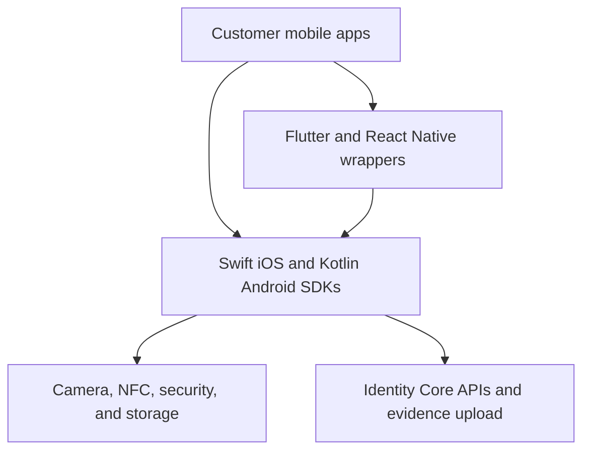

Native applications integrate the Swift or Kotlin SDK directly. Flutter and React Native applications use the same native binaries and receive normalised lifecycle events and final results through their bridges.

### 31.3 Native SDK modules

Both native SDKs should expose equivalent conceptual modules:

| Module           | Responsibility                                                                                             |
| ---------------- | ---------------------------------------------------------------------------------------------------------- |
| Core             | Configuration, capture sessions, state machine, errors, telemetry contracts                                |
| Capture UI       | Document and face guidance, permissions, accessibility, localisation                                       |
| Experience       | Signed theme resolution, asset loading, copy catalogue, safe fallback, and configuration-version reporting |
| Camera           | Frame acquisition, quality gates, auto-capture, device capability handling                                 |
| Document         | Cropping, glare and blur checks, document-side sequencing, barcode support                                 |
| Biometrics       | Face capture, liveness challenge orchestration, injection and replay controls                              |
| NFC              | ePassport and supported identity-chip reading through platform APIs                                        |
| Evidence         | Encryption, temporary storage, direct upload, retry, and cleanup                                           |
| Integrity        | App and device integrity signals, tamper indicators, capture attestation                                   |
| Provider modules | Optional adapters for approved third-party native components                                               |

The module boundaries allow customers to include only the capabilities required by policy and keep binary size, permissions, and attack surface controlled.

### 31.4 Cross-platform bridge rules

- Flutter uses a typed platform interface, preferably generated with Pigeon, over the Swift and Kotlin SDKs.
- React Native uses typed TurboModules and native views compatible with the New Architecture.
- Cross-platform packages expose the same session, step, result, cancellation, and error model as the native SDKs.
- Raw images, video frames, NFC payloads, biometric templates, and provider secrets never cross the Dart or JavaScript bridge.
- Bridges receive opaque evidence references, redacted metadata, progress events, recoverable errors, and terminal results.
- Native capture UI is embedded as a platform view or presented native screen; camera-frame rendering is not streamed through the bridge.
- Bridge calls are asynchronous, cancellable where safe, and resilient to application backgrounding and runtime recreation.
- A wrapper version declares the exact compatible native SDK range and fails clearly on an unsupported combination.
- Flutter and React Native must pass the same behavioural and security conformance suite as direct native integrations.

### 31.5 Public SDK contract

The public API should remain small and consistent across platforms:

```text
configure(configuration)
start(sessionToken, options) -> session
observe(session) -> events
resume(sessionID) -> session
cancel(sessionID, reason)
clearLocalData(sessionID)
getCapabilities() -> capabilities
```

The SDK returns a verification-session reference and safe status information. It does not return raw evidence to the customer application unless a separate, explicitly authorised product requirement is introduced.

The server-created session, not the untrusted client application, selects the authoritative workflow, assurance policy, tenant, environment, and published experience version. Client options may request an allowed locale, colour scheme, presentation style, or server-approved experience key; they cannot substitute another tenant's configuration or alter required steps.

### 31.6 Capture responsibilities

- Session-token validation
- Consent and notice presentation
- Camera permission
- Document guidance
- Image-quality feedback
- Liveness interaction
- NFC reading where supported
- Direct evidence upload
- Resumable session state
- Versioned brand and experience rendering
- Accessibility and localisation

### 31.7 SDK security

- No long-lived API credentials
- The tenant backend delivers a short-lived single-use Idenqa capture token; first native redemption proves possession of an SDK-generated hardware-backed P-256 key and atomically binds the token to one configured application identifier and proof-key digest.
- The proof transcript is versioned, domain-separated, method- and path-bound, includes the token and canonical capability digests, and has a two-minute freshness window. Replay or changed-key redemption fails generically.
- Optional App Attest, DeviceCheck, Play Integrity, or equivalent adapters may supplement proof of possession. An attestation value fails closed unless the serving process explicitly composes its verifier; capability advertisement and attestation never replace server policy or establish capture assurance by themselves.
- Certificate and transport controls appropriate to platform
- Runtime tamper and integrity signals
- One-time capture challenges
- No raw evidence in analytics
- Secure local temporary storage
- Automatic local cleanup
- Version and device metadata
- Raw evidence stays inside native memory, encrypted temporary storage, and the native upload pipeline
- Screen capture and application-switcher exposure are restricted on sensitive native screens where supported
- Sensitive buffers and temporary files are released promptly after processing or upload
- Native dependencies and packaged model assets are signed, checksummed, and included in the software bill of materials
- Integrity signals inform policy but do not silently exclude legitimate users without a fallback path

### 31.8 Lifecycle and recovery

- Persist only the minimum opaque state required to resume an interrupted session.
- Handle backgrounding, process termination, permission changes, network loss, and orientation changes.
- Use background transfer APIs only where consent, operating-system policy, and token lifetime permit.
- Revalidate the capture token and server challenge before resuming sensitive steps.
- Make cancellation and cleanup idempotent.
- Never mark capture complete until the server acknowledges evidence integrity and receipt.

### 31.9 Distribution and release engineering

| Platform     | Primary distribution                                    | Implementation                      |
| ------------ | ------------------------------------------------------- | ----------------------------------- |
| iOS          | Swift Package Manager; optional CocoaPods compatibility | Swift                               |
| Android      | Maven Central or signed private Maven repository        | Kotlin                              |
| Flutter      | pub.dev package or enterprise registry                  | Dart API plus native bindings       |
| React Native | npm package or enterprise registry                      | TypeScript API plus native bindings |

Every SDK release must include:

- Signed source tag and immutable package artifact
- Semantic version and compatibility matrix
- Changelog and migration guide
- Dependency lock or resolved dependency record
- Software bill of materials
- Provenance or build attestation
- Unit, integration, device, accessibility, and conformance results
- Minimum supported operating-system and framework versions

Native SDKs release first. Flutter and React Native packages are then built and tested against the released native versions. Emergency native security fixes must have a defined wrapper-release SLA.

### 31.10 Accessibility

The capture journey supports:

- Screen readers
- Keyboard navigation
- Reduced motion
- Clear contrast
- Localised instructions
- Alternative evidence paths
- Human-assisted verification
- Recovery from interrupted sessions

Failure to complete one biometric method must not automatically exclude legitimate users where policy allows alternatives.

### 31.11 Experience-configuration contract

Idenqa Capture uses a public, portable experience schema. Self-hosted customers may supply and validate the schema locally. Idenqa Cloud adds hosted assets, a visual editor, approvals, publishing, targeting, preview, analytics, and rollback. The rendering contract therefore remains portable even though Cloud management is commercial.

The schema supports these controlled surfaces:

| Surface          | Customisable values                                                                                               | Non-customisable boundary                                                                                                                            |
| ---------------- | ----------------------------------------------------------------------------------------------------------------- | ---------------------------------------------------------------------------------------------------------------------------------------------------- |
| Identity         | Verified organisation display name, logo, compact mark, support identity                                          | Platform and recipient identity cannot be hidden where disclosure is required                                                                        |
| Colour           | Semantic primary, accent, surface, text, focus, success, warning, and error tokens                                | Contrast, focus visibility, camera guides, safety states, and error meaning must pass validation                                                     |
| Typography       | Approved system families and vetted tenant font assets, size scale within bounds                                  | Minimum readable sizes, Dynamic Type, font scaling, and screen-reader labels remain enforced                                                         |
| Shape and motion | Radius scale, component density, illustration style, reduced-motion-safe transitions                              | Capture geometry, document guides, biometric cues, and reduced-motion preferences remain authoritative                                               |
| Copy             | Structured keys for welcome, step instructions, help, completion, support, and optional marketing-neutral context | Consent facts, purpose, biometric notice, provider disclosure, legal rights, safety warnings, and reason semantics cannot be removed or contradicted |
| Journey options  | Allowed intro, help, success, retry, and hand-off presentation preferences                                        | Required evidence, liveness challenges, policy steps, security controls, and decisions cannot be changed by theming                                  |
| Localisation     | Supported locales, translated copy, country-specific support details, right-to-left rendering                     | Locale fallback, regulatory text, accessibility, and versioned consent records remain mandatory                                                      |

The schema contains data and references only. It never accepts arbitrary JavaScript, HTML, CSS, native code, executable templates, remote scripts, analytics tags, or unsandboxed rich text.

### 31.12 Resolution and rendering lifecycle

1. A tenant publishes an immutable experience-configuration version for one environment.
2. The server creates a capture session and resolves the permitted experience using tenant, application, workflow, country, locale, and rollout rules.
3. The session token binds `tenant_id`, `environment_id`, `experience_id`, `experience_version`, manifest digest, allowed application identifiers, expiry, and region.
4. The SDK retrieves the signed manifest and content-addressed assets from the regional capture edge.
5. The native or Web renderer verifies signature, digest, tenant and application binding, schema version, SDK compatibility, and expiry before rendering.
6. The SDK pins the configuration for the session, records the locale and mandatory-copy versions, and ignores mid-session publication changes.
7. Invalid or unavailable customization falls back to a signed, accessible Idenqa safety theme without bypassing consent or capture requirements.
8. Completion and diagnostic events report only configuration identifiers and safe rendering outcomes; they do not place displayed PII or free-form copy in telemetry.

Flutter and React Native receive safe configuration metadata and lifecycle events through their typed bridges, but the native iOS and Android layers fetch, verify, cache, and render the authoritative configuration. Raw assets and configuration values that affect sensitive native views are not sourced from arbitrary Dart or JavaScript objects after session creation.

### 31.13 Copy, localisation, and consent integrity

- Copy is addressed by stable semantic keys rather than screen coordinates or arbitrary paragraphs.
- Locale files use a versioned message format with an allow-list of non-sensitive interpolation variables.
- Tenant copy is separated from Idenqa safety copy, jurisdiction-pack copy, and versioned consent or privacy notices.
- Mandatory text is locked or may be replaced only by an approved jurisdiction-specific equivalent with legal-review metadata.
- Every locale must define a fallback chain; missing critical strings fail publication, while missing optional strings use the signed Idenqa default.
- Bidirectional layout, pluralisation, text expansion, screen-reader order, and large-font layouts are tested before publication.
- Consent receipts record the exact mandatory-copy version, tenant-copy catalogue version, locale, recipient identity, and rendered experience version.
- Copy experiments cannot alter legal meaning, hide cost or consequences, manufacture urgency, or target people using sensitive identity attributes.

### 31.14 Customization security and quality gates

- Brand assets are uploaded through a malware-scanned, type-checked, dimension-limited pipeline and converted into platform-safe derivatives.
- Active SVG content, external asset references, embedded scripts, metadata payloads, and tracking pixels are rejected or sanitised and rasterised.
- Remote assets, fonts, and links must originate from Idenqa-managed delivery or a verified, policy-approved tenant domain.
- Hosted Web capture uses a restrictive Content Security Policy, frame-ancestor controls, Subresource Integrity where applicable, and origin-bound session tokens.
- Native sessions are bound to registered iOS bundle identifiers, Android application IDs and signing certificates, or other attested application identity.
- Accessibility checks cover contrast, focus, scaling, reduced motion, screen-reader labels, touch targets, and error differentiation without colour alone.
- Security, capture-quality, accessibility, and mandatory-disclosure tokens override tenant styling when they conflict.
- Preview watermarks and environment indicators prevent draft or test branding from being mistaken for production.
- Publication, approval, rollback, domain verification, and asset replacement are permissioned, dual-controlled when required, and written to the audit ledger.
- A configuration kill switch can revoke a malicious or broken version and force a signed safe fallback without releasing a new SDK.

---

## 32. Idenqa Console and operator experience

Idenqa Console is a commercial product, not part of the open-source core. Idenqa Core remains fully operable through documented APIs, webhooks, CLI tooling, and infrastructure configuration. Customers may build their own internal interface, purchase Idenqa Console, or license it for deployment in their own cloud or environment.

During product development, the team may maintain an experimental dashboard to validate workflows, information architecture, and customer needs. Experimental access does not grant an open-source licence, create a compatibility promise, or require the experimental code to be published.

### 32.1 Dashboard modules

- Verification overview
- Cases and review queues
- Subject and evidence history
- Workflow builder
- Policy editor and simulator
- Capture experience, branding, copy, localisation, preview, and publishing
- Provider configuration and health
- Model registry and evaluations
- Webhook configuration and delivery
- Access and audit reports
- Retention and privacy operations
- Team, role, SSO, and access management

### 32.2 Sensitive-interface requirements

- Raw evidence is hidden until separately requested.
- Opening evidence creates an access grant and audit event.
- Reviewer views display purpose and remaining access time.
- Copy, download, and export are separately permissioned.
- High-risk decisions show the exact policy and signal snapshot.
- AI summaries visually distinguish generated interpretation from recorded facts.

### 32.3 Commercial boundary

The commercial dashboard may include:

- Visual case queues and reviewer workspaces
- No-code workflow and policy builders
- Provider and model management
- Team administration, SSO, SCIM, and fine-grained permissions
- Compliance, assurance, fraud, quality, and cost analytics
- Operational alerts, investigations, and escalation
- Audit-search and evidence-export experiences
- Managed deployment, upgrade, backup, and support controls

The commercial boundary must not weaken customer ownership:

- The dashboard must not become the only way to read or mutate core resources.
- Every dashboard operation must call a documented, authorised core or commercial API.
- Core data must remain exportable without the dashboard.
- A customer must be able to stop using the dashboard without migrating identity evidence into a new format.
- Dashboard entitlements must be enforced outside the browser; hidden UI is not an access control.
- The dashboard must not receive raw evidence unless an authorised user requests it for a permitted purpose.

### 32.4 Experimental dashboard policy

- Source code remains in a private repository from the first commit.
- Experimental deployments use synthetic identities by default.
- Real customer evidence requires the same production security controls as the core.
- Features are promoted only after workflow validation, threat review, and entitlement design.
- Screens may change without backward-compatibility guarantees until promoted.
- Experimental code must never be copied into the public core repository by default.

---

## 33. Reference implementation technology

The technology choices are provisional and replaceable behind interfaces.

### 33.1 Core backend

- Go
- Chi HTTP router
- PostgreSQL
- Headgate v0.1.2 with its Go SDK and PostgreSQL driver behind `platform/task`
- Redis only as an optional rate-limit or ephemeral-coordination accelerator, never authoritative workflow state
- Transactional PostgreSQL outbox
- S3-compatible object storage
- OpenTelemetry logs, traces, and metrics
- Structured logging with mandatory redaction

### 33.2 Commercial dashboard

- React
- TanStack Start
- TypeScript
- Tailwind CSS
- shadcn/ui built on Base UI
- Phosphor icons

### 33.3 Model runtime

Model runners communicate through versioned gRPC or HTTP contracts and OCI containers. Implementations may use:

- ONNX Runtime
- Python ML services
- Hardware-accelerated commercial SDKs
- Customer-supplied inference servers
- On-device inference for safe capture checks

The Go core does not depend on one ML language or framework.

### 33.4 Infrastructure

- Docker Compose for development
- Helm and Kubernetes for production reference deployment
- Managed KMS or customer HSM
- Regional secrets manager
- Infrastructure-as-code examples

### 33.5 Repository layout

The open-source core and commercial dashboard use separate repositories and build pipelines. This is a source-code boundary, not merely a feature flag.

#### Public core repository

```text
/cmd
  /idenqa
  /core-api
  /core-worker
  /evidence-service
  /adapter-runner
  /model-runner

/apps
  /capture-web

/internal
  /subject
  /fact
  /verification
  /evidence
  /authority
  /workflow
  /policy
  /provider
  /model
  /decision
  /review
  /audit
  /privacy
  /contract
  /migration

/adapters
  /providers
  /models
  /storage
  /kms

/sdk
  /client
  /provider
  /model
  /webhook
  /policy-testkit
  /web
  /ios
    /Sources
      /IdenqaCore
      /IdenqaCapture
      /IdenqaNFC
      /IdenqaBiometrics
  /android
    /idenqa-core
    /idenqa-capture
    /idenqa-nfc
    /idenqa-biometrics
  /flutter
    /lib
    /ios
    /android
  /react-native
    /src
    /ios
    /android

/contracts
  /api
  /events
  /provider
  /model
  /policy
  /capture-sdk
  /capture-pages
  /bridge-events
  /conformance

/examples
  /api-quickstart
  /sdk-quickstart
  /webhook-receiver
  /synthetic-review-cli
  /self-hosted-capture

/deploy
/docs
/tests
  /contract
  /security
  /model-evaluation
  /compliance
```

The public examples demonstrate API use and synthetic workflows. They must not evolve into a production operations dashboard or reproduce the paid console's reviewer, policy-builder, analytics, or administration experience.

#### Private commercial repositories

```text
/idenqa-console
  /apps
    /dashboard
  /packages
    /design-system
    /experience-builder
    /localisation
    /api-client
    /authz
    /entitlements
  /tests
    /e2e
    /security
    /accessibility

/idenqa-cloud
  /control-plane
  /experience-config
  /brand-assets
  /manifest-delivery
  /billing
  /deployment-orchestration
  /support-operations
```

The console and cloud repositories may share generated API clients and schemas from the public core, but proprietary source must never become a build-time requirement for compiling or operating the core.

### 33.6 Open-source operational contract

An API-, SDK-, and capture-first core must be operable without a commercial dashboard. The public CLI and administrative APIs support:

- Configuration initialisation and preflight
- Database migrations and verification
- Tenant creation, suspension, export, and key rotation
- Provider, model, storage, and KMS adapter registration and validation
- Policy validation, simulation, diff, activation, and regression tests
- Synthetic verification creation and inspection
- Workflow, attempt, timer, and safe-error inspection
- Authorised reconciliation and idempotent replay
- Webhook delivery inspection and replay
- Retention and deletion-operation inspection
- Audit export and checkpoint verification
- Backup restoration and deletion-tombstone verification
- Release and contract-compatibility reporting

The CLI calls the same application services or documented APIs used by capture pages and commercial interfaces. It does not implement a privileged parallel domain model. Commands that expose evidence, activate policy, replay external effects, rotate destructive keys, or use break-glass authority require explicit authorisation, confirmation, and audit.

A clean environment must be able to start the core, run migrations, create a local tenant, activate an example policy, install a supported client SDK, complete a synthetic capture journey, inspect the reproducible decision and audit chain, simulate provider failure and recovery, and export tenant-owned data without Cloud, Console, a proprietary licence server, or undocumented endpoints.

---

## 34. Observability

### 34.1 Principles

- OpenTelemetry across all services
- Trace references rather than sensitive payloads
- Tenant-aware metrics without high-cardinality personal IDs
- Provider and model dimensions controlled through allow-lists
- Audit events separate from diagnostic telemetry

The open-source core exports vendor-neutral OTLP traces and metrics and supports both gRPC and HTTP/protobuf. A process selects one transport for one collector endpoint, preventing accidental duplicate export. Export is disabled by default, so a self-hosted installation makes no telemetry connection unless its operator opts in. TLS is required outside an explicitly insecure loopback development endpoint; bounded redacting headers support collector authentication, while custom CA, server-name, and paired client certificate/key settings support private trust and mTLS.

Trace sampling is parent-based with a configurable 0.10 default root ratio. Trace export uses a bounded 2,048-span queue, batches of at most 512, a five-second delay, and a ten-second default timeout. Metrics are not sampled and use a configurable periodic reader with a 60-second default. Transient exporter retry remains bounded. Invalid exporter configuration fails startup; a collector outage can lose bounded diagnostic telemetry but cannot expose sensitive data, grow memory without bound, or make domain processing depend on telemetry availability. Structured application logs remain on the selected `log/slog` path rather than being implicitly exported through OTLP.

### 34.2 Core metrics

#### Platform

- Request rate, latency, and error rate
- Workflow duration
- Queue age and depth
- Database and object-store health
- Webhook delivery latency
- Regional capacity

#### Verification

- Start and completion rate
- Verified, not-verified, review, inconclusive, and operational-failure rate
- Drop-off by step
- Evidence recapture rate
- Time to decision
- Manual-review duration

#### Provider

- Availability
- Latency
- Error category
- Match and inconclusive rates
- Callback delay
- Cost per attempt

#### Model

- Inference latency
- Failure to acquire
- Score distribution
- Threshold outcome
- Drift indicators
- Performance by evaluated cohort

### 34.3 Tracing

Trace attributes may include:

- Tenant token
- Verification token
- Workflow version
- Provider ID
- Model version
- Region
- Check type

They may not contain personal claims or raw evidence.

---

## 35. Reliability and resilience

### 35.1 Initial service objectives

These are design targets rather than contractual commitments:

| Capability                                | Target                |
| ----------------------------------------- | --------------------- |
| Core API availability                     | 99.9% monthly         |
| Core API p95 excluding external providers | Under 300 ms          |
| Webhook first delivery                    | 99% within 60 seconds |
| Workflow recovery after worker failure    | Automatic             |
| Managed-service RPO                       | 5 minutes or better   |
| Managed-service RTO                       | 60 minutes or better  |

### 35.2 Provider resilience

- Timeouts
- Retries only for safe operations
- Idempotent provider request references
- Circuit breakers
- Health-based routing
- Policy-approved fallback
- Degraded-mode visibility
- Cost and duplicate-charge protection

### 35.3 Model resilience

- Version pinning
- Warm capacity for active versions
- Health probes
- Shadow rollout
- Canary promotion
- Automatic rollback on technical failure
- Manual rollback on quality regression
- Safe inconclusive result if no authorised model is available

### 35.4 Disaster recovery

- Encrypted regional backups
- Restore tests
- Key-recovery procedures
- Provider credential restoration
- Audit-ledger integrity validation
- Regional failover subject to residency policy

---

## 36. Model governance and MLOps

### 36.1 Model registry record

- Model ID and task
- Owner
- Licence
- Training-data provenance summary
- Intended and prohibited uses
- Input and output schemas
- Model digest
- Runtime requirements
- Evaluation reports
- Approved regions
- Threshold sets
- Status
- Activation and retirement dates

### 36.2 Lifecycle


### 36.3 Promotion gates

- Licence approved
- Security scanning passed
- Evaluation dataset documented
- Accuracy requirements met
- Demographic analysis completed
- Privacy and impact assessment completed
- Rollback validated
- Policy thresholds approved

### 36.4 Reproducibility

An inference record stores:

- Model and runtime version
- Input asset digests
- Preprocessing version
- Hardware/runtime class when relevant
- Configuration
- Output
- Threshold set
- Timestamp

For non-deterministic models, it additionally stores prompt, tool schema, response, and accepted proposal. Exact regeneration is not assumed.

---

## 37. Testing strategy

### 37.1 Unit tests

- Domain invariants
- State transitions
- Separation of workflow state, identity outcome, and customer decision
- Observation, fact, lineage, projection, and decision-snapshot invariants
- Policy evaluation
- Identifier normalisation
- Retention calculation
- Processing-authority and consent-state enforcement
- Access checks
- Redaction

### 37.2 Contract tests

- Provider adapter conformance
- Model adapter conformance
- Webhook schemas
- SDK and API compatibility
- Experience-schema, locale-catalogue, signed-manifest, and renderer compatibility
- Storage and KMS adapters
- Policy schema
- Core client, capture, webhook, provider, model, and policy SDK conformance
- Contract-version and unknown-value compatibility

### 37.3 Integration tests

- End-to-end mock verification
- Evidence upload and deletion
- Provider callback
- Model runner
- Manual review
- Webhook retry
- Inbox deduplication, attempt reconciliation, lease fencing, and outbox recovery
- Region routing
- Restore-time deletion-tombstone replay
- Experience publication, session pinning, cross-platform rendering, and rollback

### 37.4 Security tests

- Cross-tenant access
- Broken object authorisation
- SSRF
- Callback forgery
- Replay
- Upload attacks
- Malicious document payload
- Privilege escalation
- Evidence-access expiry
- Secret leakage
- Log-redaction fixtures
- Adapter sandbox escape
- Cross-tenant experience and asset access
- Manifest, cache, origin, custom-domain, bundle-ID, application-ID, and signing-identity substitution
- Copy, font, image, SVG, URL, bidirectional-text, and asset-parser injection fixtures

### 37.5 Model tests

- Accuracy and threshold curves
- Demographic cohorts
- Poor-quality images
- Replay, print, screen, mask, and injection attacks
- Deepfake sets
- Model drift
- Regression against active production version

### 37.6 Policy tests

Every policy release includes:

- Passing cases
- Failing cases
- Inconclusive cases
- Unavailable and prohibited cases
- Provider outage
- Missing consent
- Missing, expired, withdrawn, and restricted processing authority
- Region conflict
- Accessibility exception
- AI proposal outside authority

### 37.7 Chaos and resilience tests

- Worker termination
- Redis loss
- External success followed by worker or database failure
- Callback and polling races, duplication, and reordering
- Poison work quarantine and authorised replay
- Provider timeout
- Partial database outage
- Object-store delay
- Webhook endpoint failure
- Model capacity loss
- Clock skew
- Experience edge or asset failure with signed safe fallback
- Experience-version revocation during new and in-progress sessions

### 37.8 Experience and accessibility tests

- Golden rendering across supported Web, iOS, Android, Flutter, and React Native combinations
- Light mode, dark mode, high contrast, large text, reduced motion, and right-to-left layout
- Minimum contrast, touch target, focus order, screen-reader labels, and non-colour error meaning
- Copy expansion, pluralisation, locale fallback, missing optional keys, and rejection of missing mandatory keys
- Immutable publication, optimistic concurrency, approval, environment promotion, rollback, and audit completeness
- Safe fallback under invalid signatures, expired manifests, incompatible schemas, missing assets, and offline recovery

---

## 38. Secure development lifecycle

### 38.1 Before implementation

- Threat model
- Data-flow inventory
- Privacy impact assessment
- Architecture decision records
- Abuse cases
- Security acceptance criteria
- Provider data-rights review

### 38.2 Continuous integration

- Formatting and linting
- Unit and contract tests
- Static application-security testing
- Dependency scanning
- Secret scanning
- Container scanning
- SBOM generation
- Licence checks
- Signed artifacts

### 38.3 Release

- Reproducible release manifest
- Migration validation
- Backward-compatibility tests
- Security review for sensitive changes
- Model and policy compatibility
- Signed containers and checksums
- Rollback plan

### 38.4 External assurance

- Independent penetration test before sensitive production beta
- Remediation verification
- Vulnerability disclosure programme
- Bug bounty after operational maturity
- Managed-service SOC 2 and ISO certification roadmap
- Model and PAD evaluation by qualified independent laboratories where required

### 38.5 Contract evolution and database migrations

Compatibility policy covers public APIs, webhooks and domain events, provider and model adapters, policy schemas and evaluators, evidence grants, capture sessions and SDKs, and audit schemas.

Additive fields do not change existing semantics. Enum values are never silently repurposed. Consumers tolerate declared additive evolution; security-critical unknown values fail safely when interpretation is required. Stored workflows, attempts, decisions, and events record the contract version needed to interpret them, and open releases publish schemas and conformance fixtures for every supported version.

Database changes use an expand-migrate-contract sequence:

1. Add backward-compatible schema.
2. Deploy code that reads old and new forms.
3. Backfill through restartable and observable jobs.
4. Verify counts, digests, tenant scope, and invariants.
5. Switch writes to the new form.
6. Remove the old form only after rollback and mixed-version windows close.

Migrations are idempotent, bounded, resumable, tenant safe, and tested at production-like scale. Destructive migrations require backup verification, explicit approval, and a recovery path. Rolling deployments declare which API, event, policy, adapter, and database versions may coexist. A worker that cannot interpret a claimed workflow version releases or quarantines it rather than guessing.

---

## 39. Open-source and commercial architecture

### 39.1 Idenqa Core

The open-source edition should include:

- Identity domain and API
- Evidence vault
- Workflow and policy engine
- Mock provider
- Core client SDK
- Capture SDK contracts and at least one supported capture implementation
- Provider SDK
- Model SDK
- Webhook verification SDK
- Policy test kit
- Local inference support
- Basic self-hosted and embeddable Web capture application
- Portable experience schema, validator, safe default theme, and local configuration
- Manual-review cases, assignments, decisions, and appeal APIs
- CLI or API-based operational tooling for synthetic and emergency workflows
- Webhooks
- Audit records
- Docker development deployment

The core must not require a platform account, proprietary dashboard, paid licence server, or phone-home connection. It must expose every identity resource and consequential operation required to build an independent customer interface.

### 39.2 Idenqa Console

The production dashboard is proprietary and sold separately or bundled with managed service. It provides the operational layer that teams would otherwise have to build themselves:

- Reviewer and investigation workspaces
- Workflow and policy visualisation and authoring
- Provider, model, webhook, and environment administration
- Analytics for assurance, fraud, conversion, cost, latency, and reviewer performance
- Audit, privacy, retention, and compliance operations
- SSO, SCIM, enterprise RBAC, approvals, and dual control
- Alerts, incident views, support diagnostics, and guided remediation

Commercial delivery modes may include:

1. **Managed Cloud:** dashboard and core are operated in an approved regional environment.
2. **Connect Your Core:** the hosted dashboard connects to a customer's self-hosted core through a narrowly scoped control channel.
3. **Bring Your Own Cloud:** the commercial stack is deployed into a customer-owned cloud account.
4. **Self-hosted Enterprise:** dashboard binaries or containers are licensed for an isolated customer environment.

### 39.3 Idenqa Cloud managed service

The managed service adds operational value:

- Regional hosting
- Managed upgrades and backups
- Managed KMS
- Provider access
- Global edge
- Commercial operations dashboard
- Monitoring and incident response
- Enterprise SSO and SCIM
- Compliance reports
- Support and SLAs
- Dedicated deployment

#### 39.3.1 Cloud-managed capture experiences

Idenqa Cloud provides a configuration plane for white-labelled Idenqa Capture journeys across hosted Web, embedded Web, native iOS, native Android, Flutter, and React Native. A tenant can manage logos, semantic colours, approved typography, structured text, locales, support links, custom domains, and safe presentation preferences once and publish them consistently to every supported SDK.

Customization is deliberately separate from verification policy. A brand editor cannot remove a required verification step, weaken liveness, change evidence requirements, modify provider routing, suppress a material notice, or influence the final decision. Workflow and policy determine **what must happen**; the experience configuration determines **how permitted parts are presented**.

The Cloud subsystem contains:

| Component                        | Responsibility                                                                                                 |
| -------------------------------- | -------------------------------------------------------------------------------------------------------------- |
| Experience Configuration Service | Stores tenant- and environment-scoped drafts and immutable published versions                                  |
| Brand Asset Pipeline             | Scans, sanitises, transforms, signs, and content-addresses logos, marks, illustrations, and approved fonts     |
| Copy and Locale Catalogue        | Manages structured keys, translations, fallbacks, legal-review metadata, and mandatory-copy composition        |
| Experience Resolver              | Selects a published version using authorised tenant, application, workflow, country, locale, and rollout rules |
| Manifest Signer                  | Produces short-lived, session-bound signed manifests with digests and SDK compatibility constraints            |
| Regional Experience Edge         | Delivers manifests and safe asset derivatives from the capture session's assigned region                       |
| Preview and Conformance Service  | Renders platform, locale, device-size, accessibility, dark-mode, and right-to-left previews before publication |
| Domain and Application Registry  | Verifies custom domains, Web origins, iOS bundle IDs, Android application IDs, and signing identities          |
| Experience Audit and Analytics   | Records approvals and releases and reports privacy-safe completion, fallback, error, and accessibility metrics |

Configuration lifecycle is `draft -> validation_failed | awaiting_approval -> published -> superseded | revoked`. Published versions are immutable. Editing a live configuration creates a new draft. Promotion between sandbox and production is explicit, revalidated, permissioned, and auditable; production publication may require dual control.

#### 39.3.2 Targeting, variants, and precedence

The resolver applies deterministic precedence:

1. Idenqa security and rendering invariants.
2. Applicable jurisdiction-pack disclosures and consent requirements.
3. Tenant and verified recipient identity.
4. Published environment and brand configuration.
5. Workflow-specific permitted copy and presentation overrides.
6. Locale, writing direction, and operating-system accessibility preferences.
7. A server-assigned experiment variant, if the field is eligible for experimentation.

Multi-brand tenants may define an organisation-level base and child-brand overlays. Child configurations inherit by explicit version reference, not mutable cascading state. The resolved manifest is flattened and signed so the SDK never performs ambiguous client-side inheritance.

Variants are assigned server-side, pinned for the session, and limited to presentation fields approved for experimentation. Allocation cannot use biometric results, national identifiers, protected characteristics, raw evidence, fraud suspicions, or other sensitive identity attributes. Consent, privacy, safety, error meaning, accessibility, evidence requirements, and verification outcomes are excluded from experimentation.

#### 39.3.3 Commercial API outline

```text
POST /cloud/v1/experience-configurations
GET  /cloud/v1/experience-configurations/{experience_id}
PATCH /cloud/v1/experience-configurations/{experience_id}/draft
POST /cloud/v1/experience-configurations/{experience_id}/validate
POST /cloud/v1/experience-configurations/{experience_id}/request-approval
POST /cloud/v1/experience-configurations/{experience_id}/publish
POST /cloud/v1/experience-configurations/{experience_id}/rollback
POST /cloud/v1/experience-configurations/{experience_id}/preview-sessions
POST /cloud/v1/brand-assets/upload-intents
GET  /cloud/v1/brand-assets/{asset_id}
POST /cloud/v1/domains
POST /cloud/v1/domains/{domain_id}/verify
POST /cloud/v1/applications
GET  /capture/v1/sessions/{session_id}/experience
```

Administrative calls use tenant credentials and fine-grained experience permissions. The capture endpoint accepts only the short-lived session credential, returns the single resolved signed manifest for that session, and cannot enumerate tenant assets or drafts. Mutations use idempotency keys and optimistic concurrency. Publication emits `experience.validation_failed`, `experience.approval_requested`, `experience.published`, `experience.rolled_back`, `experience.revoked`, and `experience.fallback_activated` events.

#### 39.3.4 Packaging boundary

- The public Idenqa Capture schema, validator, renderer contract, safe default theme, and self-hosted file-based configuration remain usable with Idenqa Core.
- Idenqa Cloud provides visual authoring, hosted asset processing, cross-platform preview, managed localisation, version publication, targeting, signed delivery, custom domains, analytics, and emergency rollback.
- Idenqa Console is the commercial interface for these Cloud capabilities; every action also has a documented commercial API.
- Enterprise plans may add multi-brand inheritance, approval workflows, environment promotion, customer-managed signing keys, private asset delivery, and isolated regional configuration planes.
- A tenant can export its assets, copy catalogue, tokens, and portable experience schema without exporting proprietary Console source code.

### 39.4 Idenqa Pass — Reusable Verification Cloud

Idenqa Pass is the person-facing experience of Reusable Verification Cloud. It allows a person who completed identity proofing for Company ABC to reuse still-valid verification components when onboarding to Company XYZ. The user should not repeat document capture, data entry, or liveness unnecessarily. Company XYZ still receives a new verification and a decision produced by its own active policy.

The product may be marketed as **Reusable KYC**, but the technical and legal model is **reusable verification**. A previous tenant's `verified` decision is never copied as Company XYZ's decision. Evidence, claims, checks, assurance, and provenance are evaluated again against the receiving tenant's requirements.

#### 39.4.1 Product rules

1. Reuse is opt-in and initiated or explicitly authorised by the person.
2. Company ABC does not gain visibility into Company XYZ's relationship with the person.
3. Company XYZ does not gain access to Company ABC's customer record, notes, policy, or decision.
4. The platform discloses the minimum claims and verification components required by XYZ's declared policy.
5. Dynamic or stale checks are rerun rather than represented as current.
6. A new tenant-scoped subject, verification, audit trail, and decision are created for XYZ.
7. Recipient policy, applicable law, sector rules, issuer restrictions, and data residency may prohibit or limit reuse.
8. The person can choose ordinary verification instead of reuse.

#### 39.4.2 User journey

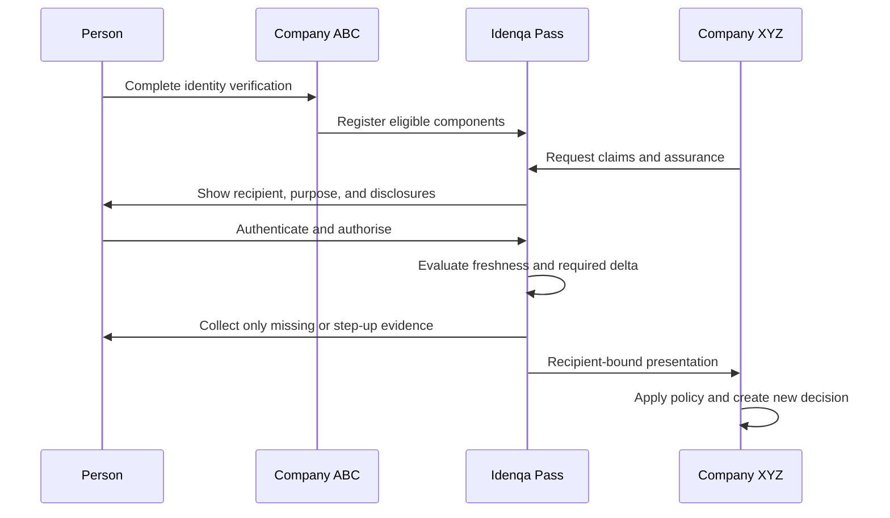

1. The person completes verification for Company ABC.
2. After completion, the Cloud offers a separate choice to save eligible components for faster verification elsewhere. Refusal does not affect the ABC verification.
3. The person creates or binds a reusable profile using a passkey and configured recovery path.
4. Company XYZ creates a reuse request declaring its purpose, required attributes, assurance, freshness, retention, and jurisdiction.
5. The person selects **Reuse my verified identity**, sees XYZ's verified display identity and requested disclosures, authenticates, and approves the grant.
6. The delta engine classifies requested components as reusable, stale, missing, prohibited, conflicted, or requiring step-up.
7. The person completes only the delta, such as a fresh selfie, new proof of address, or newly required database check.
8. The Cloud produces a recipient-bound presentation and creates a new XYZ verification.
9. XYZ's deterministic policy issues its own decision and stores the records it is required or permitted to retain.
10. The person can view disclosure history, revoke future access, correct claims, refresh components, or close the reusable profile.

#### 39.4.3 Cloud components

| Component                      | Responsibility                                                                        |
| ------------------------------ | ------------------------------------------------------------------------------------- |
| Reuse Broker                   | Orchestrates requests, consent, presentations, callbacks, and state                   |
| Regional Profile Vault         | Stores encrypted profile metadata and reusable-component references                   |
| Tenant Link Service            | Creates pairwise, tenant-scoped subject mappings without exposing a global ID         |
| Consent and Disclosure Service | Renders notices and records attribute-level, recipient-specific grants                |
| Delta Engine                   | Compares recipient requirements with component assurance, freshness, and restrictions |
| Credential Issuer              | Issues signed, versioned verification-component credentials                           |
| Credential Verifier            | Verifies proofs, audience, nonce, issuer, schema, validity, and status                |
| Trust Registry                 | Publishes accepted issuers, keys, schemas, assurance profiles, and restrictions       |
| Status Service                 | Supports suspension, supersession, expiry, and revocation checks                      |
| Rebinding Service              | Confirms that the present user remains bound to the reusable profile                  |
| Evidence Transfer Gateway      | Performs exceptional, consented, policy-approved raw-evidence transfer                |
| Privacy Ledger                 | Records notices, grants, disclosures, denials, revocations, and rights operations     |

These components belong to the proprietary Cloud control and trust plane. The open core may verify a signed reuse presentation and process it as evidence, including for a subscribed self-hosted customer, without implementing the reusable-profile network itself.

#### 39.4.4 Delta and freshness evaluation

For every requested component, the deterministic delta engine evaluates:

- Credential integrity and trusted issuer
- Status, supersession, revocation, and expiry
- Evidence and check age against the receiving policy
- Assurance dimensions and applicant-binding strength
- Source independence and accepted provider classes
- Country, document, sector, and jurisdiction compatibility
- Provider contractual permission to reuse or disclose the result
- Consent scope, purpose, retention, and recipient
- Region, residency, and cross-border-transfer constraints
- Conflicting or corrected claims
- Current risk and account-recovery signals

Typical results are:

| Result           | Action                                                               |
| ---------------- | -------------------------------------------------------------------- |
| Reusable         | Disclose the permitted component without recapture                   |
| Refresh required | Rerun the same check using existing claims or new evidence           |
| Step-up required | Rebind with passkey, possession, selfie, or liveness                 |
| Missing          | Collect only the absent evidence or attribute                        |
| Prohibited       | Do not transfer; run a recipient-local verification path             |
| Conflict         | Pause for correction or review rather than silently choosing a value |

Sanctions, PEP, adverse-media, device-risk, and similar time-sensitive checks are normally rerun. Document validity, authoritative identity matching, and biometric binding may be reused only within policy-defined freshness and assurance windows.

#### 39.4.5 Privacy and tenant isolation

- Pairwise subject identifiers prevent tenants from correlating a person through a shared platform ID.
- Raw evidence is not disclosed by default; signed derived claims and verification components are preferred.
- A raw document or biometric asset requires a separate purpose-specific grant, recipient policy approval, provider permission, and residency check.
- Biometric search is not used to locate a reusable profile. Rebinding is one-to-one against the person's selected profile.
- ABC and XYZ receive no list of the other organisations with which the person has interacted.
- A relying tenant receives only its own presentation, subject mapping, verification, and audit records.
- Profile keys and evidence keys are separated, region-scoped, rotated, and access-policy controlled.
- Cloud operators cannot browse reusable profiles through ordinary support tooling.
- Product analytics use aggregate, non-identifying metrics and never expose cross-tenant relationship graphs.

Revoking a reuse grant stops future disclosure and reuse under that grant. It does not promise deletion of records that XYZ must retain under law or another valid basis; the user interface must explain this distinction clearly.

#### 39.4.6 Holder authentication and recovery

Possession of an email address or phone number alone is insufficient for high-assurance reuse.

- Passkeys are the preferred profile authentication method.
- High-risk reuse can require a fresh selfie, liveness, device integrity, or another policy-approved factor.
- Presentations are audience-bound, nonce-bound, short-lived, and replay protected.
- Adding a device or recovering an account lowers trust until a deterministic recovery policy restores it.
- Recovery events can suspend high-assurance components and notify affected users.
- Support personnel cannot override recovery or binding controls alone.
- Lost-device and compromised-account workflows revoke sessions and rotate profile authentication keys.

#### 39.4.7 Credential and wallet interoperability

The first release may use an internal credential representation, but external boundaries should align with:

- W3C Verifiable Credentials Data Model 2.0
- OpenID for Verifiable Credential Issuance 1.0
- OpenID for Verifiable Presentations 1.0
- Selective-disclosure credential formats approved by the security profile
- Issuer status, revocation, schema, and key-rotation mechanisms

Interoperability is an interface strategy, not a requirement to place identity data on a blockchain or public ledger. The system may later issue credentials to approved third-party wallets or accept credentials from trusted external issuers.

#### 39.4.8 Commercial API outline

```text
POST /cloud/v1/reuse/requests
GET  /cloud/v1/reuse/requests/{request_id}
POST /cloud/v1/reuse/requests/{request_id}/authorise
POST /cloud/v1/reuse/requests/{request_id}/decline
POST /cloud/v1/reuse/requests/{request_id}/step-up
GET  /cloud/v1/reuse/profiles/{profile_id}/disclosures
POST /cloud/v1/reuse/grants/{grant_id}/revoke
POST /cloud/v1/reuse/components/{component_id}/refresh
GET  /cloud/v1/reuse/presentations/{presentation_id}
GET  /cloud/v1/reuse/status/{credential_id}
```

Tenant API calls use tenant credentials; user authorisation calls use short-lived, request-bound tokens and authenticated profile sessions. The Cloud emits events such as `reuse.requested`, `reuse.authorised`, `reuse.delta_required`, `reuse.presented`, `reuse.declined`, `reuse.revoked`, and `reuse.component_superseded`.

#### 39.4.9 Commercial model

Reusable Verification Cloud can be monetised through:

- Per successful reuse
- Per reusable profile activated
- Per presentation or refreshed component
- Enterprise network subscription
- Premium assurance, recovery, and wallet-interoperability modules

Pricing should reward reuse rather than making a fresh verification artificially preferable. The customer value is higher conversion, faster onboarding, fewer repeated provider calls, and lower document-handling risk.

### 39.5 Licensing and entitlement enforcement

Apache License 2.0 remains the leading proposal for the public core because it encourages infrastructure adoption and embedding. It does not apply to the dashboard, cloud control plane, commercial design system, entitlement service, or other private repositories.

The dashboard should use a commercial end-user or enterprise licence. Its server-side entitlements may control seats, environments, advanced modules, support level, and deployment mode. Entitlement failure must never corrupt, encrypt, delete, or make customer core data inaccessible.

The final licensing design must consider:

- Cloud-provider competition
- Community contribution
- Provider SDK adoption
- Enterprise procurement
- Trademark protection
- Offline enterprise activation
- Customer disaster-recovery access
- Source-available escrow for exceptional enterprise contracts

### 39.6 Product packaging

| Capability                                                 | Idenqa Core                                                        | Idenqa Console                                                   | Idenqa Cloud                                                                        |
| ---------------------------------------------------------- | ------------------------------------------------------------------ | ---------------------------------------------------------------- | ----------------------------------------------------------------------------------- |
| Identity, evidence, check, and decision APIs               | Included                                                           | Consumes APIs                                                    | Hosted and operated                                                                 |
| Client, capture, webhook, provider, model, and policy SDKs | Included                                                           | Consumes public contracts                                        | Managed distribution and compatibility support                                      |
| Basic hosted and embeddable capture pages                  | Included                                                           | Experience management UI                                         | Managed hosting and delivery                                                        |
| Provider and model adapters and local inference            | Included                                                           | Configuration UI                                                 | Managed catalogue and operations                                                    |
| Policy engine and policy-as-code                           | Included                                                           | Visual editor and simulator                                      | Managed rollout and support                                                         |
| Manual-review domain and APIs                              | Included                                                           | Full reviewer workspace                                          | Managed operations option                                                           |
| Audit events and exports                                   | Included                                                           | Search, reports, and compliance UI                               | Retention and evidence support                                                      |
| CLI and synthetic examples                                 | Included                                                           | Not applicable                                                   | Not applicable                                                                      |
| Team operations and enterprise administration              | Basic API primitives                                               | SSO, SCIM, RBAC, approvals                                       | Operated and supported                                                              |
| Hosting, upgrades, backups, and SLA                        | Customer responsibility                                            | Deployment-dependent                                             | Included by plan                                                                    |
| Reusable verification network                              | Verify imported presentations                                      | Reuse operations and support views                               | Profile, consent, delta, trust, and presentation services                           |
| Capture experience customization                           | Portable schema, validator, renderer, and file-based configuration | Visual editor, previews, approvals, localisation, and publishing | Asset pipeline, targeting, signed delivery, custom domains, analytics, and rollback |

### 39.7 Benchmark: Blnk's core-and-back-office split

As of 26 August 2026, Blnk's public GitHub repository contains its Apache-licensed Go ledger core and developer assets, but not its Cloud back-office dashboard. Its pricing page separately markets a back-office layer for reports, ledger operations, team permissions, audit logs, alerts, and connecting a self-hosted Core instance. Idenqa adopts this product pattern while preserving a stricter rule: all underlying identity resources and consequential operations remain available through Idenqa Core APIs.

### 39.8 No lock-in commitment

- Stable documented APIs
- Full customer export
- Open schemas
- Migration tooling
- Provider and model portability
- No cloud-only evidence format
- No proprietary encryption that prevents self-hosted recovery

---

## 40. Implementation milestones

### Milestone 0 — Foundations

- Finalise threat model
- Finalise domain vocabulary
- Approve architecture decisions
- Establish secure repository and CI
- Implement IDs, tenancy, encryption interfaces, audit contract, and outbox
- Define observations, facts, lineage, decision snapshots, processing authority, and consent boundaries
- Publish API, event, provider, model, policy, and SDK contract foundations
- Create mock provider and synthetic evidence fixtures

**Exit condition:** a threat-reviewed skeleton can create a tenant, subject, verification, and immutable audit events without processing real PII.

### Milestone 1 — Deterministic identity core

- Subjects and encrypted claims
- Verifications and checks
- Durable PostgreSQL-authoritative workflow state machine, inbox, outbox, attempts, timers, leases, and reconciliation
- Typed policy AST, deterministic evaluator, static analysis, simulator, and policy test kit
- Immutable decision snapshots and reproducibility tooling
- Provider SDK, model SDK, mock adapters, and conformance fixtures
- Webhook verification SDK
- At least one core client SDK
- Open CLI and administrative operations
- Webhooks
- Basic developer documentation

**Exit condition:** an API, supported client SDK, or CLI can run a complete synthetic verification and produce a reproducible decision, audit chain, and signed webhook without Cloud, Console, or proprietary services.

### Milestone 2 — Evidence and capture

- Evidence vault
- Direct upload and purpose-bound processing grants
- Basic open-source self-hosted and embeddable Web capture application
- Capture SDK contracts and at least one supported capture SDK for the first adopter segment
- Portable experience schema, validator, safe default theme, local configuration, and session pinning
- Processing-authority, notice, and consent records
- Typed retention resolution and observable asynchronous deletion
- Manual-review, correction, and appeal domain APIs
- Document quality and OCR adapter

**Exit condition:** the open-source capture pages and a supported capture SDK can collect encrypted evidence, process it through scoped grants, produce a reviewable decision, and complete the documented deletion lifecycle without Cloud or Console.

### Milestone 3 — Biometrics

- Model registry
- Liveness adapter
- Face comparison
- Additional native iOS and Android capture or biometric modules according to adopter demand
- Native NFC modules for selected supported documents
- Flutter and React Native wrappers when their underlying native SDKs are stable
- Threshold sets
- Evaluation harness
- Inconclusive and manual-review paths

**Exit condition:** one-to-one biometric binding is versioned, evaluated, auditable, policy controlled, and usable through every capture SDK advertised as supported; raw evidence never crosses a Dart or JavaScript bridge.

### Milestone 4 — Real providers and global packs

- At least two materially different providers
- Capability and restriction manifests
- Provider health and fallback
- Initial document packs
- Initial jurisdiction packs
- Tenant-owned credentials

**Exit condition:** one workflow can switch providers without changing the customer integration.

### Milestone 5 — Operations and hardening

- Manual-review queue and case APIs
- Dual control
- SSO
- Audit export
- Observability
- Backup and restore
- Penetration test
- Production runbooks
- Contract compatibility, expand-migrate-contract database migrations, and open recovery tooling

**Exit condition:** controlled production beta with sensitive identities.

### Idenqa Console and Cloud track — Begins after the open deterministic core is usable

Commercial interface work does not precede or block the open-source foundation. It may progress incrementally alongside later core milestones after Milestone 1 has met its exit condition.

- Private repository and independent CI/CD
- Experimental synthetic-data dashboard
- Verification explorer and reviewer workspace
- Policy simulator and provider configuration
- RBAC, SSO, SCIM, and dual-control experiences
- Assurance, fraud, latency, conversion, and cost analytics
- Capture experience editor, brand-asset pipeline, copy and locale management, cross-platform previews, approvals, publishing, and rollback
- Verified custom domains and registered mobile applications
- Managed Cloud, Connect Your Core, and BYOC deployment modes
- Commercial licensing, billing, and entitlements

**Exit condition:** the dashboard creates enough operational value to purchase while the open core remains usable, self-hostable, and non-dependent on proprietary code.

### Milestone 6 — AI-native orchestration

- Review copilot
- Adaptive-route proposals
- Natural-language policy drafts
- Proposal guardrails
- Prompt and model registry
- AI impact assessments

**Exit condition:** non-deterministic AI improves routing or review while every accepted action remains bounded and auditable.

### Milestone 7 — Idenqa Pass and Reusable Verification Cloud

- Regional reusable-profile vault
- Passkey enrolment, device binding, and high-assurance recovery
- Pairwise tenant link service
- Reuse request, grant, disclosure, and presentation lifecycle
- Credential issuer, verifier, trust registry, and status service
- Deterministic delta and freshness engine
- Recipient-bound selective disclosure
- Step-up and one-to-one biometric rebinding
- User disclosure history, correction, revocation, and deletion workflows
- Cloud-to-self-hosted signed presentation support
- Jurisdiction, provider-licence, residency, and retention enforcement

**Exit condition:** a person verified for Company ABC can authorise Company XYZ to reuse eligible components, complete only the required delta, and receive a new XYZ policy decision without exposing a global subject ID, ABC's records, or raw evidence by default.

### Milestone 8 — Ecosystem

- Signed adapter registry
- Additional public adapter tooling and conformance profiles
- Additional native platform capabilities and framework wrappers
- Additional data planes
- Enterprise deployment
- External issuer and wallet interoperability

---

## 41. Version-one acceptance criteria

Version one is ready for external beta when:

- The complete core can run without a connection to the managed cloud.
- The documented SDKs, CLI, and basic hosted or embeddable capture pages operate without Cloud, Console, a proprietary licence server, or undocumented endpoints.
- At least one mock and two real provider adapters pass conformance tests.
- A provider can be replaced without changing the customer API.
- A model can be replaced without changing the workflow definition.
- Raw evidence is envelope encrypted.
- National identifiers are encrypted and tokenised with tenant-scoped HMAC.
- No raw PII appears in logs, traces, or queue payloads under automated tests.
- Every decision identifies its immutable fact snapshot, evidence, lineage groups, signals, models, providers, runtimes, preprocessing, thresholds, evaluator, processing authority, and policy.
- Correlated transformations of one source cannot satisfy an independent-source requirement.
- Policy evaluation is pure, typed, deterministic, bounded, snapshot based, and reproducible without contacting providers or models.
- Named synthetic policy scenarios use production resolution semantics, retain every expectation mismatch, and produce an input-order-independent safe report without authoring production state.
- Policy revision and activation-history inspection is bounded, metadata-only, newest first, and non-disclosing across tenants; canonical policy documents are not loaded for list operations.
- Workflow state, identity-proofing outcome, and customer business decision are distinct.
- Provider, model, consent, authority, configuration, and residency failures cannot become `not_verified`.
- Every enabled AI action is a recorded proposal approved by guardrails.
- Inconclusive evidence routes safely.
- Manual review uses bounded findings, least privilege, separation of duties, and audit; reviewers cannot bypass hard controls.
- Every processing operation carries an active purpose-compatible processing-authority reference.
- Evidence processing by models and adapters uses scoped grants without releasing tenant keys or general evidence access.
- Evidence retention resolves typed minimum, maximum, legal-hold, region, and backup constraints.
- Deletion covers derived assets, reports `awaiting_backup_expiry` honestly, and survives restore through tombstone replay.
- Workflow state, attempts, timers, inbox, and outbox recover from Redis and worker loss through PostgreSQL.
- External success followed by local failure reconciles without blind duplicate execution.
- Webhooks are signed, replay protected, and idempotent.
- At least one core client SDK and one capture SDK for the initial adopter segment pass their public conformance and security suites.
- Every SDK advertised as supported passes interruption, resumption, cancellation, cleanup, compatibility, and platform-appropriate security tests.
- Any Flutter or React Native wrapper advertised as supported uses the native SDK and does not transmit raw evidence through Dart or JavaScript bridges.
- A complete subject journey succeeds through the open-source capture pages using the portable experience schema and safe default theme.
- Every capture session pins and records a validated experience, locale, tenant-copy, and mandatory-copy version.
- Invalid or unavailable customization activates the signed accessible fallback without skipping consent or verification steps.
- Tenant customization cannot alter verification policy, required evidence, liveness controls, provider routing, or final decisions.
- Cross-tenant security tests pass.
- Model evaluation and rollback are operational.
- Backup restoration has been tested.
- Audit checkpoints can be independently verified for gaps, reordering, mutation, and key history.
- Expand-migrate-contract database changes and mixed-version compatibility have been tested.
- A clean deployment passes the documented open-source usability gate without database surgery.
- Independent penetration testing has no unresolved critical findings.

### 41.1 Idenqa Cloud capture-experience acceptance criteria

The Cloud-managed customization capability is ready for beta when:

- One published configuration renders consistently across hosted Web, embedded Web, native iOS, native Android, Flutter, and React Native within documented platform differences.
- Logo, semantic colours, structured copy, locale, support links, dark mode, right-to-left layout, and verified-domain branding pass automated and human preview checks.
- Published versions are immutable, sessions remain pinned, and rollback or revocation activates without an SDK release.
- Manifest signature, digest, expiry, tenant, environment, region, origin, bundle-ID, application-ID, and signing-identity checks fail closed or use the signed safe fallback.
- Cross-tenant manifest, asset, cache, custom-domain, and application-binding attacks fail the security suite.
- Arbitrary JavaScript, HTML, CSS, executable templates, remote scripts, active SVG content, tracking pixels, and unsanctioned analytics cannot enter the renderer.
- Mandatory consent, privacy, recipient identity, biometric, provider, safety, and regulatory disclosures cannot be hidden or contradicted by tenant copy.
- Contrast, scaling, reduced motion, focus, touch-target, screen-reader, text-expansion, and colour-independent error tests meet the supported accessibility baseline.
- Draft, approval, publication, environment promotion, asset replacement, domain verification, rollback, and revocation actions are authorised and audited.
- Export reproduces the tenant's portable schema, tokens, assets, and copy catalogue without requiring Idenqa Console.
- Privacy-safe metrics exclude raw copy, displayed PII, evidence, identifiers, and sensitive-attribute targeting.

### 41.2 Idenqa Pass and Reusable Verification Cloud acceptance criteria

The later Cloud module is ready for beta when:

- Every reuse produces a new recipient-owned verification and deterministic policy decision.
- No source tenant decision, case note, customer reference, or relationship metadata is disclosed.
- Reuse consent is recipient-specific, purpose-specific, attribute-specific, versioned, and auditable.
- Tenant-facing subject identifiers are pairwise and unlinkable without privileged Cloud mediation.
- Raw evidence is not transferred by default and cannot be transferred without an explicit policy path.
- Dynamic, stale, revoked, superseded, conflicted, and jurisdiction-incompatible components cannot silently pass.
- Presentations are signed, recipient-bound, nonce-bound, short-lived, and replay protected.
- High-risk reuse supports passkey authentication and policy-controlled biometric rebinding.
- Account recovery reduces or suspends assurance until deterministic controls restore it.
- The user can inspect disclosure history, revoke future reuse, request correction, and close the profile.
- Revocation semantics distinguish future disclosure from a recipient's legally required retention.
- Region and cross-border controls are evaluated before disclosure or evidence transfer.
- Account-takeover, tenant-correlation, consent-confusion, replay, and malicious-recipient tests pass.
- An independent privacy and security assessment has no unresolved critical findings.

---

## 42. Key risks and mitigations

| Risk                                                   | Consequence                                        | Primary mitigation                                                                        |
| ------------------------------------------------------ | -------------------------------------------------- | ----------------------------------------------------------------------------------------- |
| Provider does not permit portrait export               | Internal face matching unavailable                 | Capability manifests and provider-native fallback                                         |
| Provider abstraction becomes lowest-common-denominator | Weak functionality                                 | Stable core plus typed provider extensions                                                |
| Document coverage expands without quality              | False confidence                                   | Explicit support levels and evaluation gates                                              |
| LLM proposal treated as fact                           | Unsafe decision                                    | Evidence references and deterministic guardrails                                          |
| Biometric bias or drift                                | Unequal false outcomes                             | Cohort evaluation, thresholds, monitoring, human path                                     |
| Evidence breach                                        | Irreversible identity harm                         | Isolation, minimisation, encryption, short retention                                      |
| Malicious community adapter                            | Secret or data exfiltration                        | Signed packages, isolation, network and secret scopes                                     |
| Provider outage or pricing change                      | Verification disruption                            | Portability, health routing, circuit breakers                                             |
| Operational failure becomes an adverse subject outcome | Unfair rejection and misleading audit history      | Separate workflow state, proofing outcome, and customer decision                          |
| Correlated signals are counted as independent evidence | Inflated assurance                                 | Immutable provenance, lineage groups, and independence-aware policy                       |
| Privileged audit mutation is described as impossible   | False compliance assurance                         | Explicit trust model, signed checkpoints, independent export and verifier                 |
| Open core lacks usable SDK or capture path             | Nominal openness without practical adoption        | Open SDKs, capture pages, CLI, conformance fixtures, and usability gate                   |
| Unsafe schema or contract migration                    | Cross-tenant corruption or unrecoverable workflows | Version pinning, expand-migrate-contract, mixed-version tests, and recovery plans         |
| Compliance pack becomes stale                          | Incorrect customer assumptions                     | Versioning, update notices, legal review, no guarantee claim                              |
| Global scope delays launch                             | No usable product                                  | Global architecture with narrow v1 capabilities                                           |
| Manual review becomes expensive                        | Poor margins                                       | Better capture, AI assistance, quality analytics                                          |
| Managed service liability                              | Financial and regulatory loss                      | Controls, contracts, insurance, incident response                                         |
| Open source is difficult to operate                    | Low adoption                                       | Secure defaults, Docker, Helm, diagnostics, managed option                                |
| Tenant branding impersonates another organisation      | Phishing and consent confusion                     | Verified recipient identity, domain and application binding, brand review, abuse response |
| Custom copy hides or contradicts material facts        | Invalid consent or dark patterns                   | Locked mandatory copy, structured keys, validation, legal-review metadata, audit          |
| Broken or malicious experience configuration           | Capture outage or code and data exposure           | Non-executable schema, sanitised assets, signed manifests, safe fallback, kill switch     |
| Translation changes legal or safety meaning            | Misleading disclosure                              | Locale ownership, approved fallbacks, jurisdiction review, exact version receipts         |
| Reusable-profile account takeover                      | Fraudulent identity presentation                   | Passkeys, device binding, step-up, recovery assurance downgrade                           |
| Stale verification component reused                    | Incorrect recipient decision                       | Deterministic freshness, status, revocation, and delta checks                             |
| Cross-tenant relationship leakage                      | Surveillance and privacy harm                      | Pairwise identifiers, selective disclosure, isolated audit views                          |
| Cloud profile becomes a data honeypot                  | Large-scale identity harm                          | Regional split vaults, minimisation, key separation, JIT access                           |
| Recipient assumes KYC liability transferred            | Regulatory failure                                 | New recipient decision, reliance policy, contracts, clear provenance                      |
| User misunderstands revocation                         | False deletion expectation                         | Granular notices and separate future-use versus retention controls                        |

---

## 43. Architecture decisions

### Accepted

- Idenqa is the selected masterbrand, subject to formal legal and namespace clearance before public launch
- Idenqa Core, Cloud, Console, Capture, Pass, and Registry form one product family
- Global jurisdiction-neutral domain model
- Regional data planes
- Customer-owned self-hosting
- Open-source core includes public SDKs and basic hosted or embeddable capture pages
- Commercial interfaces begin at advanced operation and managed-service value, not basic usability
- Provider and model abstractions
- Initial adopter pack: mobile-first regulated fintech onboarding of adult individuals in Nigeria, Ghana, Kenya, and South Africa
- Initial real provider adapters: Smile ID and Dojah behind tenant-owned credentials and isolated provider runners
- Initial country-pack baseline and authority identifiers defined by D-014, with capability-equivalent policy-approved fallback only
- Deterministic final policy authority
- Workflow execution state, identity-proofing outcome, and customer business decision are separate
- Decisions evaluate immutable fact snapshots with lineage and correlation controls
- Processing authority is explicit and distinct from consent
- Reviewers contribute policy-bounded findings rather than mutating terminal states directly
- Non-deterministic AI proposals behind guardrails
- One-to-one face verification before one-to-many identification
- Tenant-isolated fraud analysis by default
- Modular implementation with isolated sensitive runners
- PostgreSQL as authoritative domain store
- PostgreSQL as authoritative workflow, attempt, timer, inbox, and outbox store
- Redis and worker queues are optional accelerators rather than recovery authority
- Object storage as encrypted evidence store
- Evidence plaintext is released through purpose-bound processing and review grants
- Transactional outbox for domain events
- Observable asynchronous deletion with typed retention resolution and honest backup-expiry states
- Versioned contracts and expand-migrate-contract database evolution
- Open CLI and administrative tooling sufficient to operate without Console or Cloud
- Production operations dashboard kept outside the open-source repository
- Open administrative APIs remain sufficient to build an independent dashboard
- Swift and Kotlin SDKs are the authoritative mobile capture implementations
- Flutter and React Native are thin wrappers over the native SDKs
- Capture customization uses a public portable schema and a non-executable rendering contract
- Cloud-managed configurations are immutable, signed, session-pinned, tenant- and application-bound, and safely reversible
- Tenant branding and copy cannot override policy, consent meaning, security controls, accessibility invariants, or consequential decisions
- Reusable verification is a proprietary Cloud network capability
- Reuse transfers eligible components, never another tenant's final decision
- Every reuse creates a new tenant-scoped subject, verification, and decision
- Reusable-profile identifiers are hidden and tenants receive pairwise subject identifiers

### Proposed

- Go and Chi reference backend
- React and TanStack Start commercial dashboard
- Apache License 2.0
- Headgate v0.1.2 with its PostgreSQL backend behind the owned task boundary
- Redis only as an optional rate-limit or ephemeral-coordination accelerator
- Kubernetes and Helm production reference
- OCI and gRPC model and adapter runners

### Deferred

- First managed regions
- Cross-tenant fraud network
- KYB and AML module boundaries

---

## 44. Open product decisions

The following require founder decisions before implementation commitments:

1. **Resolved:** mobile-first regulated African fintech onboarding of adult individuals, initially in Nigeria, Ghana, Kenya, and South Africa.
2. Is the initial go-to-market self-hosted, managed cloud, or hybrid?
3. **Resolved:** Smile ID and Dojah, using tenant-owned credentials behind isolated adapters; neither is a universal primary and fallback requires equivalent semantics plus authority, recipient, region, and purpose compatibility.
4. Which region hosts the first managed data plane?
5. **Resolved for the initial pack:** live selfie, liveness/PAD, one-to-one face comparison, national identity document, passport and driving-licence capture, document quality, and MRZ/barcode where declared. NFC and voice are deferred.
6. Is Apache 2.0 the final core licence, and what commercial licence governs self-hosted dashboard deployments?
7. What customer data, if any, may contribute to opt-in model improvement?
8. **Resolved:** use the selected class-specific defaults in section 26.1, with tenant shortening, explicitly capped extensions, legal-hold precedence, and immutable regional pinning.
9. Which assurance profiles ship as supported defaults?
10. **Resolved:** version one of this adopter pack is individual proofing only; KYB remains deferred.
11. What liability and insurance limits apply to managed verification decisions?
12. Which Idenqa trademarks, company names, domains, package names, and social handles are cleared and prioritised for launch?
13. Which verification components and freshness windows are eligible for the first reuse release?
14. Which countries and regulated sectors permit the initial reliance model?
15. Is the initial reusable profile Cloud-custodied only, or does it also issue to external wallets?
16. What recovery ceremony is strong enough to restore high-assurance reusable components?
17. Is reuse priced per successful onboarding, presentation, active profile, or enterprise subscription?
18. Which capture-customization capabilities ship in the first paid Cloud tier versus enterprise plans?
19. Are customer-managed signing keys and privately hosted brand assets required for the first enterprise release?
20. Which core-client SDK language and capture SDK platform ship first for the initial adopter segment?

---

## 45. Suggested initial product contract

The first public release should make this commitment:

> Deploy Idenqa Core in your infrastructure, integrate through open SDKs, collect evidence through open self-hosted or embeddable Idenqa Capture pages, connect your providers, run approved models privately, and receive deterministic, explainable decisions. Your evidence, keys, policies, providers, models, and audit history remain under your control.

> When you want a production control room instead of building one, connect Idenqa Console and Idenqa Cloud without surrendering ownership of Idenqa Core or its data.

This contract is narrower and more credible than promising instant support for every country, document, regulator, and fraud pattern.

---

## 46. Reference standards and source material

- [Blnk Finance open-source ledger](https://github.com/blnkfinance/blnk)
- [Stripe Identity](https://stripe.com/identity)
- [MetaMap identity-verification platform](https://www.metamap.com/)
- [Persona API introduction](https://docs.withpersona.com/api-introduction)
- [Sumsub documentation](https://docs.sumsub.com/)
- [Incode identity platform](https://www.incode.com/platform)
- [Ballerine open-source risk-management infrastructure](https://github.com/ballerine-io/ballerine)
- [NIST SP 800-63A-4 identity proofing](https://pages.nist.gov/800-63-4/sp800-63a/proofing/)
- [NIST Face Recognition Technology Evaluation](https://pages.nist.gov/frvt/html/frvt11.html)
- [NIST AI Risk Management Framework](https://www.nist.gov/itl/ai-risk-management-framework)
- [ISO/IEC 27001 information-security management](https://www.iso.org/standard/27001)
- [ISO/IEC 27701 privacy-information management](https://www.iso.org/standard/27701)
- [ISO/IEC 30107 presentation-attack detection](https://www.iso.org/standard/83828.html)
- [ISO/IEC 42001 AI-management systems](https://www.iso.org/standard/42001)
- [OWASP ASVS](https://owasp.org/www-project-application-security-verification-standard/)
- [OWASP MASVS](https://mas.owasp.org/MASVS/)
- [W3C Web Content Accessibility Guidelines 2.2](https://www.w3.org/TR/WCAG22/)
- [AICPA SOC 2 Trust Services Criteria](https://www.aicpa-cima.com/resources/download/2017-trust-services-criteria-with-revised-points-of-focus-2022)
- [EU GDPR](https://eur-lex.europa.eu/eli/reg/2016/679/oj/eng)
- [W3C Verifiable Credentials Data Model 2.0](https://www.w3.org/TR/vc-data-model-2.0/)
- [OpenID for Verifiable Credential Issuance 1.0](https://openid.net/specs/openid-4-verifiable-credential-issuance-1_0.html)
- [OpenID for Verifiable Presentations 1.0](https://openid.net/specs/openid-4-verifiable-presentations-1_0.html)
- [FATF Guidance on Digital Identity](https://www.fatf-gafi.org/en/publications/Financialinclusionandnpoissues/Digital-identity-guidance.html)
- [Smile ID REST API products](https://docs.usesmileid.com/integration-options/rest-api/products)
- [Smile ID authority-backed identity types and sandbox data](https://docs.usesmileid.com/supported-id-types/for-individuals-kyc/backed-by-id-authority/test-data)
- [Smile ID African document-image catalogue](https://docs.usesmileid.com/supported-id-types/for-individuals-kyc/using-document-image/regions/africa)
- [Dojah API and product changelog](https://docs.dojah.io/changelog/api_changes)
- [Dojah public SDK endpoint catalogue](https://github.com/dojah-inc/dojah-sdks/blob/main/python/README.md)

---

## 47. Document maintenance

This specification should live with the source repository and change through reviewed pull requests.

Every material architecture change should include:

- Updated diagram or data flow
- Threat-model impact
- Privacy and residency impact
- API compatibility impact
- Provider and model compatibility impact
- Migration plan
- Architecture decision record

Suggested review cadence:

- Architecture: every material feature
- Threat model: every quarter and before sensitive launches
- Provider restrictions: on every adapter release
- Jurisdiction packs: on regulatory change
- Model evaluations: on every model or threshold promotion
- Disaster recovery: at least twice yearly

### 47.1 Companion specifications and decisions

This document remains the product and reference architecture. Implementation-critical semantics should live in focused, versioned companion documents:

```text
/docs/architecture/
  reference-architecture.md
  trust-boundaries.md
  data-residency.md

/docs/specifications/
  sdk-contracts-and-compatibility.md
  capture-pages-and-experience-schema.md
  domain-model.md
  verification-state-machine.md
  policy-language.md
  durable-orchestration.md
  evidence-access.md
  processing-authority-and-consent.md
  retention-and-deletion.md
  review-correction-and-appeals.md
  provider-and-model-contracts.md
  principals-keys-and-audit.md
  contract-compatibility-and-migrations.md
  public-api.md
  operations-cli.md

/docs/decisions/
  ADR-0001-modular-core.md
  ADR-0002-postgresql-authority.md
  ADR-0003-deterministic-policy-authority.md
  ADR-0004-regional-data-planes.md
  ADR-0005-open-core-commercial-console-boundary.md
```

The reference architecture states intent and boundaries. Specifications define testable behaviour. Architecture decision records preserve reasoning behind consequential choices.
